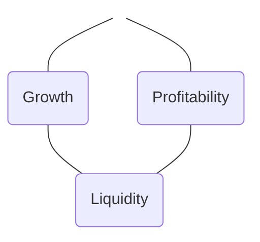
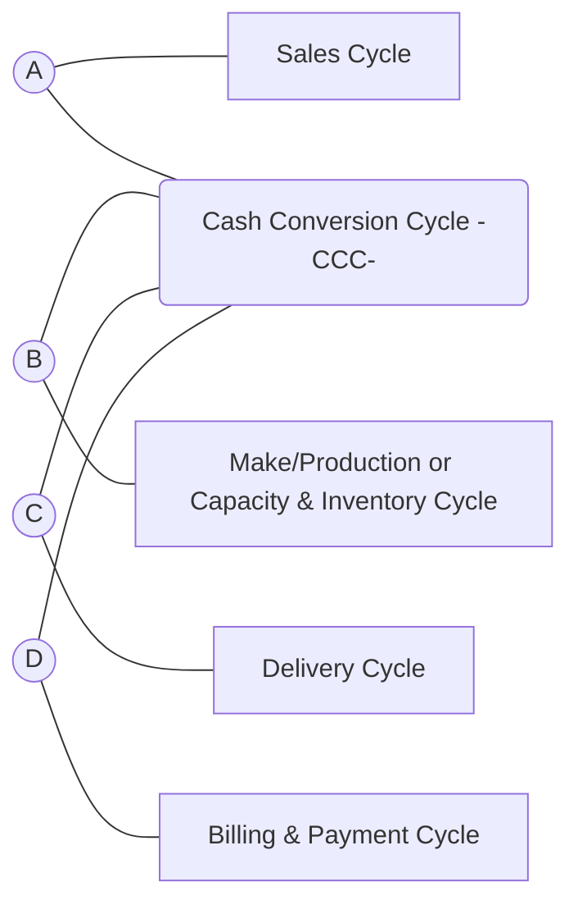
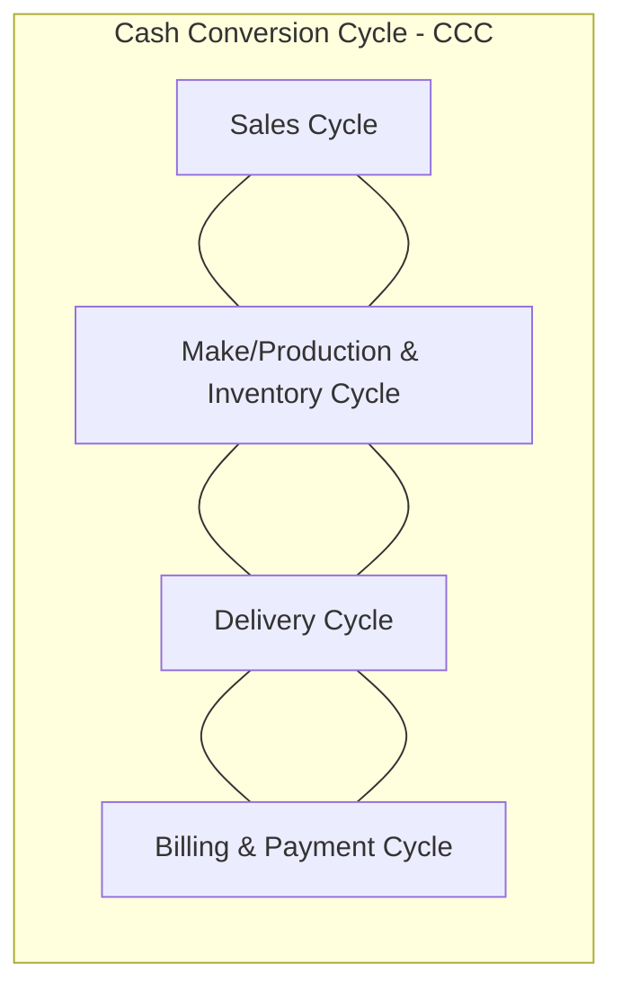
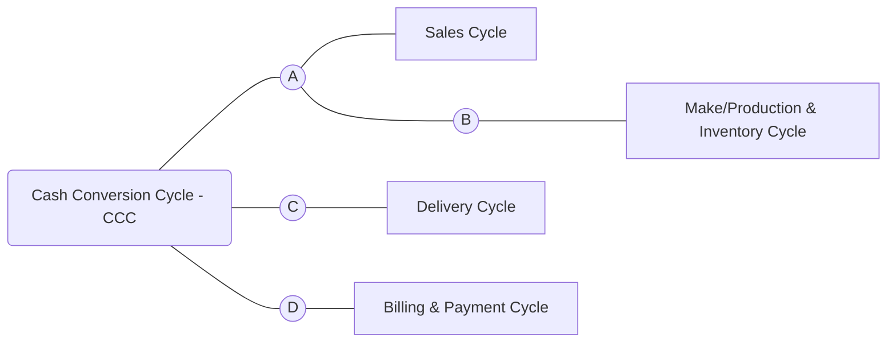
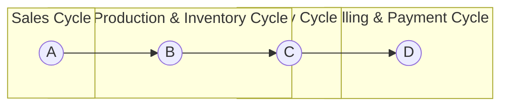

# CASH

# <mark>LEARNING DAY</mark>
## Participant Workbook

**PURPOSE:**
Guide the Learning Day participant through the process of learning and applying the content of this module

1. Prior to Learning Day, read Scaling Up Assigned Pages (from Accelerator website)

2. Attend Accelerator Learning Day, and complete leadership team exercises.

3. Update Accelerator Accountability Tracking Plan.

4. Meet with Accountability Group & Coach, and share how you are applying leadership team exercises and results.

---

# Cash
## Glossary (Basic Terms)

**THREE CORE FINANCIAL DOCUMENTS:**

**BALANCE SHEET** represents an organization’s financial position at a certain point in time by displaying its assets, liabilities, and shareholders’ equity. This financial statement lists assets on one side and liabilities and shareholders' equity on the other, and the two sides must equal each other.

**INCOME STATEMENT** is also known as a Profit and Loss statement and reports a company’s earnings and losses over a particular period, often monthly. It measures a company’s ability to earn money and its growth potential.

**CASH FLOW STATEMENT** reflects the movement of money in and out of a business over a particular period. A cash flow statement measures solvency, meaning an organization's ability to pay its bills and expenses. If more money flows into the business than out of it, the business is cash-flow positive.

**BUDGET** is a financial plan that determines how much money will be spent over a particular period. A budget helps you stay accountable for your spending. When creating budgets, businesses should consider factors such as income, assets, and liabilities.

A budget can help entities compare how much money they make to how much they spend, which allows for how they make financial decisions or plan for the future.
* **Comprehensive budget** or a master budget is a detailed budget that helps your business tracks your spending over time, and ensures you overspend or work towards cutting back in specific areas.
* **Problem-solving budget** help you determine the areas where you are likely to overspend and helps you set limits.
* **Planning budget** help you plan for certain events or circumstances, especially when you are trying to achieve a specific goal.

**INCOME** is the amount of money earned for work or from investments.
* **Revenue** is total income receives from typical activities.
* **Gross Income** or **Gross Profit** is revenue after direct labor and Cost Of Goods (COGs) have been subtracted.
* **Net Income** or **Net Profit** is the revenue after subtracting expenses and costs of ALL direct and indirect expenses i.e. overheads, depreciation, amortization.

**EXPENSES:** Costs of operating a business and related to generating revenue e.g. rent, utilities, payroll.
* **Fixed expense** does not change with production e.g. rent, insurance.
* **Variable expense** changes with production e.g. electric bill, COGs
* **Operating expense** are costs related to providing a service or product e.g. machinery, rent, payroll.
* **Non-operating expense** is unrelated to business operating functions e.g. interest and taxes.

**ASSETS** are items with economic value that an entity owns and appears on businesses’ balance sheets, along with liabilities.
* **Current Assets**, also known as liquid assets, represents assets that the owners can easily or quickly convert into cash, often within a year
* **Non-current Assets** usually take longer to liquidate e.g. property, machinery or equipment.
* **Tangible Assets** are material items such as cash or equipment.
* **Intangible Assets** are non-physical objects that have value e.g. trademarks, patents, copyrights, or franchise agreements.

**LIABILITY** is often a debt or amount of money that an entity owes to another entity and may include bank loans, accounts payable and credit card debts. Liabilities like assets will appear on a business balance sheet.
* **Current liabilities** are due within a year.
* **Non-current liabilities** are longer term e.g. mortgages or leases.

**STOCKHOLDERS’ EQUITY** refers to the assets remaining in a business once all liabilities have been settled (company’s net worth). This is calculated by subtracting total liabilities from total assets; alternatively, it can be calculated by taking the sum of share capital and retained earnings, less treasury stock.

**CREDIT:** Contractual agreement in which a lender loans money to a borrower. A borrower demonstrates credit trustworthiness in different ways e.g. making loan payments on time. Credit cards represent the most common example of buying on credit.
* **Credit Score:** Also known as a FICO Score, this is a three-digit number that measures an individual’s trustworthiness to pay back loans/debts based on different factors such as credit history.

**INTEREST:** Interest is the additional money one must pay when borrowing money.
* **Compound Interest** is the amount of interest earned on a loan based on the initial amount plus the interest accumulated over time. Compound interest is calculated as a percentage of the new loan amount every year.
* **Simple Interest** is the percentage of the initial or principal amount of the loan.

**ACCOUNTS RECEIVABLE** is the money that customers owe a business for products/services provided to them but have not received payment. This can be listed as assets on balance sheets.

**ACCOUNTS PAYABLE** is the money a business owes to others for their provided services/products (but have not yet paid). This can be listed as short-term debts or liabilities on balance sheets. Long-term liabilities can be long-term loans or mortgages.

---

# CASH
Do you have the CASH to fund GROWTH?

EOA
SCALING UP
A GAZELLES COMPANY

----

## Growth is Hard

<table>
  <thead>
    <tr>
        <th>Revenue Category</th>
        <th>Percentage/Count</th>
        <th>Status</th>
    </tr>
  </thead>
  <tbody>
    <tr>
        <td>&lt;$1 Million</td>
<td>96%</td>
<td>Valley of Death</td>
    </tr>
<tr>
        <td>$1 Million</td>
<td>4%</td>
<td>Valley of Death</td>
    </tr>
<tr>
        <td>$10 Million</td>
<td>0.4%</td>
<td>Valley of Death</td>
    </tr>
<tr>
        <td>$50 Million</td>
<td>17,000</td>
<td>Valley of Death</td>
    </tr>
  </tbody>
</table>

**32.5 Million Firms**

SCALING UP
A GAZELLES COMPANY
EOA

----

# THE $105 TRILLION WORLD ECONOMY
**2023 GLOBAL GDP**

According to IMF projections, global nominal GDP will reach $105 trillion in 2023. However, key economies like Russia, Canada, and Saudi Arabia are facing shrinking GDPs.

### The World Economy
* 2000-2023
* $34T to $105T

**United States**
> 60% to 26% Gross

<table>
  <thead>
    <tr>
        <th>Country/Region</th>
        <th>GDP Value</th>
    </tr>
  </thead>
  <tbody>
    <tr>
        <td>USA</td>
<td>$26.9T</td>
    </tr>
<tr>
        <td>CHN</td>
<td>$19.4T</td>
    </tr>
<tr>
        <td>JPN</td>
<td>$4.4T</td>
    </tr>
<tr>
        <td>DEU</td>
<td>$4.3T</td>
    </tr>
<tr>
        <td>IND</td>
<td>$3.7T</td>
    </tr>
<tr>
        <td>GBR</td>
<td>$3.2T</td>
    </tr>
<tr>
        <td>FRA</td>
<td>$2.9T</td>
    </tr>
<tr>
        <td>ITA</td>
<td>$2.2T</td>
    </tr>
<tr>
        <td>CAN</td>
<td>$2.1T</td>
    </tr>
<tr>
        <td>BRA</td>
<td>$2.1T</td>
    </tr>
<tr>
        <td>RUS</td>
<td>$2.1T</td>
    </tr>
<tr>
        <td>KOR</td>
<td>$1.7T</td>
    </tr>
<tr>
        <td>AUS</td>
<td>$1.7T</td>
    </tr>
<tr>
        <td>MEX</td>
<td>$1.7T</td>
    </tr>
<tr>
        <td>ESP</td>
<td>$1.5T</td>
    </tr>
<tr>
        <td>IDN</td>
<td>$1.4T</td>
    </tr>
<tr>
        <td>SAU</td>
<td>$1.1T</td>
    </tr>
<tr>
        <td>TUR</td>
<td>$1.0T</td>
    </tr>
<tr>
        <td>CHE</td>
<td>$870B</td>
    </tr>
<tr>
        <td>TWN</td>
<td>$791B</td>
    </tr>
<tr>
        <td>POL</td>
<td>$749B</td>
    </tr>
<tr>
        <td>ARG</td>
<td>$641B</td>
    </tr>
<tr>
        <td>SWE</td>
<td>$599B</td>
    </tr>
<tr>
        <td>BEL</td>
<td>$572B</td>
    </tr>
<tr>
        <td>THA</td>
<td>$574B</td>
    </tr>
<tr>
        <td>ISR</td>
<td>$522B</td>
    </tr>
<tr>
        <td>NOR</td>
<td>$522B</td>
    </tr>
<tr>
        <td>ARE</td>
<td>$509B</td>
    </tr>
<tr>
        <td>NLD</td>
<td>$1.0T</td>
    </tr>
  </tbody>
</table>

* **The IMF sees the world economy** growing 5.3%, or when adjusted for inflation, 2.8%.
* **Russia's projected $150B** GDP drop is more than Ukraine's total $149B GDP.
* **India dethrones the** UK as the 5th largest economy in the world.
* **China's GDP is expected to** grow 7.1% in 2023, ahead of U.S. growth of 5.5%.

SCALING UP
A GAZELLES COMPANY
EOA

----

# EO Accelerator

SCALING UP
A GAZELLES COMPANY

---

# AGENDA
Arrivals
* Welcome & Updates
* Cash Conversion Cycle
AM Break
* Power of One (recurring)
* Recurring Revenue
Lunch Break
* Panel/Speaker
PM Break
* Outside Funding or Compensation
* Leadership: Deeper Listening
* Vision Summary & Housekeeping

**SCALING UP** A GAZELLES COMPANY
**EOA**

----

# Introductions
* **Introduce Yourself & Company**
* **Biggest Win?**
* **Biggest Challenge Right Now?**

**SCALING UP** A GAZELLES COMPANY
**EOA**

----

# EO Accelerator

To empower entrepreneurs with the <mark>**TOOLS**</mark>, <mark>**COMMUNITY**</mark>, and <mark>**ACCOUNTABILITY**</mark> to aggressively grow and master their business.

**SCALING UP** A GAZELLES COMPANY
**EOA**

----

# EOA Core Values
### Trust and Respect
### Thirst for Learning
### Think Big, Be Bold
### Together We Grow

**SCALING UP** A GAZELLES COMPANY
**EOA**

---

### Process and Rules
* Phones, Emails and Breaks
* One Honest Conversation
* No Blame / No Shame
* Carry Your Own Bag
* Trust the Process
* Confidentiality

**SCALING UP** A GAZELLES COMPANY
**EOA**

----

### EOA Program Tools
* Simple
* Practical
* Actionable

#### Bias toward ACTION

**EOA**
**SCALING UP** A GAZELLES COMPANY

----

# What did you try?

**SCALING UP** A GAZELLES COMPANY
**EOA**

----

# CASH
### Do you have the CASH to fund GROWTH?

**EOA**
**SCALING UP** A GAZELLES COMPANY

---

05:55 GMT+12 AKL
18:55 GMT+1 LDN
STRATEGIC THINKING DIGITAL SERVICES OUR WORK ARTICLES CONTACT

    
    
    
    
    

    
    
    
    
    
    

    
    
    
    
    

    
    
    
    
    

---

# 7 Financial Lessons

* REVENUE is vanity
* PROFIT is sanity (opinion)
* CASH IS KING (fact)
* Can't pay bills with PROFITS
* ASSETS are what you own
* LIABILITIES are what you owe
* EQUITY is your book value

EOA
SCALING UP
A GAZELLES COMPANY

***

# Profit V's Cash In Our Life – 1 Day
<page_header>
EOA SCALING UP
A GAZELLES COMPANY
Jonathan Mond
</page_header>

<table>
    <tr>
        <th></th>
        <th></th>
        <th></th>
        <th></th>
    </tr>
<tr>
        <td>We Work and Earn Income</td>
<td>We Fill Up Gas</td>
<td>Buy a Coffee</td>
<td>Get Lunch</td>
    </tr>
<tr>
        <td>Income (P&amp;L) = $300&lt;br/&gt;Cash (Balance sheet) = $0</td>
<td>Expense (P&amp;L) = $10&lt;br/&gt;Cash (Balance sheet) = $50</td>
<td>Expense (P&amp;L) = $4.5&lt;br/&gt;Cash (Balance sheet) = $4.5</td>
<td>Expense (P&amp;L) = $8&lt;br/&gt;CCard (Balance sheet) = $8</td>
    </tr>
</table>

<table>
  <tbody>
    <tr>
        <td>Profit/Loss</td>
<td>Cash</td>
        <td colspan="2">Balance sheet (Working Capital)</td>
    </tr>
<tr>
        <td>Income $300</td>
<td>Income $0</td>
<td>AR (Wages):</td>
<td>$300</td>
    </tr>
<tr>
        <td>Expenses $22.5</td>
<td>Expenses $22.5</td>
<td>Inventory (Gas)</td>
<td>$40</td>
    </tr>
<tr>
        <td><u>Profit: $277.5</u></td>
<td><u>Cash Flow: $-54.5</u></td>
<td><u>AP (Credit Card):</u></td>
<td><u>$8</u></td>
    </tr>
  </tbody>
</table>

***

# AI Exercise

* Delete the company name from your financials: Income Statement (P&L) and your Balance Sheet. Upload only if comfortable with this use.
* "What's my Cash Flow Story? How does my business compare to others in my industry? Help me understand my numbers and trends with a high level analysis and give me 3-5 changes to improve the business."

SCALING UP A GAZELLES COMPANY EOA

***

# Cash Exercise

## What's Your Cash Conversion Cycle?

<page_footer>
EOA SCALING UP A GAZELLES COMPANY
</page_footer>

---

# Catapult Systems
The Microsoft Consulting Company

Services | Clients | About | Careers | Learn | Contact

**13 Microsoft Competencies**

# Bill Twice a Month!

**INVESTMENTS.**
**Smart Solutions. Experienced Team. Proven Delivery. Personal Relationships.**

**Ready to Launch?**
Watch Now

**THE CATAPULT BRAND PROMISE**

**Catapult Systems** is a Microsoft-focused IT consulting firm.
We build business critical systems and help our clients maximize their investment in Microsoft.

Clients | **SCALING UP** A GAZELLES COMPANY

----

> Realized that all the temps and contractors in the industry led to unhappy customers who paid late and demanded discounts.

**endless events**

**Will Curran**
EO Accelerator
Arizona, USA

EOA | **SCALING UP** A GAZELLES COMPANY

----

# Tom Meredith at DELL

<description>
A triangle diagram with "Growth" at the top left vertex, "Profitability" at the top right vertex, and "Liquidity" at the bottom vertex.
</description>

EOA | **SCALING UP** A GAZELLES COMPANY

----

# Dwight Cooper and Anne Mims
**PPR**

**SCALING UP** A GAZELLES COMPANY | EOA

---

1. Hired clerk to get invoices out on time
2. Relationships with A/P person at top 150 clients
3. Invoices structured the way client wanted
4. Email copies of paper invoices for preview
5. Follow up calls 10 days after invoicing
6. Blue invoice paper: easier to find in stack

**Results?**
15 days off cycle on millions in revenue

SCALING UP A GAZELLES COMPANY
EOA

***

<page_header>
EOA
SCALING UP A GAZELLES COMPANY
</page_header>

***

# Customer Funded

<page_header>
EOA
SCALING UP A GAZELLES COMPANY
</page_header>

***

# Cash Conversion Cycle

<table>
  <tbody>
    <tr>
        <td>Shorten Cycle Times</td>
<td>Eliminate Mistakes</td>
<td>Improve Business Model &amp; P/L</td>
    </tr>
  </tbody>
</table>

<page_header>
EOA
SCALING UP A GAZELLES COMPANY
</page_header>

---

SCALING UP
A GAZELLES COMPANY
EOA

# Optimize Cash
Eliminate Mistakes
Shorten Cycle Times
Improve Business Model

----

# Stop saying:
## "Well, that's just the way it is in our industry."

----

# Ask AI
* Can you describe my Cash Conversion Cycle? (Correct if wrong)
* Where do I likely have mistakes and or delays?
* Where could I change my business model to get cash sooner than I have to pay it out? (my business model)

----

### CASH: Cash Acceleration Strategies (CASh)

**A Ways to improve your Sales Cycle**
1.     
2.     
3.     
4.     
5.     

**B Ways to improve your Make/Production & Inventory Cycle**
1.     
2.     
3.     
4.     
5.     

**C Ways to improve your Delivery Cycle**
1.     
2.     
3.     
4.     
5.     

**D Ways to improve your Billing & Payment Cycle**
1.     
2.     
3.     
4.     
5.     

EOA
SCALING UP
A GAZELLES COMPANY

---

CASH: Cash Acceleration Strategies (CASh) EOA SCALING UP

<table>
  <thead>
    <tr>
        <th>Ways to improve your Sales Cycle</th>
        <th>Shorten Cycle Times</th>
        <th>Eliminate Mistakes</th>
        <th>Improve Business Model &amp; P/L</th>
    </tr>
  </thead>
  <tbody>
    <tr>
        <td>1</td>
<td>    </td>
<td>    </td>
<td>    </td>
    </tr>
<tr>
        <td>2</td>
<td>    </td>
<td>    </td>
<td>    </td>
    </tr>
<tr>
        <td>3</td>
<td>    </td>
<td>    </td>
<td>    </td>
    </tr>
<tr>
        <td>4</td>
<td>    </td>
<td>    </td>
<td>    </td>
    </tr>
<tr>
        <td>5</td>
<td>    </td>
<td>    </td>
<td>    </td>
    </tr>
  </tbody>
</table>

<table>
  <thead>
    <tr>
        <th>Ways to improve your Make/Production &amp; Inventory Cycle</th>
        <th>Shorten Cycle Times</th>
        <th>Eliminate Mistakes</th>
        <th>Improve Business Model &amp; P/L</th>
    </tr>
  </thead>
  <tbody>
    <tr>
        <td>1</td>
<td>    </td>
<td>    </td>
<td>    </td>
    </tr>
<tr>
        <td>2</td>
<td>    </td>
<td>    </td>
<td>    </td>
    </tr>
<tr>
        <td>3</td>
<td>    </td>
<td>    </td>
<td>    </td>
    </tr>
<tr>
        <td>4</td>
<td>    </td>
<td>    </td>
<td>    </td>
    </tr>
<tr>
        <td>5</td>
<td>    </td>
<td>    </td>
<td>    </td>
    </tr>
  </tbody>
</table>

<table>
  <thead>
    <tr>
        <th>Ways to improve your Delivery Cycle</th>
        <th>Shorten Cycle Times</th>
        <th>Eliminate Mistakes</th>
        <th>Improve Business Model &amp; P/L</th>
    </tr>
  </thead>
  <tbody>
    <tr>
        <td>1</td>
<td>    </td>
<td>    </td>
<td>    </td>
    </tr>
<tr>
        <td>2</td>
<td>    </td>
<td>    </td>
<td>    </td>
    </tr>
<tr>
        <td>3</td>
<td>    </td>
<td>    </td>
<td>    </td>
    </tr>
<tr>
        <td>4</td>
<td>    </td>
<td>    </td>
<td>    </td>
    </tr>
<tr>
        <td>5</td>
<td>    </td>
<td>    </td>
<td>    </td>
    </tr>
  </tbody>
</table>

<table>
  <thead>
    <tr>
        <th>Ways to improve your Billing &amp; Payment Cycle</th>
        <th>Shorten Cycle Times</th>
        <th>Eliminate Mistakes</th>
        <th>Improve Business Model &amp; P/L</th>
    </tr>
  </thead>
  <tbody>
    <tr>
        <td>1</td>
<td>    </td>
<td>    </td>
<td>    </td>
    </tr>
<tr>
        <td>2</td>
<td>    </td>
<td>    </td>
<td>    </td>
    </tr>
<tr>
        <td>3</td>
<td>    </td>
<td>    </td>
<td>    </td>
    </tr>
<tr>
        <td>4</td>
<td>    </td>
<td>    </td>
<td>    </td>
    </tr>
<tr>
        <td>5</td>
<td>    </td>
<td>    </td>
<td>    </td>
    </tr>
  </tbody>
</table>

© Scaling Up, a Gazelles company

---

CASH: Cash Acceleration Strategies (CASh)
EOA | SCALING UP A GAZELLES COMPANY

# Cash Conversion Cycle (CCC)

<table>
  <thead>
    <tr>
        <th></th>
        <th>Shorter Cycle Times</th>
        <th>Eliminate Mistakes</th>
        <th>Improve Business Model (Cash)</th>
    </tr>
  </thead>
  <tbody>
    <tr>
        <td>A Ways to improve your Sales Cycle</td>
<td></td>
<td></td>
<td></td>
    </tr>
<tr>
        <td>1 Get more/better leads</td>
<td>X</td>
<td></td>
<td>X</td>
    </tr>
<tr>
        <td>2 Get people to pay for demos/beta test</td>
<td>X</td>
<td></td>
<td>X</td>
    </tr>
<tr>
        <td>3 Automate the likely reviews</td>
<td>X</td>
<td></td>
<td></td>
    </tr>
<tr>
        <td>4 Hire a sales rep</td>
<td>X</td>
<td></td>
<td>X</td>
    </tr>
<tr>
        <td>5 Create a referral partner program</td>
<td>X</td>
<td></td>
<td>X</td>
    </tr>
<tr>
        <td>B Ways to improve your Make/Production &amp; Inventory Cycle</td>
<td></td>
<td></td>
<td></td>
    </tr>
<tr>
        <td>1 Uber/Airbnb our practitioners</td>
<td></td>
<td></td>
<td>X</td>
    </tr>
<tr>
        <td>2 Sell franchise program</td>
<td></td>
<td></td>
<td>X</td>
    </tr>
<tr>
        <td>3 Create 100% online offering</td>
<td>X</td>
<td>X</td>
<td>X</td>
    </tr>
<tr>
        <td>4 Get suppliers to drop ship</td>
<td>X</td>
<td></td>
<td>X</td>
    </tr>
<tr>
        <td>5 Set up 3rd Party Logistics 3PL</td>
<td>X</td>
<td></td>
<td>X</td>
    </tr>
<tr>
        <td>C Ways to improve your Delivery Cycle</td>
<td></td>
<td></td>
<td></td>
    </tr>
<tr>
        <td>1 Uber/Airbnb delivery</td>
<td></td>
<td></td>
<td>X</td>
    </tr>
<tr>
        <td>2 Sell franchise program</td>
<td></td>
<td></td>
<td>X</td>
    </tr>
<tr>
        <td>3 Create 100% online offering</td>
<td>X</td>
<td>X</td>
<td>X</td>
    </tr>
<tr>
        <td>4 Get suppliers to drop ship</td>
<td>X</td>
<td></td>
<td>X</td>
    </tr>
<tr>
        <td>5 Set up 3rd Party Logistics 3PL</td>
<td>X</td>
<td></td>
<td>X</td>
    </tr>
<tr>
        <td>D Ways to improve your Billing &amp; Payment Cycle</td>
<td></td>
<td></td>
<td></td>
    </tr>
<tr>
        <td>1 50/40/10 deposit on order</td>
<td>X</td>
<td></td>
<td>X</td>
    </tr>
<tr>
        <td>2 Prepay</td>
<td>X</td>
<td></td>
<td>X</td>
    </tr>
<tr>
        <td>3 Time based progress payments</td>
<td>X</td>
<td></td>
<td>X</td>
    </tr>
<tr>
        <td>4 ACH or credit card payments</td>
<td>X</td>
<td>X</td>
<td></td>
    </tr>
<tr>
        <td>5 Gift Certificates</td>
<td>X</td>
<td></td>
<td>X</td>
    </tr>
  </tbody>
</table>

----

# Power of ONE
## *Small Changes Matter*

EOA | SCALING UP A GAZELLES COMPANY

----

# KAIVAC®
## Grew to $50M
## Price Increases
## Cash Management

<page_footer>
EOA | SCALING UP A GAZELLES COMPANY
</page_footer>

----

### Jeremy Allen
### EO Seattle Accelerator
#### System Six

<page_footer>
SCALING UP A GAZELLES COMPANY | EOA
</page_footer>

---

# Power of One (1%)

* Small changes have a bigger impact
* 7 Financial variables influence cash and profit
* Which of the variables most influences cash?

EOA
SCALING UP A GAZELLES COMPANY

# 7 Variables

Price
Volume
Cost of Goods (or Service)
Accounts Receivable (A/R)
Accounts Payable (A/P)
Inventory (Turns)
Overhead Expense

<page_footer>
EOA
SCALING UP A GAZELLES COMPANY
</page_footer>

<table>
  <thead>
    <tr>
        <th>Driver</th>
        <th>Value</th>
        <th>Option 1</th>
        <th>Option 2</th>
        <th>Option 3</th>
        <th>Option 4</th>
        <th>Option 5</th>
        <th>Option 6</th>
    </tr>
  </thead>
  <tbody>
    <tr>
        <td>Price</td>
<td>C: $190K P: $240k</td>
<td>Category Discount Differentiation</td>
<td>Pricing Psychology</td>
<td>A/B testing on price</td>
<td>Review all prices</td>
<td>Insurance options</td>
<td></td>
    </tr>
<tr>
        <td>Volume</td>
<td>C: $43k P: $90k</td>
<td>Bulk Buying options</td>
<td>Club membership</td>
<td>Social Media followers</td>
<td>State to state Strategy</td>
<td>Amazon</td>
<td>Online Finance Options</td>
    </tr>
<tr>
        <td>COGS</td>
<td>C: $147k P: $150k</td>
<td>Pass courier costs to buyer</td>
<td>Supplier consolidation strategy</td>
<td>Better reporting</td>
<td>Optimize packaging</td>
<td>MOQ</td>
<td>3PL</td>
    </tr>
<tr>
        <td>Overheads</td>
<td>C: $67k P: $67k</td>
<td>ERP Automation</td>
<td>Overhead review</td>
<td>In house customs</td>
        <td colspan="3"></td>
    </tr>
<tr>
        <td>Receivables</td>
<td>C: $65K</td>
<td>Additional Human Support</td>
<td>Legal letters</td>
<td>COD</td>
        <td colspan="3"></td>
    </tr>
<tr>
        <td>Inventory</td>
<td>C: $41k</td>
<td>MOQ review</td>
<td>Reporting</td>
        <td colspan="4"></td>
    </tr>
<tr>
        <td>Payables</td>
<td>C: $41k</td>
<td>Supplier Terms</td>
        <td colspan="5"></td>
    </tr>
  </tbody>
</table>

<page_footer>
Jonathan Mond
EOA SCALING UP A GAZELLES COMPANY
</page_footer>

---

# Ask AI

* Delete the company name from your financials: Income Statement (P&L) and your Balance Sheet. Upload only if comfortable with this use.
* "Do a Power of One analysis, in the style of Alan Miltz and Cash Flow Story, for me and give me some suggestions to improve my business."

SCALING UP A GAZELLES COMPANY | EOA

----

# Exercise
## Power of One

### Cash
The Power of One

**Name**:      **Date**:     

<table>
  <thead>
    <tr>
        <th>Your Power of One</th>
        <th>Net Cash Flow $</th>
        <th>EBIT $</th>
        <th></th>
    </tr>
  </thead>
  <tbody>
    <tr>
        <td>Your Current Position</td>
<td>    </td>
<td>    </td>
<td></td>
    </tr>
<tr>
        <th>Your Power of One</th>
        <th>Change you would like to make</th>
        <th>Annual Impact on Cash Flow $</th>
        <th>Impact on EBIT $</th>
    </tr>
<tr>
        <td>Price Increase %</td>
<td>%</td>
<td>    </td>
<td>    </td>
    </tr>
<tr>
        <td>Volume Increase %</td>
<td>%</td>
<td>    </td>
<td>    </td>
    </tr>
<tr>
        <td>COGS Reduction %</td>
<td>%</td>
<td>    </td>
<td>    </td>
    </tr>
<tr>
        <td>Overheads Reduction %</td>
<td>%</td>
<td>    </td>
<td>    </td>
    </tr>
<tr>
        <td>Reduction in Debtors Days</td>
<td>day(s)</td>
<td>    </td>
<td>    </td>
    </tr>
<tr>
        <td>Reduction in Stock Days</td>
<td>day(s)</td>
<td>    </td>
<td>    </td>
    </tr>
<tr>
        <td>Increase in Creditors Days</td>
<td>day(s)</td>
<td>    </td>
<td>    </td>
    </tr>
<tr>
        <th>Your Power of One Impact</th>
        <th>    </th>
        <th>    </th>
        <th></th>
    </tr>
<tr>
        <th>Your Power of One</th>
        <th>Net Cash Flow $</th>
        <th>EBIT $</th>
        <th></th>
    </tr>
<tr>
        <td>Your Adjusted Position</td>
<td>    </td>
<td>    </td>
<td></td>
    </tr>
  </tbody>
</table>

SCALING UP A GAZELLES COMPANY | EOA

----

# 7 Variables for Profit & Cash

* Price
* Volume
* Cost of Goods (or Service)
* Accounts Receivable (A/R)
* Accounts Payable (A/P)
* Inventory (Turns)
* Overhead Expense

EOA | SCALING UP A GAZELLES COMPANY

----

# Recurring Revenue
## Automatic Customers

SCALING UP A GAZELLES COMPANY | EOA

---

# Cash
## The Power of One

**Name**: [______________________________] **Date**: [________________________]

* **Your Power of One**
    * **Net Cash Flow $**:     
    * **EBIT $**:     
    * **Your Current Position**:     

* **Your Power of One Analysis**
    * **Price Increase %**
        * **Change you would like to make**:      %
        * **Annual Impact on Cash Flow $**:     
        * **Impact on EBIT $**:     
    * **Volume Increase %**
        * **Change you would like to make**:      %
        * **Annual Impact on Cash Flow $**:     
        * **Impact on EBIT $**:     
    * **COGS Reduction %**
        * **Change you would like to make**:      %
        * **Annual Impact on Cash Flow $**:     
        * **Impact on EBIT $**:     
    * **Overheads Reduction %**
        * **Change you would like to make**:      %
        * **Annual Impact on Cash Flow $**:     
        * **Impact on EBIT $**:     
    * **Reduction in Debtors Days**
        * **Change you would like to make**:      day(s)
        * **Annual Impact on Cash Flow $**:     
    * **Reduction in Stock Days**
        * **Change you would like to make**:      day(s)
        * **Annual Impact on Cash Flow $**:     
    * **Increase in Creditors Days**
        * **Change you would like to make**:      day(s)
        * **Annual Impact on Cash Flow $**:     

* **Your Power of One Impact**
    * **Total Annual Impact on Cash Flow $**:     
    * **Total Impact on EBIT $**:     

* **Your Power of One Adjusted**
    * **Net Cash Flow $**:     
    * **EBIT $**:     
    * **Your Adjusted Position**:     

Adapted from Scaling Up by Verne Harnish & the team at ScalingUp with permission June 2022

---

# 7 Factors of Value Building

1) Track Record of Profit Growth
2) Growth industry
3) Low market share
4) Low customer concentration
5) Recurring Revenue
6) Company Size
7) Management team

EOA
SCALING UP A GAZELLES COMPANY

# 7 Factors of Value Building

1) Track Record of Profit Growth
2) Growth industry
3) Low market share
4) Low customer concentration
5) <mark>Recurring Revenue</mark>
6) Company Size
7) Management team

<page_footer>
EOA
SCALING UP A GAZELLES COMPANY
</page_footer>

---

# Hierarchy of Recurring Revenue

1. Long Term Contracts 

<description>
Logo for EOA on the bottom left and SCALING UP A GAZELLES COMPANY on the bottom right.
</description>

----

# Hierarchy of Recurring Revenue

1. Long Term Contracts 
2. Auto Renewing Subscriptions 

<description>
Logo for EOA on the bottom left and SCALING UP A GAZELLES COMPANY on the bottom right.
</description>

----

# Hierarchy of Recurring Revenue

1. Long Term Contracts 
2. Auto Renewing Subscriptions 
3. Capital Investment Subscriptions **Bloomberg**

<description>
Logo for EOA on the bottom left and SCALING UP A GAZELLES COMPANY on the bottom right.
</description>

----

# Hierarchy of Recurring Revenue

1. Long Term Contracts 
2. Auto Renewing Subscriptions 
3. Capital Investment Subscriptions **Bloomberg**
4. Subscriptions (fixed period) <mark>**NETFLIX**</mark>

<description>
Logo for EOA on the bottom left and SCALING UP A GAZELLES COMPANY on the bottom right.
</description>

---

# Hierarchy of Recurring Revenue

1. Long Term Contracts 
2. Auto Renewing Subscriptions 
3. Capital Investment Subscriptions **Bloomberg**
4. Subscriptions (fixed period) **NETFLIX**
5. Capital Investment Consumables **NESPRESSO**

EOA | SCALING UP A GAZELLES COMPANY

# Hierarchy of Recurring Revenue

1. Long Term Contracts 
2. Auto Renewing Subscriptions 
3. Capital Investment Subscriptions **Bloomberg**
4. Subscriptions (fixed period) **NETFLIX**
5. Capital Investment Consumables **NESPRESSO**
6. Consumables 

<page_footer>
EOA | SCALING UP A GAZELLES COMPANY
</page_footer>

# Ask AI

* What sort of recurring revenue should I consider adding?
* What do others do for recurring revenue in my industry?
* Where else could I draw inspiration for boosting recurring revenues?

<page_footer>
SCALING UP A GAZELLES COMPANY | EOA
</page_footer>

# CASH: Value Improvement from Recurring Revenue

**Instructions:**
* Assess your company in these 6 areas of recurring revenue value and mark with an "X".
* Compare your assessment with your team or a partner.

<table>
  <thead>
    <tr>
        <th></th>
        <th>None</th>
        <th>Weak</th>
        <th>Solid</th>
        <th>Exceptional</th>
    </tr>
  </thead>
  <tbody>
    <tr>
        <td>Long-term Contracts</td>
<td>    </td>
<td>    </td>
<td>    </td>
<td>    </td>
    </tr>
<tr>
        <td>Auto Renewal Subscriptions</td>
<td>    </td>
<td>    </td>
<td>    </td>
<td>    </td>
    </tr>
<tr>
        <td>Capital Investment Subscriptions</td>
<td>    </td>
<td>    </td>
<td>    </td>
<td>    </td>
    </tr>
<tr>
        <td>Subscriptions</td>
<td>    </td>
<td>    </td>
<td>    </td>
<td>    </td>
    </tr>
<tr>
        <td>Capital Investment Consumables</td>
<td>    </td>
<td>    </td>
<td>    </td>
<td>    </td>
    </tr>
<tr>
        <td>Consumables</td>
<td>    </td>
<td>    </td>
<td>    </td>
<td>    </td>
    </tr>
  </tbody>
</table>

**Collaborate and Plan:**
* Collaborate to create ideas and then rank 1-3 priorities to improve recurring revenue over the next period.
* Assign an owner and deadline to your final priorities.

<table>
  <thead>
    <tr>
        <th></th>
        <th>Improve</th>
        <th>Build</th>
    </tr>
  </thead>
  <tbody>
    <tr>
        <td>1.</td>
<td>    </td>
<td>    </td>
    </tr>
<tr>
        <td>2.</td>
<td>    </td>
<td>    </td>
    </tr>
<tr>
        <td>3.</td>
<td>    </td>
<td>    </td>
    </tr>
  </tbody>
</table>

<page_footer>
EOA | SCALING UP A GAZELLES COMPANY
</page_footer>

---

CASH: Value Improvement from Recurring Revenue 

### Instructions:
* Assess your company in these 6 areas of recurring revenue value and mark with an "X".
* Compare your assessment with your team or a partner.

<table>
  <thead>
    <tr>
        <th></th>
        <th>None</th>
        <th>Weak</th>
        <th>Solid</th>
        <th>Exceptional</th>
    </tr>
  </thead>
  <tbody>
    <tr>
        <td>Long-term Contracts</td>
<td>    </td>
<td>    </td>
<td>    </td>
<td>    </td>
    </tr>
<tr>
        <td>Auto Renewal Subscriptions</td>
<td>    </td>
<td>    </td>
<td>    </td>
<td>    </td>
    </tr>
<tr>
        <td>Capital Investment Subscriptions</td>
<td>    </td>
<td>    </td>
<td>    </td>
<td>    </td>
    </tr>
<tr>
        <td>Subscriptions</td>
<td>    </td>
<td>    </td>
<td>    </td>
<td>    </td>
    </tr>
<tr>
        <td>Capital Investment Consumables</td>
<td>    </td>
<td>    </td>
<td>    </td>
<td>    </td>
    </tr>
<tr>
        <td>Consumables</td>
<td>    </td>
<td>    </td>
<td>    </td>
<td>    </td>
    </tr>
  </tbody>
</table>

### Collaborate and Plan:
* Collaborate to create ideas and then rank 1-3 priorities to improve recurring revenue over the next period.
* Assign an owner and deadline to your final priorities.

<table>
  <thead>
    <tr>
        <th></th>
        <th>Improve</th>
        <th>Build</th>
        <th></th>
    </tr>
  </thead>
  <tbody>
    <tr>
        <td>1.</td>
        <td rowspan="2">    </td>
<td>    </td>
<td>    </td>
    </tr>
<tr>
        <td>2.</td>
        <td rowspan="2">    </td>
<td>    </td>
<td>    </td>
    </tr>
<tr>
        <td>3.</td>
        <td rowspan="2">    </td>
<td>    </td>
<td>    </td>
    </tr>
  </tbody>
</table>

---

CASH: Value Improvement from Recurring Revenue EOA SCALING UP

**Instructions:**
* Assess your company in these 6 areas of recurring revenue value and mark with an "X".
* Compare your assessment with your team or a partner.

<table>
  <thead>
    <tr>
        <th></th>
        <th>None</th>
        <th>Weak</th>
        <th>Solid</th>
        <th>Exceptional</th>
    </tr>
  </thead>
  <tbody>
    <tr>
        <td>Long-term Contracts</td>
<td></td>
<td></td>
<td>X</td>
<td></td>
    </tr>
<tr>
        <td>Auto Renewal Subscriptions</td>
<td></td>
<td></td>
<td></td>
<td>X</td>
    </tr>
<tr>
        <td>Capital Investment Subscriptions</td>
<td>X</td>
<td></td>
<td></td>
<td></td>
    </tr>
<tr>
        <td>Subscriptions</td>
<td></td>
<td></td>
<td>X</td>
<td></td>
    </tr>
<tr>
        <td>Capital Investment Consumables</td>
<td>X</td>
<td></td>
<td></td>
<td></td>
    </tr>
<tr>
        <td>Consumables</td>
<td>X</td>
        <td colspan="3"></td>
    </tr>
  </tbody>
</table>

**Collaborate and Plan:**
* Collaborate to create ideas and then rank 1-3 priorities to improve recurring revenue over the next period.
* Assign an owner and deadline to your final priorities.

<table>
  <thead>
    <tr>
        <th></th>
        <th></th>
        <th>Improve</th>
        <th>Build</th>
    </tr>
  </thead>
  <tbody>
    <tr>
        <td>1.</td>
<td>&lt;mark style="background-color: white"&gt;Get them to invest in dedicated area with our software</mark></td>
<td>X</td>
<td></td>
    </tr>
<tr>
        <td>2.</td>
<td>Offer branded iPad and fixture with subscription</td>
<td></td>
<td>X</td>
    </tr>
<tr>
        <td>3.</td>
        <td colspan="3"></td>
    </tr>
  </tbody>
</table>

EOA SCALING UP A GAZELLES COMPANY

***

# Outside Funding
## Other Peoples Money

<page_footer>
SCALING UP A GAZELLES COMPANY EOA
</page_footer>

***

# Michael Ly used SBA Loans to grow past $6M

<page_footer>
EOA R RECONCILED SCALING UP A GAZELLES COMPANY
</page_footer>

***

# BOMGAR™

<page_footer>
SCALING UP A GAZELLES COMPANY EOA
</page_footer>

---

----

## Types of Outside Funding

- Debt
- Angel & Family
- Venture Capital
- Private Equity
- Mezzanine
- Crowdfunding
- Customer & Supplier

EOA | SCALING UP A GAZELLES COMPANY

----

## Improving Fundability

1. Leadership Team
2. Business Model
3. Values & Execution Habits
4. Industry Experience
5. Exit Plan
6. House In Order
7. Consistency
8. Protected Assets

<page_footer>
EOA | SCALING UP A GAZELLES COMPANY
</page_footer>

----

## Ask AI

* What are the top 3-5 ways we could use outside money to grow the business?
* What are the top things I need to improve my fundability for either debt or equity?

<page_footer>
SCALING UP A GAZELLES COMPANY | EOA
</page_footer>

---

Cash+: Fundability Improvement

1.  **Individually evaluate the organization based on the following criteria:**

<table>
  <thead>
    <tr>
        <th>Individually evaluate the organization based on the following criteria:</th>
        <th>Weak</th>
        <th>Solid</th>
        <th>Great</th>
    </tr>
  </thead>
  <tbody>
    <tr>
        <td>**Leadership Team** based on: [ ] Track record [ ] Relevant experience [ ] Continuous learning</td>
<td>    </td>
<td>    </td>
<td>    </td>
    </tr>
<tr>
        <td>**Business Model** based on: [ ] Recurring revenue [ ] Competitive advantage [ ] Going market and customer base</td>
<td>    </td>
<td>    </td>
<td>    </td>
    </tr>
<tr>
        <td>**Vales &amp; Execution Habits** based on: [ ] Purpose, Vision &amp; Values [ ] One Page Strategic Plan [ ] Rockefeller Habits Usage</td>
<td>    </td>
<td>    </td>
<td>    </td>
    </tr>
<tr>
        <td>**Industry Experience** based on: [ ] Competitive experience [ ] Industry leadership</td>
<td>    </td>
<td>    </td>
<td>    </td>
    </tr>
<tr>
        <td>**Exit Plan** based on: [ ] Potential acquirers [ ] Valuation multiples researched</td>
<td>    </td>
<td>    </td>
<td>    </td>
    </tr>
<tr>
        <td>**House In Order** based on: [ ] Capitalization table documented [ ] Good record keeping [ ] Orderly financial statements</td>
<td>    </td>
<td>    </td>
<td>    </td>
    </tr>
<tr>
        <td>**Consistency** based on: [ ] Predictable and consistent results [ ] Revenue and profit growth every quarter</td>
<td>    </td>
<td>    </td>
<td>    </td>
    </tr>
<tr>
        <td>**Protected Assets** based on: [ ] Patents, trademarks and copyrights [ ] Thought Leadership [ ] Unique products or services</td>
<td>    </td>
<td>    </td>
<td>    </td>
    </tr>
  </tbody>
</table>

2.  **Compare your evaluation with the team or a partner.**

3.  **Brainstorm 6+ ways to improve fundability over the next period with the team or a partner.**

4.  **Refine your top 1-3 ideas and write them below.**

<table>
  <thead>
    <tr>
        <th></th>
        <th>Improve</th>
        <th>Build</th>
        <th>Owner</th>
        <th>Dedaline</th>
    </tr>
  </thead>
  <tbody>
    <tr>
        <td>    </td>
<td>[ ]</td>
<td>[ ]</td>
<td>    </td>
<td>    </td>
    </tr>
<tr>
        <td>    </td>
<td>[ ]</td>
<td>[ ]</td>
<td>    </td>
<td>    </td>
    </tr>
<tr>
        <td>    </td>
<td>[ ]</td>
<td>[ ]</td>
<td>    </td>
<td>    </td>
    </tr>
  </tbody>
</table>

Adapted from "Fundability Improvement" by Scaling Coach © Humanisteq LLC with permission
v20/02 - © 2020 by Scaling Up Coaches

---

Cash+: Fundability Improvement
EOA / SCALING UP

1. **Individually evaluate the organization based on the following criteria:**

<table>
  <thead>
    <tr>
        <th>Criteria</th>
        <th>Weak</th>
        <th>Solid</th>
        <th>Great</th>
    </tr>
  </thead>
  <tbody>
    <tr>
        <td>**Leadership Team** based on:   [ ] Track record [ ] Relevant experience [ ] Continuous learning</td>
<td></td>
<td>X</td>
<td></td>
    </tr>
<tr>
        <td>**Business Model** based on:   [ ] Recurring revenue [ ] Competitive advantage [ ] Going market and customer base</td>
<td></td>
<td>X</td>
<td></td>
    </tr>
<tr>
        <td>**Values &amp; Execution Habits** based on:   [ ] Purpose, Vision &amp; Values [ ] One Page Strategic Plan [ ] Rockefeller Habits Usage</td>
<td></td>
<td>X</td>
<td></td>
    </tr>
<tr>
        <td>**Industry Experience** based on:   [ ] Competitive experience [ ] Industry leadership</td>
<td></td>
<td></td>
<td>X</td>
    </tr>
<tr>
        <td>**Exit Plan** based on:   [ ] Potential acquirers [ ] Valuation multiples researched</td>
<td>X</td>
<td></td>
<td></td>
    </tr>
<tr>
        <td>**House In Order** based on:   [ ] Capitalization table documented [ ] Good record keeping [ ] Orderly financial statements</td>
<td>X</td>
<td></td>
<td></td>
    </tr>
<tr>
        <td>**Consistency** based on:   [ ] Predictable and consistent results [ ] Revenue and profit growth every quarter</td>
<td></td>
<td>X</td>
<td></td>
    </tr>
<tr>
        <td>**Protected Assets** based on:   [ ] Patents, trademarks and copyrights [ ] Thought Leadership [ ] Unique products or services</td>
<td>X</td>
        <td colspan="2"></td>
    </tr>
  </tbody>
</table>

2. **Compare your evaluation with the team or a partner.**

3. **Brainstorm 6+ ways to improve fundability over the next period with the team or a partner.**

4. **Refine your top 1-3 ideas and write them below.**

<table>
    <tr>
        <th>Improve</th>
        <th>Build</th>
        <th>Idea</th>
        <th>Owner</th>
        <th>Deadline</th>
    </tr>
<tr>
        <td>[ ]</td>
<td>[ ]</td>
<td>Clean up our books &amp; partner agreements</td>
<td>    </td>
<td>    </td>
    </tr>
<tr>
        <td>[ ]</td>
<td>[ ]</td>
<td>Ask group and coach about exit options</td>
<td>    </td>
<td>    </td>
    </tr>
<tr>
        <td>[ ]</td>
<td>[ ]</td>
<td>    </td>
<td>    </td>
<td>    </td>
    </tr>
</table>

Adapted from "Fundability Improvement" by Scaling Coach R. Romanczuk LLC with permission. ©2020 by Scaling Up Coaches.
SCALING UP A GAZELLES COMPANY

----

<page_header>
SCALING UP A GAZELLES COMPANY
</page_header>

# Scaling Up Compensation

<page_footer>
EOA / SCALING UP
</page_footer>

----

<page_header>
EOA
</page_header>

# $40,000 in Bragging Rights Bonuses
## Paradigm Mechanical Corp.
### SETTING A NEW STANDARD FOR SERVICE THROUGH INNOVATION, CREATIVITY, AND DISCIPLINE

**Melinda Dicharry, Startup to $15M**

<page_footer>
SCALING UP A GAZELLES COMPANY
</page_footer>

---

SCALING UP
A GAZELLES COMPANY
EOA

----

SCALING UP A GAZELLES COMPANY
EOA
Image source: https://training.unh.edu/sites/default/files/courses/images/compensation_planning_0.jpg

----

<page_footer>
EOA
SCALING UP A GAZELLES COMPANY
</page_footer>

----

<table>
  <thead>
    <tr>
        <th>Chapter</th>
        <th>Type</th>
        <th>Level</th>
        <th colspan="2"></th>
    </tr>
  </thead>
  <tbody>
    <tr>
        <td rowspan="3">Chapter 1 "Be Different"</td>
<td>Chapter 5 "Sharing is Caring"</td>
<td>Profit-/Value-sharing</td>
        <td rowspan="2">Group</td>
<td></td>
    </tr>
<tr>
        <th>Chapter 4 "Gamify Gains"</th>
        <th>Gain-sharing</th>
        <th></th>
    </tr>
<tr>
        <th>Chapter 3 "Easy on the Carrots"</th>
        <th>Individual Incentives</th>
        <th rowspan="2">Individual</th>
        <th></th>
    </tr>
<tr>
        <th></th>
        <th>Chapter 2 "Fairness, not Sameness"</th>
        <th>Base Pay</th>
        <th></th>
    </tr>
  </tbody>
</table>

<page_footer>
EOA
SCALING UP A GAZELLES COMPANY
</page_footer>

---

SCALING UP A GAZELLES COMPANY

# 1. Be Different

> Start with hiring strange people.
> **Daniel Cable**, London Biz School

EOA

----

# Daniel M. Cable

![Recruitment advertisement for the city bin co. featuring a kickboxer. Text: GET PAID WHILE YOU WORK OUT! Now Hiring for Driver's Assistants. IDEAL FOR ATHLETES. And that's exactly what World Super Welterweight Kickboxing Champion Gary Manogue did. He joined The City Bin Co. team to maximise his training schedule. This is Manogue's first seven-round fight and he has prepared with a fitness regime that involves an eight-kilometre run every morning, work-out in the gym in the evening, and in between working for The City Bin Co. "Running after bins keeps me pretty fit too," he says. Galway Advertiser. Please apply to careers@citybin.com with the words 'Driver's Assistants' in the subject line. www.citybin.com](image)

EOA
SCALING UP A GAZELLES COMPANY

----

# The Container Store
## 1 Great = 3 Good

SCALING UP A GAZELLES COMPANY
EOA

----

# 2. Fairness Not Sameness

> Pay is a status-laden, envy-inspiring, politically charged monster.
> **James Harter**, Gallup Chief Scientist

SCALING UP A GAZELLES COMPANY
EOA

---

> *If someone would find our payroll in the paper bin and start asking questions, I would struggle to justify the differences in salaries across the firm.*
>
> Alex Böhmcker, CEO
>
> 
>
> **TMC**
> a Unilabs company
>
> EOA
> **SCALING UP**
> A GAZELLES COMPANY

----

## 3. Easy on the Carrots

*...97 percent of executives believe they are among the top 10 percent of performers!*

<small>Image source: https://www.comstocksmag.com/sites/main/files/imagecache/lightbox/main-images/0518_blog_government_incentives_ss.jpg</small>

EOA
**SCALING UP**
A GAZELLES COMPANY

----

## 4. Gamify Gains

*It's the thrill of not knowing the amount or the frequency – the surprise! – that makes gambling so thrilling and creates that dopamine addiction!*

EOA
**SCALING UP**
A GAZELLES COMPANY

----

## 5. Sharing is Caring

*My people don't work any harder because of the extra check they will receive sometime next year. But they take different decisions, which is good for the company and good for them.*

Steve Rothschild

EOA
**SCALING UP**
A GAZELLES COMPANY

---

The Great Game of Business 800.386.2752
Purchase Books Become a Coach
Great Game of Business About • The Fundamentals • Playing the Game • Events • Some Answers • Products Blog

# The Great Game of Business

### Meet Jack Stack

**Jack Stack**

Jack Stack is Founder, President and CEO of SRC Holdings Corporation. Jack has been called the "<u>smartest strategist in America</u>" by Inc. Magazine and one of the "<u>top 10 minds in small business</u>" by Fortune Magazine. A pioneer of the leadership model known as <u>open-book management</u>, Stack is the author of two books on the subject, *The Great Game of Business* and *A Stake in the Outcome*. His expertise in using the open-book model has helped SRC Holdings Corporation start, acquire, and own over 60 businesses and created thousands of jobs since 1983. Along the way, SRC's stock value has increased 360,000%.

Source: https://www.citybin.com/

**SCALING UP**
A GAZELLES COMPANY
**EOA**

----

Source: https://all2door.com/wp-content/uploads/2019/02/Outback-Steakhouse.png

**SCALING UP**
A GAZELLES COMPANY
**EOA**

----

# 5 Design Principles

1. Be Different
2. Fairness not Sameness
3. Easy on the Carrots
4. Gamify Gains
5. Sharing is Caring

**SCALING UP**
A GAZELLES COMPANY
**EOA**

----

# Ask AI

* What are the most and least common comp structures in my industry?
* What's unfair about the way our industry pays?
* What fun games or incentives could we take to drive      this quarter?
* What approaches could take to create a simple profit sharing or group performance bonus?

**SCALING UP**
A GAZELLES COMPANY
**EOA**

---

CASH: Compensation

1. **Be Different:** Aligning Compensation with Culture and Strategy
   **How could you align to brand promises and pay differently than competitors?**
       

2. **Fairness Not Sameness:** Creating a Coherent and Flexible Pay Structure
   **How could you create wider pay bands and job levels?**
       

3. **Easy on the Carrots:** Using Individual Incentives Effectively
   **Where are paying bonuses that are expected and no longer motivating?**
       

4. **Gamify Gains:** Driving Critical Numbers Through P(l)ay
   **How could you create more play against quarterly goals?**
       

5. **Sharing Is Caring:** Getting Employees to Think Like Owners
   **How might you structure profit sharing to help retain your team?**
       

To download more copies or to get help implementing these tools, please go to www.ScalingUp.com
vBG23/06 - Copyright 2023 Gazelles

---

CASH: Compensation
EO/A

1.  **Be Different: Aligning Compensation with Culture and Strategy**
    How could you align to brand promises and pay differently than competitors?
        

2.  **Fairness Not Sameness: Creating a Coherent and Flexible Pay Structure**
    How could you create wider pay bands and job levels?
        

3.  **Easy on the Carrots: Using Individual Incentives Effectively**
    Where are paying bonuses that are expected and no longer motivating?
        

4.  **Gamify Gains: Driving Critical Numbers Through P(l)ay**
    How could you create more play against quarterly goals?
        

5.  **Sharing Is Caring: Getting Employees to Think Like Owners**
    How might you structure profit sharing to help retain your team?
        

SCALING UP
A GAZELLES COMPANY

***

<page_header>
CASH: Compensation
EO/A
</page_header>

1.  **Be Different: Aligning Compensation with Culture and Strategy**
    How could you align to brand promises and pay differently than competitors?
    Pay team commission on Net Sales vs individual and gross sales

2.  **Fairness Not Sameness: Creating a Coherent and Flexible Pay Structure**
    How could you create wider pay bands and job levels?
    Assistant, basic, Lead, Senior, Director: each with higher base pay range

3.  **Easy on the Carrots: Using Individual Incentives Effectively**
    Where are paying bonuses that are expected and no longer motivating?
    Large-ish quarterly and end of year bonuses that are expected now

4.  **Gamify Gains: Driving Critical Numbers Through P(l)ay**
    How could you create more play against quarterly goals?
    Create quarterly games with smaller prizes, more awards, & drawings

5.  **Sharing Is Caring: Getting Employees to Think Like Owners**
    How might you structure profit sharing to help retain your team?
    25% Quarter profit shared with whole team, 50% now and 50% in one year.

<page_footer>
SCALING UP
A GAZELLES COMPANY
</page_footer>

***

# Deeper Listening
## For Negotiating, Coaching, etc.

<page_footer>
SCALING UP
A GAZELLES COMPANY
EO/A
</page_footer>

***

# THE BLIND AND THE ELEPHANT
sketchplanations.com/the-blind-and-the-elephant

**OUR OWN EXPERIENCE IS RARELY THE WHOLE TRUTH**

<page_footer>
SCALING UP
A GAZELLES COMPANY
EO/A
</page_footer>

---

----

----

----

---

# Ask Al

*   What do you think is my biggest blind spot when it comes to deeper listening?
*   How could I use my natural strengths to be a better listener?
*   What do you think is the biggest complaint or frustration I've had lately?

**SCALING UP** A GAZELLES COMPANY | **EOA**

----

# Deeper Listening Exercise

*Write down the biggest frustration or complaint that you have now.*

**SCALING UP** A GAZELLES COMPANY | **EOA**

----

# Ask about frustration or complaint:

1) Listen for the content, the words & facts.
2) Notice emotional state, tone, & body language.
3) What's it like for them? What's it like to be them?
4) What's not said? What really matters to them?
5) Tell them what you heard and noticed.

**EOA** | **SCALING UP** A GAZELLES COMPANY

----

# Audio summaries available on Blinkist.com

**EOA** | **SCALING UP** A GAZELLES COMPANY

---

# Closing Survey
1 minute

https://www.research.net/r/Accelerator-Learning-Day-Survey

EOA

----

# It's time to make a change

SCALING UP A GAZELLES COMPANY
EOA

----

## EO Accelerator Vision Summary

### What will you COMMIT to?
(between now and the next accountability group meeting?)

**Vision Summary**

<table>
  <thead>
    <tr>
        <th>Core Values</th>
        <th>Purpose</th>
        <th>Brand Promises</th>
    </tr>
  </thead>
  <tbody>
    <tr>
        <td>1. We act in our clients' best interest</td>
<td>WE</td>
<td>1. Best implementation: faster, right the first time</td>
    </tr>
<tr>
        <td>2. We thrive on detail</td>
<td>UNLEASH</td>
<td>2. Best partners: service &amp; support</td>
    </tr>
<tr>
        <td>3. We have a bias for action</td>
<td>POTENTIAL</td>
<td>3. Fastest ROI</td>
    </tr>
<tr>
        <td>4. We rely on initiative</td>
<td></td>
<td></td>
    </tr>
<tr>
        <td>5. We ensure the best idea wins</td>
        <td colspan="2"></td>
    </tr>
  </tbody>
</table>

**BHAG***
$1 Billion ROI for Our Clients

**STRATEGIC PRIORITIES**

<table>
  <thead>
    <tr>
        <th>3-5 Years</th>
        <th>1 Year</th>
        <th>Quarter</th>
    </tr>
  </thead>
  <tbody>
    <tr>
        <td>1. Launch European Operation</td>
<td>1. Add Resource Allocation s/w support</td>
<td>1. Add 2 strategic partners</td>
    </tr>
<tr>
        <td>2. Expand from consulting support to legal, accounting and engineering</td>
<td>2. Add 5 new strategic alliances</td>
<td>2. Hire VP of Sales</td>
    </tr>
<tr>
        <td>3. Open second US office or expand current office</td>
<td>3. Implement Agile/Scrum methodology with all development teams</td>
<td>3. Implement eNPS</td>
    </tr>
<tr>
        <td>4. Increase outsourced dev. to 50%</td>
<td>4. Add 1 new outsourced dev. partner</td>
<td></td>
    </tr>
<tr>
        <td>5. Research disruptive technologies</td>
<td>5. Implement TopGrading &amp; Measure Talent</td>
<td></td>
    </tr>
  </tbody>
</table>

<table>
  <thead>
    <tr>
        <th>Key Ps</th>
        <th>Goal</th>
        <th>Critical #: People or S/S</th>
        <th>Key Quarterly Actions</th>
        <th>Due</th>
    </tr>
  </thead>
  <tbody>
    <tr>
        <td>% A-Players</td>
<td>40%</td>
<td>10 1st Demos</td>
<td>Implement eNPS survey/Process</td>
<td>EOQ</td>
    </tr>
<tr>
        <td>eNPS</td>
<td>60%</td>
<td>Critical #: Process or P/L</td>
<td>Pilot Topgrading for VP Sales hire</td>
<td>EOQ</td>
    </tr>
<tr>
        <td>Stay Interviews/wk</td>
<td>2</td>
<td>45% Close Ratios</td>
<td>Implement Agile/Scrum w/ 2 teams</td>
<td>EOQ</td>
    </tr>
  </tbody>
</table>

SCALING UP A GAZELLES COMPANY
EOA

----

# Housekeeping

* Complete session survey
* Note your next Learning Day
* Next accountability group meeting

EOA

---

 
# Vision Summary

<table>
    <tr>
        <th>Core Values</th>
        <th>Purpose</th>
        <th>Brand Promises</th>
    </tr>
<tr>
        <td>    </td>
<td>    </td>
<td>    </td>
    </tr>
<tr>
        <td></td>
    </tr>
<tr>
        <td>BHAG®</td>
    </tr>
<tr>
        <td>    </td>
    </tr>
<tr>
        <td></td>
    </tr>
<tr>
        <td>STRATEGIC PRIORITIES</td>
    </tr>
<tr>
        <td></td>
    </tr>
<tr>
        <td>3-5 Years</td>
<td>1 Year</td>
<td>Quarter</td>
    </tr>
<tr>
        <td>    </td>
<td>    </td>
<td>    </td>
    </tr>
</table>

***

**YOUR NAME**:     

<table>
    <tr>
        <th>Your KPIs</th>
        <th>Goal</th>
    </tr>
<tr>
        <td>**1**     </td>
<td>    </td>
    </tr>
<tr>
        <td>**2**     </td>
<td>    </td>
    </tr>
<tr>
        <td>**3**     </td>
<td>    </td>
    </tr>
<tr>
        <td></td>
    </tr>
<tr>
        <td>Critical #: People or B/S</td>
    </tr>
<tr>
        <td>●     </td>
    </tr>
<tr>
        <td>●     </td>
    </tr>
<tr>
        <td>● *Between green and red*</td>
    </tr>
<tr>
        <td>●     </td>
    </tr>
<tr>
        <td></td>
    </tr>
<tr>
        <td>Critical #: Process or P/L</td>
    </tr>
<tr>
        <td>●     </td>
    </tr>
<tr>
        <td>●     </td>
    </tr>
<tr>
        <td>● *Between green and red*</td>
    </tr>
<tr>
        <td>●     </td>
    </tr>
<tr>
        <td></td>
    </tr>
<tr>
        <td>Your Quarterly Priorities</td>
<td>Due</td>
    </tr>
<tr>
        <td>**1**     </td>
<td>    </td>
    </tr>
<tr>
        <td>**2**     </td>
<td>    </td>
    </tr>
<tr>
        <td>**3**     </td>
<td>    </td>
    </tr>
<tr>
        <td>**4**     </td>
<td>    </td>
    </tr>
<tr>
        <td>**5**     </td>
<td>    </td>
    </tr>
</table>

Adapted from Scaling Up by Verne Harnish & the team at ScaleUpU with permission Sept.2021

---

# CASH

NOTES:

    
    
    
    
    
    
    
    
    
    
    
    
    
    
    
    
    
    
    
    
    
    
    
    
    
    
    
    
    
    
    
    

---

# CASH

This publication and associated worksheets are protected under U.S. and foreign copyright laws, all rights reserved to Gazelles International™, Inc., and/or its licensors. No reproduction, modification, distribution or other use without prior express written authorization of Gazelles International, Inc. Gazelles International™ and Four Decisions™ are trademarks of Gazelles International, Inc., all rights reserved.

500 Montgomery Street Suite 700 Alexandria, VA 22314-1437 | p: 703.519.6700 | www.EONetwork.org/eo-accelerator | www.eoaccelerator.org
