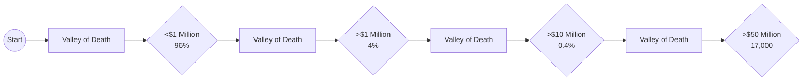

# LEARNING DAY
## Participant Workbook

**PURPOSE:**
Guide the Learning Day participant through the process of learning and applying the content of this module

1. Prior to Learning Day, read Scaling Up Assigned Pages (from Accelerator website)

2. Attend Accelerator Learning Day, and complete leadership team exercises.

3. Update Accelerator Accountability Tracking Plan.

4. Meet with Accountability Group & Coach, and share how you are applying leadership team exercises and results.

---

# PEOPLE
* Is your team happy & engaged?
* Would you enthusiastically rehire everyone on your team?

EOA | SCALING UP A GAZELLES COMPANY

----

# AGENDA
**Arrival and Intro**
* Core Values
* Culture

**AM Break**
* Functional Accountability
* Team Growth

**Lunch Break**
* Speaker/Panel

**PM Break**
* Assessments (DISC)
* Love/Loathe
* Vision Summary: Goal Setting
* Housekeeping

EOA

----

# EO Accelerator

To empower entrepreneurs with the **TOOLS**, <mark>**COMMUNITY**</mark>, and <mark>**ACCOUNTABILITY**</mark> to aggressively grow and master their business.

SCALING UP A GAZELLES COMPANY | EOA

----

# What did you try?

SCALING UP A GAZELLES COMPANY | EOA

---

# Introductions

*   Introduce Yourself & Company
*   Biggest Win?
*   Biggest Challenge Right Now?

SCALING UP A GAZELLES COMPANY
EOA

# Growth is Hard

**32.5 Million Firms**

<page_footer>
SCALING UP A GAZELLES COMPANY
EOA
</page_footer>

# THE $105 TRILLION WORLD ECONOMY
## 2023 GLOBAL GDP

According to IMF projections, global nominal GDP will reach $105 trillion in 2023. However, key economies like Russia, Canada, and Saudi Arabia are facing shrinking GDPs.

### The World Economy
*   2000-2023
*   $34T to $105T

**United States**
Declined from > 60 to 26

<table>
  <thead>
    <tr>
        <th></th>
        <th>Economy</th>
        <th>GDP Value / Growth</th>
        <th>Note</th>
    </tr>
  </thead>
  <tbody>
    <tr>
        <td></td>
<td>World Economy</td>
<td>5.3% (2.8% inflation adjusted)</td>
<td>IMF projection</td>
    </tr>
<tr>
        <td></td>
<td>Russia</td>
<td>-$150B</td>
<td>Drop is more than Ukraine's total $149B GDP</td>
    </tr>
<tr>
        <td></td>
<td>India</td>
<td>5th Largest</td>
<td>Dethrones the UK</td>
    </tr>
<tr>
        <td></td>
<td>China</td>
<td>7.1%</td>
<td>Expected growth in 2023, ahead of U.S. growth of 5.5%</td>
    </tr>
  </tbody>
</table>

<page_footer>
SCALING UP A GAZELLES COMPANY
EOA
</page_footer>

# EOA Program Tools

*   Simple
*   Practical
*   Actionable

## Bias toward ACTION

<page_footer>
EOA
SCALING UP A GAZELLES COMPANY
</page_footer>

---

EOA SCALING UP A GAZELLES COMPANY

---

**Agile Scaleup**
EOA
SCALING UP
A GAZELLES COMPANY

----

EOA
SCALING UP
A GAZELLES COMPANY

----

# Core Values
Your handful of rules that remain constant
EOA
SCALING UP
A GAZELLES COMPANY

----

*Verne Harnish*
EOA
SCALING UP
A GAZELLES COMPANY

---

---

SCALING UP
A GAZELLES COMPANY

# Atlassian Core Values
EOA

----

## Core Values
* Not Aspirational (Wish you were)
* Not Generic Words (Integrity, teamwork)
* Not Too Many (4-5)

SCALING UP A GAZELLES COMPANY
EOA

----

### People
**Core Values: Mission to Mars**

The 5-7 passengers on the Mission to Mars rocket that best represent your culture:
* High credibility with peers
* Most competent in their roles
* Gut-level understanding of core values

**List Your 5-7 Best People:**

<table>
  <thead>
    <tr>
      <th>Jimmy H</th>
      <th>CLIENT FOCUSED</th>
    </tr>
  </thead>
  <tbody>
    <tr>
      <td>Carlos S</td>
<td>DETAIL FREAK</td>
    </tr>
<tr>
      <td>Sheila E</td>
<td>QUICK TO ACT</td>
    </tr>
<tr>
      <td>Tom J</td>
<td>INITIATIVE</td>
    </tr>
<tr>
      <td>Declan M</td>
<td>IDEAS</td>
    </tr>
<tr>
      <td>Bob D</td>
<td>WILLING TO DEBATE</td>
    </tr>
<tr>
      <td>Debra H</td>
<td>CUSTOMER ADVOCATE</td>
    </tr>
  </tbody>
</table>

**Core Values Criteria:**
* Small set of timeless principles
* Intrinsic value and importance
* Independent of operational realities

**Our Core Values:**
1. <u>WE ACT IN OUR CLIENTS' BEST INTEREST</u>
2. <u>WE THRIVE ON DETAIL.</u>
3. <u>WE HAVE A BIAS FOR ACTION.</u>
4. <u>WE RELY ON INITIATIVE.</u>
5. <u>WE ENSURE THE BEST IDEA WINS.</u>
6.     

SCALING UP A GAZELLES COMPANY
EOA

----

## Ask AI for Values

I really value <mark>name, name, name</mark> on my team because of <mark>quality, quality, quality.</mark>

I would love to hire <mark>name</mark> and <mark>name</mark> for my team because of <mark>quality</mark> and <mark>quality.</mark>

I would NEVER hire <mark>name</mark> and <mark>name</mark> for my team because of <mark>quality</mark> and <mark>quality.</mark>

Please also use at anything on our website at company.com and help me create a draft of our 4-5 core values using non-generic statements 2-5 words each.

Ask me up to 5 questions until you have enough information to draft my company core values.

SCALING UP A GAZELLES COMPANY
EOA

---

# People
## Core Values: Mission to Mars

**The 5-7 passengers on the Mission to Mars rocket that best represent your culture:**
* High credibility with peers
* Most competent in their roles
* Gut-level understanding of core values

### List Your 5-7 Best People:

<table>
  <tbody>
    <tr>
        <td>Who? (Names)</td>
<td>Why? (Attributes)</td>
    </tr>
<tr>
        <td>1.     </td>
<td>    </td>
    </tr>
<tr>
        <td>2.     </td>
<td>    </td>
    </tr>
<tr>
        <td>3.     </td>
<td>    </td>
    </tr>
<tr>
        <td>4.     </td>
<td>    </td>
    </tr>
<tr>
        <td>5.     </td>
<td>    </td>
    </tr>
<tr>
        <td>6.     </td>
<td>    </td>
    </tr>
<tr>
        <td>7.     </td>
<td>    </td>
    </tr>
  </tbody>
</table>

**Core Values Criteria:**
* Small set of timeless principles
* Intrinsic value and importance
* Independent of operational realities

### Our Core Values:
1.     
2.     
3.     
4.     
5.     

<description>
A light gray watermark of a rocket ship is angled upwards behind the "Our Core Values" section.
</description>

Adapted from Scaling Up by Verne Harnish & the team at ScaleUpU with permission Nov. 2021

---

EOA
SCALING UP A GAZELLES COMPANY

# Exercise
## Core Values

* Fire an offender
* Take a financial hit
* Performance - Alive among your people today

----

<page_header>
EO Accelerator Vision Summary
SCALING UP A GAZELLES COMPANY
</page_header>

<table>
  <thead>
    <tr>
        <th>Core Values</th>
        <th>Purpose</th>
        <th>Brand Promises</th>
    </tr>
  </thead>
  <tbody>
    <tr>
        <td>1. We act in our clients' best interest</td>
        <td rowspan="5">WE UNLEASH POTENTIAL</td>
<td>1. Best implementation: faster, right the first time</td>
    </tr>
<tr>
        <td>2. We thrive on detail.</td>
<td>2. Best partners: service &amp; support</td>
    </tr>
<tr>
        <td>3. We have a bias for action.</td>
<td>3. Fastest ROI</td>
    </tr>
<tr>
        <td>4. We rely on initiative.</td>
<td></td>
    </tr>
<tr>
        <td>5. We ensure the best idea wins.</td>
<td></td>
    </tr>
  </tbody>
</table>

**BHAG***
$1 Billion ROI for Our Clients

**STRATEGIC PRIORITIES**

<table>
  <thead>
    <tr>
        <th>3-5 Years</th>
        <th>1 Year</th>
        <th>Quarter</th>
    </tr>
  </thead>
  <tbody>
    <tr>
        <td>1. Launch European Operation</td>
<td>1. Add Resource Allocation s/w support</td>
<td>1. Add 2 strategic partners</td>
    </tr>
<tr>
        <td>2. Expand from consulting support to legal, accounting and engineering</td>
<td>2. Add 5 new strategic alliances</td>
<td>2. Hire VP of Sales</td>
    </tr>
<tr>
        <td>3. Open second US office or expand current office</td>
<td>3. Implement Agile/Scrum methodology with all development teams</td>
<td>3. Implement eNPS</td>
    </tr>
<tr>
        <td>4. Increase outsourced dev. to 50%</td>
<td>4. Add 1 new outsourced dev. partner</td>
<td></td>
    </tr>
<tr>
        <td>5. Research disruptive technologies</td>
<td>5. Implement TopGrading &amp; Measure Talent</td>
<td></td>
    </tr>
  </tbody>
</table>

<table>
  <thead>
    <tr>
        <th>Your KPIs</th>
        <th>Goal</th>
        <th>Critical #: People or S/S</th>
        <th>Your Quarterly Priorities</th>
        <th>Due</th>
    </tr>
  </thead>
  <tbody>
    <tr>
        <td>% A-Players</td>
<td>40%</td>
<td>10 8 1st Demos 4</td>
<td>Implement eNPS survey/ Process</td>
<td>EOQ</td>
    </tr>
<tr>
        <td>eNPS</td>
<td>60%</td>
<td>Critical #: Process or P/L</td>
<td>Pilot Topgrading for VP Sales hire</td>
<td>EOQ</td>
    </tr>
<tr>
        <td>Stay Interviews/wk</td>
<td>2</td>
<td>60% Close Ratios 45% 30%</td>
<td>Implement Agile/Scrum w/ 2 teams</td>
<td>EOQ</td>
    </tr>
  </tbody>
</table>

EOA

----

<page_header>
EOA
SCALING UP A GAZELLES COMPANY
</page_header>

# Culture
## Actions to Live By

----

<page_header>
SCALING UP A GAZELLES COMPANY
EOA
</page_header>

# Culture Inquiry
* What is culture?
* What are the elements of culture?

---

EOA
SCALING UP

***

**Be A Pro**
WE WORK TO BE THE BEST AT OUR JOBS SO THAT WE CAN GET THE BEST OUT OF EACH OTHER.

**PLAY for-KEEPS**
WE STRIVE TO BE The Best We Can Be, THROUGH OUR INDIVIDUAL EFFORTS AND COLLECTIVELY AS A TEAM.

**We Learn!!**
WE SEEK TO BE Continuous Learners AT PROSERVICE.

**Pro FIRST**
OUR Company AND OUR Culture ARE THINGS EACH OF US OWNS AND TO WHICH EVERYONE CONTRIBUTES.

**CLIENTS-are-PARTNERS**
OUR CLIENTS' SUCCESS IS OUR SUCCESS. WE BRING PASSION AND DISCIPLINE TO MAKING IMPROVEMENTS FOR CLIENTS.

SCALING UP
A GAZELLES COMPANY
EOA

***

<page_footer>
EOA
SCALING UP
A GAZELLES COMPANY
</page_footer>

***

**GOCAR TOURS MANIFESTO**
**OUR PURPOSE >** UNIQUE & AWESOME EXPERIENCES

**OUR VALUES:**
*   **HAPPINESS** - HAPPY PEOPLE MAKE A HAPPY COMPANY.
*   **CUSTOMER FIRST** - WE'RE A PEOPLE BUSINESS, PROVIDING FUN.
*   **TEAMWORK** - WE'RE ALL CONNECTED. EVERY POSITION MATTERS & IMPACTS THE WHOLE TEAM.
*   **DEPENDABLE** - YOU CAN COUNT ON US TO DELIVER, OR MAKE IT RIGHT.
*   **LOOKING GOOD** - OUR THEME: WE CARE ABOUT OUR IMAGE AND PAY ATTENTION TO DETAILS. THIS QUARTER TOP GEAR!

**Manifesto:**
*   Purpose
*   Values
*   Promises
*   BHAG

**GoCar**
1-800-91-GO-CAR
www.GoCarSF.com
2715 HYDE STREET

<page_footer>
SCALING UP
A GAZELLES COMPANY
EOA
</page_footer>

---

**Rackspace Culture**

Our "CORE VALUES" are our driving principles. We live them everyday.

----

**Our Purpose...**
is to provide *amazing* customer experiences

**TREAT CUSTOMERS THE WAY YOU WOULD LIKE A SERVICE PROVIDER TO TREAT YOUR PARENTS**

----

# Elements of Culture

* Rituals & Traditions
* Ceremonies
* Events
* Displays & Attire
* Symbols & Tokens
* Rewards & Penalties
* Stories & Legends
* Foods, Songs
* Values in Action
* Rules
* Rites of Passage
* Training & Lessons

EOA SCALING UP A GAZELLES COMPANY

----

# When Culture Comes Alive

* Recruiting and Selection
* Onboarding
* Performance Appraisals
* Training Programs
* Recognition & Awards
* Themes
* Company Communications
* External Communications

<page_footer>
EOA SCALING UP A GAZELLES COMPANY
</page_footer>

---

**Attributes of your Actions to Live By:**
* Actionable ideas to make them come alive
* Make your actions tangible and real
* Inspirational, fun, and energetic actions

### Each team member:
Identify 3 potential "actions to live by" for your company's core purpose, core values and BHAG®

**Purpose**:     
    
    

**Values**:     
    
    

**BHAG®**:     
    
    

### Collaborate as a team:
Finalize the top 2 "actions to live by" for your company's core purpose, core values and BHAG®

**Purpose**:     
    

**Values**:     
    

**BHAG®**:     
    

Adapted from Scaling Up by Verne Harnish & the team at ScaleUpU with permission Nov. 2021

---

# Exercise
## Actions to Live By
* Core Purpose (Why)
* Core Values (How)
* BHAG (What)

EOA
SCALING UP
A GAZELLES COMPANY

----

### People
#### Actions to Live By

**Attributes of your Actions to Live By:**
* Actionable ideas to make them come alive
* Make your actions tangible and real
* Inspirational, fun, and energetic actions

**Each team member:**
Identify 3 potential "actions to live by" for your company's core purpose, core values and BHAG®
* **Purpose:** Create a manifesto, read daily, put on the back of our t-shirts, add to our trucks, website, social descriptions, video series, etc
* **Values:** Same as purpose but add... Employee Rewards and evaluations, Hiring and onboarding
* **BHAG®:** Website counter, office thermometer style poster

**Collaborate as a team:**
Finalize the top 2 "actions to live by" for your company's core purpose, core values and BHAG®
* **Purpose:** Create a manifesto, read daily, put on the back of our t-shirts
* **Values:** Same as purpose but add... Employee Rewards and evaluations, Hiring and onboarding
* **BHAG®:** Office thermometer style poster

<page_header>
EOA
SCALING UP
A GAZELLES COMPANY
</page_header>

----

# Ask AI

> I want to design a set of five practices, rituals and traditions to build our company culture around our core values.
>
> We are already doing these things .....
>
> Ask me up to 5 questions, one at a time, until you have enough information to give me suggestions for our company culture practices.

SCALING UP A GAZELLES COMPANY
EOA

----

# FACe
## Functional Accountability

<page_footer>
EOA
SCALING UP A GAZELLES COMPANY
</page_footer>

---

---

# This is the story of 4 people:
EOA

**EVERYBODY SOMEBODY ANYBODY NOBODY**

SCALING UP
A GAZELLES COMPANY

----

SCALING UP
A GAZELLES COMPANY

# Getting the right people on the bus

EOA

----

# The Right Questions

* What are my RIGHT seats?
* Do I have the RIGHT people in each seat?
* Are the RIGHT people doing the RIGHT things?

SCALING UP
A GAZELLES COMPANY

EOA

----

# Exercise
## Core Functions (FACe)

* What are my RIGHT seats?
* Do I have the RIGHT people in each seat?
* Are the RIGHT people doing the RIGHT things?

EOA

SCALING UP
A GAZELLES COMPANY

---

# FACe – Function Accountability Chart

## Right People

### Head of Company
### Marketing
### R&D
### Sales
### Operations
### Treasury
### Controller
### Information Technology
### Human Resources
### Talent Development
### Customer Advocacy

SCALING UP A GAZELLES COMPANY

----

# Ask AI

> I need to decide on what functional role to fill next. I'm considering      or     .
>
> Ask me up to 5 questions, one at a time, until you have enough information to give me reasons pro and con each one.

<page_footer>
SCALING UP A GAZELLES COMPANY EOA
</page_footer>

---

# People
## Function Accountability Chart (FACe)

1. Name the person accountable for each function.
2. Ask the four questions at the bottom of the page re: whose name(s) you listed for each function.
3. List Key Performance Indicators (KPIs) for each function.
4. Take your Profit and Loss (P&L), Balance Sheet, and Cash Flow accounting statements and assign a person to each line item, then derive appropriate Results/Outcomes for each function.

<table>
  <thead>
    <tr>
        <th>Functions</th>
        <th>1 Person Accountable</th>
        <th>3 Leading Indicators (Key Performance Indicators)</th>
        <th>4 Results/Outcomes (P/L or B/S Items)</th>
    </tr>
  </thead>
  <tbody>
    <tr>
        <td>    </td>
<td>    </td>
<td>    </td>
<td>    </td>
    </tr>
<tr>
        <td>    </td>
<td>    </td>
<td>    </td>
<td>    </td>
    </tr>
<tr>
        <td>    </td>
<td>    </td>
<td>    </td>
<td>    </td>
    </tr>
<tr>
        <td>    </td>
<td>    </td>
<td>    </td>
<td>    </td>
    </tr>
<tr>
        <td>    </td>
<td>    </td>
<td>    </td>
<td>    </td>
    </tr>
<tr>
        <td>    </td>
<td>    </td>
<td>    </td>
<td>    </td>
    </tr>
<tr>
        <td>    </td>
<td>    </td>
<td>    </td>
<td>    </td>
    </tr>
<tr>
        <td>    </td>
<td>    </td>
<td>    </td>
<td>    </td>
    </tr>
<tr>
        <td>    </td>
<td>    </td>
<td>    </td>
<td>    </td>
    </tr>
<tr>
        <td>    </td>
<td>    </td>
<td>    </td>
<td>    </td>
    </tr>
<tr>
        <td>    </td>
<td>    </td>
<td>    </td>
<td>    </td>
    </tr>
<tr>
        <td>    </td>
<td>    </td>
<td>    </td>
<td>    </td>
    </tr>
<tr>
        <td>Heads of Business Units</td>
<td>    </td>
<td>    </td>
<td>    </td>
    </tr>
<tr>
        <td>•     </td>
<td>    </td>
<td>    </td>
<td>    </td>
    </tr>
<tr>
        <td>•     </td>
<td>    </td>
<td>    </td>
<td>    </td>
    </tr>
<tr>
        <td>•     </td>
<td>    </td>
<td>    </td>
<td>    </td>
    </tr>
<tr>
        <td>•     </td>
<td>    </td>
<td>    </td>
<td>    </td>
    </tr>
  </tbody>
</table>

**2 Identify: 1.** More than 1 person in a seat; **2.** Person in more than 1 seat; **3.** Empty seats; **4.** Enthusiastically rehire?

Adapted from Scaling Up by Verne Harnish & the team at ScaleUpU with permission Nov. 2021

---

Right Things

# People
## Function Accountability Chart (FACe)

1. Name the person accountable for each function.
2. Ask the four questions at the bottom of the page re: whose name(s) you listed for each function.
3. List Key Performance Indicators (KPIs) for each function.
4. Take your Profit and Loss (P&L), Balance Sheet, and Cash Flow accounting statements and assign a person to each line item, then derive appropriate Results/Outcomes for each function.

<table>
  <thead>
    <tr>
        <th>Functions</th>
        <th>Person Accountable</th>
        <th>Leading Indicators (Key Performance Indicators)</th>
        <th>Results/Outcomes (P&amp;L or B/S items)</th>
    </tr>
  </thead>
  <tbody>
    <tr>
        <td>Head of Company</td>
<td>    </td>
<td>    </td>
<td>    </td>
    </tr>
<tr>
        <td>Marketing</td>
<td>    </td>
<td>    </td>
<td>    </td>
    </tr>
<tr>
        <td>R&amp;D/Innovation</td>
<td>    </td>
<td>    </td>
<td>    </td>
    </tr>
<tr>
        <td>Sales</td>
<td>    </td>
<td>    </td>
<td>    </td>
    </tr>
<tr>
        <td>Operations</td>
<td>    </td>
<td>    </td>
<td>    </td>
    </tr>
<tr>
        <td>Treasury</td>
<td>    </td>
<td>    </td>
<td>    </td>
    </tr>
<tr>
        <td>Controller</td>
<td>    </td>
<td>    </td>
<td>    </td>
    </tr>
<tr>
        <td>Information Technology</td>
<td>    </td>
<td>    </td>
<td>    </td>
    </tr>
<tr>
        <td>Human Resources</td>
<td>    </td>
<td>    </td>
<td>    </td>
    </tr>
<tr>
        <td>Talent Development/Learning</td>
<td>    </td>
<td>    </td>
<td>    </td>
    </tr>
<tr>
        <td>Customer Advocacy</td>
<td>    </td>
<td>    </td>
<td>    </td>
    </tr>
<tr>
        <td rowspan="4">Heads of Business Units</td>
<td>    </td>
<td>    </td>
<td>    </td>
    </tr>
<tr>
        <td>    </td>
<td>    </td>
<td>    </td>
    </tr>
<tr>
        <td>    </td>
<td>    </td>
<td>    </td>
    </tr>
<tr>
        <td>    </td>
<td>    </td>
<td>    </td>
    </tr>
  </tbody>
</table>

**Identify:** 1. More than 1 person in a seat; 2. Person in more than 1 seat; 3. Empty seats; 4. Enthusiastically rehire?

EOA | SCALING UP A GAZELLES COMPANY

----

<page_header>
Right
</page_header>

# People
## Function Accountability Chart (FACe)

1. Name the person accountable for each function.
2. Ask the four questions at the bottom of the page re: whose name(s) you listed for each function.
3. List Key Performance Indicators (KPIs) for each function.
4. Take your Profit and Loss (P&L), Balance Sheet, and Cash Flow accounting statements and assign a person to each line item, then derive appropriate Results/Outcomes for each function.

<table>
  <thead>
    <tr>
        <th>Functions</th>
        <th>Person Accountable</th>
        <th>Leading Indicators (Key Performance Indicators)</th>
        <th>Results/Outcomes (P&amp;L or B/S items)</th>
    </tr>
  </thead>
  <tbody>
    <tr>
        <td>Head of Company</td>
<td>    </td>
<td>    </td>
<td>    </td>
    </tr>
<tr>
        <td>Marketing</td>
<td>    </td>
<td>    </td>
<td>    </td>
    </tr>
<tr>
        <td>R&amp;D/Innovation</td>
<td>    </td>
<td>    </td>
<td>    </td>
    </tr>
<tr>
        <td>Sales</td>
<td>    </td>
<td>    </td>
<td>    </td>
    </tr>
<tr>
        <td>Operations</td>
<td>    </td>
<td>    </td>
<td>    </td>
    </tr>
<tr>
        <td>Treasury</td>
<td>    </td>
<td>    </td>
<td>    </td>
    </tr>
<tr>
        <td>Controller</td>
<td>    </td>
<td>    </td>
<td>    </td>
    </tr>
<tr>
        <td>Information Technology</td>
<td>    </td>
<td>    </td>
<td>    </td>
    </tr>
<tr>
        <td>Human Resources</td>
<td>    </td>
<td>    </td>
<td>    </td>
    </tr>
<tr>
        <td>Talent Development/Learning</td>
<td>    </td>
<td>    </td>
<td>    </td>
    </tr>
<tr>
        <td>Customer Advocacy</td>
<td>    </td>
<td>    </td>
<td>    </td>
    </tr>
<tr>
        <td rowspan="4">Heads of Business Units</td>
<td>    </td>
<td>    </td>
<td>    </td>
    </tr>
<tr>
        <td>    </td>
<td>    </td>
<td>    </td>
    </tr>
<tr>
        <td>    </td>
<td>    </td>
<td>    </td>
    </tr>
<tr>
        <td>    </td>
<td>    </td>
<td>    </td>
    </tr>
  </tbody>
</table>

**Identify:** 1. More than 1 person in a seat; 2. Person in more than 1 seat; 3. Empty seats; 4. Enthusiastically rehire?

<page_footer>
EOA | SCALING UP A GAZELLES COMPANY
</page_footer>

----

<page_header>
Who
</page_header>

<table>
  <thead>
    <tr>
        <th>AnyCo Technologies</th>
        <th>2005</th>
        <th>%</th>
        <th>2006</th>
        <th>%</th>
        <th>Change</th>
        <th>Change %</th>
    </tr>
  </thead>
  <tbody>
    <tr>
        <td>Net Sales</td>
<td>1,653,340</td>
<td>100.00%</td>
<td>1,844,344</td>
<td>100.00%</td>
<td>0.00%</td>
<td>0.0%</td>
    </tr>
<tr>
        <td>Cost of Goods Sold</td>
<td>685,666</td>
<td>41.47%</td>
<td>748,945</td>
<td>40.60%</td>
<td>0.00%</td>
<td>0.0%</td>
    </tr>
<tr>
        <td>Raw Materials</td>
<td>685,666</td>
<td>41.47%</td>
<td>748,945</td>
<td>40.60%</td>
<td>0.00%</td>
<td>0.0%</td>
    </tr>
<tr>
        <td>Direct Overheads</td>
<td>0</td>
<td>0.00%</td>
<td>0</td>
<td>0.00%</td>
<td>0.00%</td>
<td>0.0%</td>
    </tr>
<tr>
        <td>Direct Labor</td>
<td>0</td>
<td>0.00%</td>
<td>0</td>
<td>0.00%</td>
<td>0.00%</td>
<td>0.0%</td>
    </tr>
<tr>
        <td>Other Direct Expenses</td>
<td>0</td>
<td>0.00%</td>
<td>0</td>
<td>0.00%</td>
<td>0.00%</td>
<td>0.0%</td>
    </tr>
<tr>
        <td>Gross Profit</td>
<td>967,674</td>
<td>58.53%</td>
<td>1,095,400</td>
<td>59.40%</td>
<td>0.00%</td>
<td>0.0%</td>
    </tr>
<tr>
        <td>SG&amp;A expenses</td>
<td>821,351</td>
<td>49.68%</td>
<td>929,161</td>
<td>50.38%</td>
<td>0.00%</td>
<td>0.0%</td>
    </tr>
<tr>
        <td>Wages &amp; Related Expenses</td>
<td>455,345</td>
<td>27.54%</td>
<td>524,455</td>
<td>28.44%</td>
<td>0.00%</td>
<td>0.0%</td>
    </tr>
<tr>
        <td>Taxes &amp; Utilities</td>
<td>12,750</td>
<td>0.77%</td>
<td>13,324</td>
<td>0.72%</td>
<td>0.00%</td>
<td>0.0%</td>
    </tr>
<tr>
        <td>Repairs</td>
<td>23,456</td>
<td>1.42%</td>
<td>28,445</td>
<td>1.54%</td>
<td>0.00%</td>
<td>0.0%</td>
    </tr>
<tr>
        <td>Employee Benefits</td>
<td>25,095</td>
<td>1.52%</td>
<td>23,242</td>
<td>1.26%</td>
<td>0.00%</td>
<td>0.0%</td>
    </tr>
<tr>
        <td>Selling &amp; G&amp;A expenses</td>
<td>255,650</td>
<td>15.46%</td>
<td>288,445</td>
<td>15.64%</td>
<td>0.00%</td>
<td>0.0%</td>
    </tr>
<tr>
        <td>Depreciation &amp; amortization</td>
<td>49,055</td>
<td>2.97%</td>
<td>51,249</td>
<td>2.78%</td>
<td>0.00%</td>
<td>0.0%</td>
    </tr>
<tr>
        <td>Operating Income</td>
<td>146,323</td>
<td>8.85%</td>
<td>166,239</td>
<td>9.01%</td>
<td>0.00%</td>
<td>0.0%</td>
    </tr>
<tr>
        <td>Non-operating income (expense)</td>
<td>0</td>
<td>0.00%</td>
<td>0</td>
<td>0.00%</td>
<td>0.00%</td>
<td>0.0%</td>
    </tr>
<tr>
        <td>Interest expense</td>
<td>8,824</td>
<td>0.53%</td>
<td>8,945</td>
<td>0.49%</td>
<td>0.00%</td>
<td>0.0%</td>
    </tr>
<tr>
        <td>Pre-tax income (loss)</td>
<td>137,499</td>
<td>8.32%</td>
<td>157,294</td>
<td>8.53%</td>
<td>0.00%</td>
<td>0.0%</td>
    </tr>
<tr>
        <td>Provision for income taxes</td>
<td>26,812</td>
<td>1.62%</td>
<td>30,672</td>
<td>1.66%</td>
<td>0.00%</td>
<td>0.0%</td>
    </tr>
<tr>
        <td>Net income (loss)</td>
<td>110,687</td>
<td>6.69%</td>
<td>126,622</td>
<td>6.87%</td>
<td>0.00%</td>
<td>0.0%</td>
    </tr>
<tr>
        <td>Preferred stock dividend</td>
<td>0</td>
<td>0.00%</td>
<td>0</td>
<td>0.00%</td>
<td>0.00%</td>
<td>0.0%</td>
    </tr>
<tr>
        <td>Net income attributable to common stock</td>
<td>110,679</td>
<td>    </td>
<td>126,622</td>
<td>    </td>
<td>    </td>
<td>    </td>
    </tr>
<tr>
        <td>Dividends payable on common stock</td>
<td>    </td>
<td>    </td>
<td>    </td>
<td>    </td>
<td>    </td>
<td>    </td>
    </tr>
<tr>
        <td>Net Increase/(Decrease) in Reserves</td>
<td>110,679</td>
<td>    </td>
<td>126,622</td>
<td>    </td>
<td>    </td>
<td>    </td>
    </tr>
<tr>
        <td>Effective Tax Rates</td>
<td>19.50%</td>
<td>    </td>
<td>19.50%</td>
<td>    </td>
<td>1.00%</td>
<td>1.00%</td>
    </tr>
  </tbody>
</table>

<page_footer>
EOA | SCALING UP A GAZELLES COMPANY
</page_footer>

----

# People
## Function Accountability Chart (FACe)

1. Name the person accountable for each function.
2. Ask the four questions at the bottom of the page re: whose name(s) you listed for each function.
3. List Key Performance Indicators (KPIs) for each function.
4. Take your Profit and Loss (P&L), Balance Sheet, and Cash Flow accounting statements and assign a person to each line item, then derive appropriate Results/Outcomes for each function.

<table>
  <thead>
    <tr>
        <th>Functions</th>
        <th>Person Accountable</th>
        <th>Leading Indicators (Key Performance Indicators)</th>
        <th>Results/Outcomes (P&amp;L or B/S items)</th>
    </tr>
  </thead>
  <tbody>
    <tr>
        <td>Head of Company</td>
<td>Jane S</td>
<td>Full &amp; Green</td>
<td>Net Profit &amp; Co Val</td>
    </tr>
<tr>
        <td>Marketing</td>
<td>Jimi H</td>
<td>Qual Leads</td>
<td>Cust Acquisition $</td>
    </tr>
<tr>
        <td>R&amp;D/Innovation</td>
<td>Carlos S</td>
<td>New Code</td>
<td>IP Count</td>
    </tr>
<tr>
        <td>Sales</td>
<td>Sheila E</td>
<td>Pipeline Value</td>
<td>Net Sales &amp; GM</td>
    </tr>
<tr>
        <td>Operations</td>
<td>Tom J</td>
<td>Incidents</td>
<td>Opex %</td>
    </tr>
<tr>
        <td>Treasury</td>
<td>Declan M</td>
<td>Avg Rec Days</td>
<td>Months Cash OH</td>
    </tr>
<tr>
        <td>Controller</td>
<td>Bob D</td>
<td>Timely Statements</td>
<td>% of Budget</td>
    </tr>
<tr>
        <td>Information Technology</td>
<td>Debra H</td>
<td>Uptime</td>
<td>% IT Budget</td>
    </tr>
<tr>
        <td>Human Resources</td>
<td>Bob M</td>
<td>eNPS</td>
<td>A Player Ratio</td>
    </tr>
<tr>
        <td>Talent Development/Learning</td>
<td>Darryl H</td>
<td>Learning Days</td>
<td>Errors</td>
    </tr>
<tr>
        <td>Customer Advocacy</td>
<td>Rick J</td>
<td>Time to Answer</td>
<td>NPS</td>
    </tr>
<tr>
        <td rowspan="4">Heads of Business Units</td>
<td>    </td>
<td>    </td>
<td>    </td>
    </tr>
<tr>
        <td>    </td>
<td>    </td>
<td>    </td>
    </tr>
<tr>
        <td>    </td>
<td>    </td>
<td>    </td>
    </tr>
<tr>
        <td>    </td>
<td>    </td>
<td>    </td>
    </tr>
  </tbody>
</table>

**Identify:** 1. More than 1 person in a seat; 2. Person in more than 1 seat; 3. Empty seats; 4. Enthusiastically rehire?

<page_footer>
EOA | SCALING UP A GAZELLES COMPANY
</page_footer>

---

# Ask AI

I want to create leading and lagging KPI's for the functional roles on our Functional Accountability Chart from Scaling Up.

Ask me up to 5 questions, one at a time, until you have enough information to give me a draft.

SCALING UP A GAZELLES COMPANY | EOA

----

# Hiring Plan
## Growing & Developing

EOA | SCALING UP A GAZELLES COMPANY

----

![Recruitment advertisement for The City Bin Co. featuring World Super Welterweight Kickboxing Champion Gary Manogue. The text reads: "GET PAID WHILE YOU WORK OUT! Now Hiring for Driver's Assistants. IDEAL FOR ATHLETES. And that's exactly what World Super Welterweight Kickboxing Champion Gary Manogue did. He joined The City Bin Co. team to maximise his training schedule. This is Manogue's first seven-round fight and he has prepared with a fitness regime that involves an eight-kilometre run every morning, work-out in the gym in the evening, and in between working for The City Bin Co. 'Running after bins keeps me pretty fit too,' he says. Galway Advertiser. Please apply to careers@citybin.com with the words 'Driver's Assistants' in the subject line. www.citybin.com"](image)

SCALING UP A GAZELLES COMPANY | EOA

----

![A composite image showing the book cover of "change to strange" by Daniel M. Cable on the left, and a character breakdown of The A-Team on the right. The A-Team section includes: Murdock (multiple personalities, clinically insane, top-notch pilot, secret team member), Triple A (the only girl in the gang, information expert), Face (smooth-talking con-artist, car and equipment thief, good with numbers), Hannibal (the leader, always on the jazz, unorthodox but effective, cigar afficionado, loves it when a plan comes together), and B.A. Baracus (the muscle man and mechanical genius, bad attitude, gold digger, loves milk, hates flying).](image)

EOA | SCALING UP A GAZELLES COMPANY

---

# Fish where there are fish.

## Ask AI

When we try to hire people we have the most trouble finding and attracting      and     . I need to find some new fishing holes and methods to attract candidates. Ask me up to 5 questions, one at a time, until you have enough information to give me some ideas.

SCALING UP A GAZELLES COMPANY EOA

---

# Hiring Process

1. Design job
2. Market job
3. Screen candidates
4. Interview well
5. Test skills
6. Verify history
7. Make offer

EOA
SCALING UP A GAZELLES COMPANY

----

# Ask AI

When we hire new people we often have trouble with     ,      and     . Our steps are .....

I need to redesign my hiring process. Ask me up to 5 questions, one at a time, until you have enough information to give me a draft.

SCALING UP A GAZELLES COMPANY
EOA

----

# Team Growth
Growing & Developing

EOA
SCALING UP A GAZELLES COMPANY

----

*Verne Harnish*

EOA
SCALING UP A GAZELLES COMPANY

---

# Exercise
## Develop Your Team
* Onboarding
* Coaching
* Ongoing Training & Development

EOA SCALING UP A GAZELLES COMPANY

---

**Cultures in which team members grow and thrive place resources, energy, and accountability in three key areas:**
* Onboarding new team members
* Regular structured internal coaching
* Ongoing learning and development

### Instructions:
Rank both the company's effectiveness and your personal leadership effectiveness in each key area. (1 = weak, 5 = strong)

<table>
  <thead>
    <tr>
        <th></th>
        <th>Company</th>
        <th>Personal</th>
    </tr>
  </thead>
  <tbody>
    <tr>
        <td>Onboarding new team members</td>
<td>    </td>
<td>    </td>
    </tr>
<tr>
        <td>Regular one-on-one coaching</td>
<td>    </td>
<td>    </td>
    </tr>
<tr>
        <td>Ongoing learning and development</td>
<td>    </td>
<td>    </td>
    </tr>
<tr>
        <td>Average</td>
<td>    </td>
<td>    </td>
    </tr>
  </tbody>
</table>

Develop a quarterly company and/or personal priority to take action on in the next quarter to improve onboarding, coaching, or team member development.

    

    

    

    

    

Adapted from Scaling Up by Verne Harnish & the team at ScaleUpU with permission Nov. 2021

---

People
Grow Your Team
EOA

**Cultures in which team members grow and thrive place resources, energy, and accountability in three key areas:**
* Onboarding new team members
* Regular structured internal coaching
* Ongoing learning and development

**Instructions:**
Rank both the company's effectiveness and your personal leadership effectiveness in each key area.
(1 = weak, 5 = strong)

<table>
  <thead>
    <tr>
        <th></th>
        <th>Company</th>
        <th>Personal</th>
    </tr>
  </thead>
  <tbody>
    <tr>
        <td>Onboarding new team members</td>
<td>1</td>
<td>1</td>
    </tr>
<tr>
        <td>Regular one-on-one coaching</td>
<td>3</td>
<td>5</td>
    </tr>
<tr>
        <td>Ongoing learning and development</td>
<td>1</td>
<td>4</td>
    </tr>
<tr>
        <td>Average</td>
<td>2</td>
<td>3</td>
    </tr>
  </tbody>
</table>

Develop a quarterly company and/or personal priority to take action on in the next quarter to improve onboarding, coaching, or team member development.

<u>New onboarding plan: Welcome Lunch, balloons etc,</u>
<u>have existing members share the values and what they</u>
<u>mean. Social post the new hire</u>
<u>Training Plan: Create a reading list for new hires and</u>
<u>weekly lunch & learn, assign a buddy</u>

EOA
SCALING UP
A GAZELLES COMPANY

***

# Ask AI

> I want to onboard, grow and develop my team better and I need some ideas but I don't have any real budget or much time to spare. Ask me up to 3 questions, one at a time, until you have enough information to give me ideas for team development.

<page_footer>
SCALING UP A GAZELLES COMPANY
EOA
</page_footer>

***

# Using Assessments

<page_footer>
EOA
SCALING UP A GAZELLES COMPANY
</page_footer>

***

### DOMINANCE
* Direct
* Results-oriented
* Firm
* Strong-willed
* Forceful

### INFLUENCE
* Outgoing
* Enthusiastic
* Optimistic
* High-spirited
* Lively

### CONSCIENTIOUSNESS
* Analytical
* Reserved
* Precise
* Private
* Systematic

### STEADINESS
* Even-tempered
* Accommodating
* Patient
* Humble
* Tactful

<page_footer>
EOA
SCALING UP A GAZELLES COMPANY
</page_footer>

---

EOA SCALING UP

### Instructions:

Consider each column, low to high, and then find and circle the 2-3 words that best represent where you fit on the scale. This begins to give you some insight into your likely DiSC profile.

<table>
  <thead>
    <tr>
        <th></th>
        <th>Dominance</th>
        <th>Influence</th>
        <th>Steadiness</th>
        <th>Conscientiousness</th>
    </tr>
  </thead>
  <tbody>
    <tr>
        <td>High</td>
<td>Demanding</td>
<td>Gregarious</td>
<td>Patient</td>
<td>Cautious</td>
    </tr>
<tr>
        <td></td>
<td>Driving</td>
<td>Persuasive</td>
<td>Predictable</td>
<td>Perfectionist</td>
    </tr>
<tr>
        <td></td>
<td>Forceful</td>
<td>Inspiring</td>
<td>Passive</td>
<td>Systematic</td>
    </tr>
<tr>
        <td></td>
<td>Daring</td>
<td>Enthusiastic</td>
<td>Complacent</td>
<td>Careful</td>
    </tr>
<tr>
        <td></td>
<td>Determined</td>
<td>Sociable</td>
<td>Stable</td>
<td>Analytical</td>
    </tr>
<tr>
        <td> </td>
<td>Competitive</td>
<td>Poised</td>
<td>Consistent</td>
<td>Orderly</td>
    </tr>
<tr>
        <td></td>
<td>Responsible</td>
<td>Charming</td>
<td>Steady</td>
<td>Neat</td>
    </tr>
<tr>
        <td> </td>
<td>Inquisitive</td>
<td>Convincing</td>
<td>Outgoing</td>
<td>Balanced</td>
    </tr>
<tr>
        <td></td>
<td>Conservative</td>
<td>Reflective</td>
<td>Restless</td>
<td>Independent</td>
    </tr>
<tr>
        <td></td>
<td>Mild</td>
<td>Matter-of-Fact</td>
<td>Active</td>
<td>Rebellious</td>
    </tr>
<tr>
        <td></td>
<td>Agreeable</td>
<td>Withdrawn</td>
<td>Spontaneous</td>
<td>Careless</td>
    </tr>
<tr>
        <td>Low</td>
<td>Unobtrusive</td>
<td>Aloof</td>
<td>Impetuous</td>
<td>Defiant</td>
    </tr>
  </tbody>
</table>

**How do you think the others on your team show up?**
    

**How can you work better together?**
    

**What's the value of each area and style?**
    

Adapted from Scaling Up by Verne Harnish & the team at ScaleUpU with permission Nov. 2021

---

People
Introduction to DiSC Profiles
EOA

# Exercise
## Intro to DiSC

**Instructions:**
Consider each column, low to high, and then find and circle the 2-3 words that best represent where you fit on the scale. This begins to give you some insight into your likely DiSC profile.

<table>
  <thead>
    <tr>
        <th></th>
        <th>Dominance</th>
        <th>Influence</th>
        <th>Steadiness</th>
        <th>Conscientiousness</th>
    </tr>
  </thead>
  <tbody>
    <tr>
        <td>High</td>
<td>Demanding</td>
<td>Gregarious</td>
<td>Patient</td>
<td>Cautious</td>
    </tr>
<tr>
        <td></td>
<td>Driving</td>
<td>Persuasive</td>
<td>Predictable</td>
<td>Perfectionist</td>
    </tr>
<tr>
        <td></td>
<td>Forceful</td>
<td>Inspiring</td>
<td>Passive</td>
<td>Systematic</td>
    </tr>
<tr>
        <td></td>
<td>Daring</td>
<td>Enthusiastic</td>
<td>Complacent</td>
<td>Careful</td>
    </tr>
<tr>
        <td></td>
<td>Determined</td>
<td>Sociable</td>
<td>Stable</td>
<td>Analytical</td>
    </tr>
<tr>
        <td></td>
<td>Competitive</td>
<td>Poised</td>
<td>Consistent</td>
<td>Orderly</td>
    </tr>
<tr>
        <td></td>
<td>Responsible</td>
<td>Charming</td>
<td>Steady</td>
<td>Neat</td>
    </tr>
<tr>
        <td></td>
<td>Inquisitive</td>
<td>Convincing</td>
<td>Outgoing</td>
<td>Balanced</td>
    </tr>
<tr>
        <td></td>
<td>Conservative</td>
<td>Reflective</td>
<td>Restless</td>
<td>Independent</td>
    </tr>
<tr>
        <td></td>
<td>Mild</td>
<td>Matter-of-Fact</td>
<td>Active</td>
<td>Rebellious</td>
    </tr>
<tr>
        <td></td>
<td>Agreeable</td>
<td>Withdrawn</td>
<td>Spontaneous</td>
<td>Careless</td>
    </tr>
<tr>
        <td>Low</td>
<td>Unobtrusive</td>
<td>Aloof</td>
<td>Impetuous</td>
<td>Defiant</td>
    </tr>
  </tbody>
</table>

**How do you think the others on your team show up?**
    

**How can you work better together?**
    

**What's the value of each area and style?**
    

EOA
SCALING UP A GAZELLES COMPANY

***

<page_header>
People
Introduction to DiSC Profiles
EOA
</page_header>

**Instructions:**
Consider each column, low to high, and then find and circle the 2-3 words that best represent where you fit on the scale. This begins to give you some insight into your likely DiSC profile.

<table>
  <thead>
    <tr>
        <th></th>
        <th>Dominance</th>
        <th>Influence</th>
        <th>Steadiness</th>
        <th>Conscientiousness</th>
    </tr>
  </thead>
  <tbody>
    <tr>
        <td>High</td>
<td>&lt;mark style="background-color: yellow"&gt;Demanding</mark></td>
<td>Gregarious</td>
<td>Patient</td>
<td>Cautious</td>
    </tr>
<tr>
        <td></td>
<td>&lt;mark style="background-color: yellow"&gt;Driving</mark></td>
<td>Persuasive</td>
<td>Predictable</td>
<td>Perfectionist</td>
    </tr>
<tr>
        <td></td>
<td>&lt;mark style="background-color: yellow"&gt;Forceful</mark></td>
<td>&lt;mark style="background-color: yellow"&gt;Inspiring</mark></td>
<td>Passive</td>
<td>Systematic</td>
    </tr>
<tr>
        <td></td>
<td>Daring</td>
<td>&lt;mark style="background-color: yellow"&gt;Enthusiastic</mark></td>
<td>Complacent</td>
<td>Careful</td>
    </tr>
<tr>
        <td></td>
<td>Determined</td>
<td>Sociable</td>
<td>Stable</td>
<td>Analytical</td>
    </tr>
<tr>
        <td></td>
<td>Competitive</td>
<td>Poised</td>
<td>Consistent</td>
<td>Orderly</td>
    </tr>
<tr>
        <td></td>
<td>Responsible</td>
<td>Charming</td>
<td>Steady</td>
<td>Neat</td>
    </tr>
<tr>
        <td></td>
<td>Inquisitive</td>
<td>Convincing</td>
<td>Outgoing</td>
<td>Balanced</td>
    </tr>
<tr>
        <td></td>
<td>Conservative</td>
<td>Reflective</td>
<td>&lt;mark style="background-color: yellow"&gt;Restless</mark></td>
<td>Independent</td>
    </tr>
<tr>
        <td></td>
<td>Mild</td>
<td>Matter-of-Fact</td>
<td>Active</td>
<td>Rebellious</td>
    </tr>
<tr>
        <td></td>
<td>Agreeable</td>
<td>Withdrawn</td>
<td>Spontaneous</td>
<td>Careless</td>
    </tr>
<tr>
        <td>Low</td>
<td>Unobtrusive</td>
<td>Aloof</td>
<td>Impetuous</td>
<td>Defiant</td>
    </tr>
  </tbody>
</table>

**How do you think the others on your team show up?**
All are more steady and conscientious than me, by design.

**How can you work better together?**
Be mindful of my dominance and influence and appreciate their balancing qualities publicly.

**What's the value of each area and style?**
We need all of these for different times and places.

<page_footer>
EOA
SCALING UP A GAZELLES COMPANY
</page_footer>

***

# Ask AI

Create a DiSC profile on me.

Ask me some questions, one at a time, until you have enough information to give me my DiSC profile.

Give me coaching on how to best work with others given my DiSC profile.

<page_footer>
SCALING UP A GAZELLES COMPANY
EOA
</page_footer>

***

<page_header>
SCALING UP A GAZELLES COMPANY
</page_header>

<table>
    <tr>
        <th>Love</th>
        <th>Loathe</th>
    </tr>
<tr>
        <td>    </td>
<td>    </td>
    </tr>
</table>

Lois Melbourne

<page_footer>
EOA
</page_footer>

---

EOA SCALING UP A GAZELLES COMPANY

# Strengths vs. Weaknesses
# Checkers vs. Chess

***

# Love & Loathe

> There are things that you excel in and **love**.
>
> You may have skill in others but you **loathe** them.

***

# Automate
# Delegate
# Abdicate

***

# People: Love Loathe Worksheet

**Name**: Jane Scales
**Date**:     

**Optimizing your team:**
Team members are most productive when they are doing what they love (strengths) and avoiding or delegating what they loathe (energy drain). Consider also your Gallup/Clifton Strengthsfinder® results.

**Instructions:**
1. List and rank your most important or common weekly recurring tasks (1=high, 5=low)
2. Next, circle the actions (love or loathe) that are CORE to your role (non-delegable)

<table>
    <tr>
        <th>Tasks I LOVE</th>
        <th>Tasks I LOATHE</th>
    </tr>
<tr>
        <td>1: Product development</td>
<td>Bookkeeping</td>
    </tr>
<tr>
        <td>2: Speaking/Promoting</td>
<td>Taxes</td>
    </tr>
<tr>
        <td>3: New Client onboarding</td>
<td>Scheduling</td>
    </tr>
<tr>
        <td>4: Marketing stuff</td>
<td>Updating things</td>
    </tr>
<tr>
        <td>5: Networking</td>
<td>Routine stuff</td>
    </tr>
</table>

**Collaborate with your team:**
Choose your top "LOATHE" action, discuss how it can be reassigned. Then place the reassigning on your quarterly personal priority list

1. Hiring a new bookkeeping service and using profit first (finally)
2. Create a twice monthly meeting with new bookkeeper
3. Bookkeeper estimates the quarterly tax payment

EOA SCALING UP A GAZELLES COMPANY

---

# People: Love Loathe Worksheet

**Name**:      **Date**:     

## Optimizing your team:

Team members are most productive when they are doing what they love (strengths) and avoiding or delegating what they loathe (energy drain). Consider also your Gallup/Clifton Strengthsfinder® results.

**Instructions:**
1. List and rank your most important or common weekly recurring tasks (1=high, 5=low)
2. Next, circle the actions (love or loathe) that are CORE to your role (non-delegable)

<table>
  <thead>
    <tr>
        <th> Tasks I LOVE</th>
        <th> Tasks I LOATHE</th>
    </tr>
  </thead>
  <tbody>
    <tr>
        <td>1:     </td>
<td>    </td>
    </tr>
<tr>
        <td>2:     </td>
<td>    </td>
    </tr>
<tr>
        <td>3:     </td>
<td>    </td>
    </tr>
<tr>
        <td>4:     </td>
<td>    </td>
    </tr>
<tr>
        <td>5:     </td>
<td>    </td>
    </tr>
  </tbody>
</table>

## Collaborate with your team:

Choose your top "LOATHE" action, discuss how it can be reassigned. Then place the reassigning on your quarterly personal priority list

    
    
    
    
    

*To download more copies or to get help implementing these tools, please go to www.ScalingUp.com* *vBG20/01 - Copyright 2020 Gazelles*

---

# Ask AI

I want to simplify my work, to do more of what I love and less of what I loathe. I need to find a few things to delegate, automate or abdicate.

Some things I hate doing now are ...

Some things I love doing now are...

Ask me up to 5 questions, one at a time, until you have enough information to give me suggestions.

**SCALING UP** A GAZELLES COMPANY | **EOA**

----

# AGENDA

* Core Values
* Culture
* Functional Accountability
* Team Growth
* Speaker/Panel
* Assessments (DISC)
* Love/Loathe

**EOA**

----

# Ask AI

Tell AI your top 2-3 things from the day

**SCALING UP** A GAZELLES COMPANY | **EOA**

----

# Continue with AI

With all the ideas in this thread, give me 10 simple weekly tasks that I can do over the next 10 weeks, in less than an hour a week, with little or no cash investment? What are the top 3 results I would want to get done by this time next quarter?

**SCALING UP** A GAZELLES COMPANY | **EOA**

---

# Continue with AI

Can you create those as calendar events? A .ics file that I can import for the next 10 weeks? I think <u>DAY</u> at <u>TIME</u> would be ok as a recurring time.

**SCALING UP**
A GAZELLES COMPANY
EOA

----

# Closing Survey
1-minute

https://www.research.net/r/Accelerator-Learning-Day-Survey
EOA

----

Audio summaries available on Blinkist.com

**More recommendations:**
* The War on Normal People by Andrew Yang
* Good People by Anthony Tjan
* Investing in People by Cascio and Boudreau
* Hire with your Head by Lou Adler
* Can't Even by Anne Helen Peterson

EOA
**SCALING UP**
A GAZELLES COMPANY

----

# It's time to make a change

EOA

---

EO Accelerator
Vision Summary

# What will you COMMIT to?
(between now and the next accountability group meeting?)

## Vision Summary

### Vision Summary Details

**Core Values**
1. We act in our clients' best interest
2. We thrive on detail.
3. We have a bias for action.
4. We rely on initiative.
5. We ensure the best idea wins.

**Purpose**
WE UNLEASH POTENTIAL

**Brand Promises**
1. Best implementation: faster, right the first time
2. Best partners: service & support
3. Fastest ROI

**BHAG***
$1 Billion ROI for Our Clients

**STRATEGIC PRIORITIES**

<table>
  <thead>
    <tr>
        <th>3-5 Years</th>
        <th>1 Year</th>
        <th>Quarter</th>
    </tr>
  </thead>
  <tbody>
    <tr>
        <td>1. Launch European Operation</td>
<td>1. Add Resource Allocation s/w support</td>
<td>1. Add 2 strategic partners</td>
    </tr>
<tr>
        <td>2. Expand from consulting support to legal, accounting and engineering</td>
<td>2. Add 5 new strategic alliances</td>
<td>2. Hire VP of Sales</td>
    </tr>
<tr>
        <td>3. Open second US office or expand current office</td>
<td>3. Implement Agile/Scrum methodology with all development teams</td>
<td>3. Implement eNPS</td>
    </tr>
<tr>
        <td>4. Increase outsourced dev. to 50%</td>
<td>4. Add 1 new outsourced dev. partner</td>
<td></td>
    </tr>
<tr>
        <td>5. Research disruptive technologies</td>
<td>5. Implement Topgrading &amp; Measure Talent</td>
<td></td>
    </tr>
  </tbody>
</table>

**Metrics and Rocks**

<table>
  <thead>
    <tr>
        <th>Your KPI's</th>
        <th>Goal</th>
        <th>Critical #: People or S/S</th>
        <th>Your Strategic Priorities</th>
        <th>Due</th>
    </tr>
  </thead>
  <tbody>
    <tr>
        <td>% A-Players</td>
<td>40%</td>
        <td rowspan="3">10 8 P 4 1st Demos</td>
<td>Implement eNPS survey/ Process</td>
<td>EOQ</td>
    </tr>
<tr>
        <td>eNPS</td>
<td>60%</td>
<td>Pilot Topgrading for VP Sales hire</td>
<td>EOQ</td>
    </tr>
<tr>
        <td>Stay Interviews/wk</td>
<td>2</td>
        <td rowspan="3">Critical #: Process or P/L 60% 45% Close Ratios 30%</td>
<td>Implement Agile/Scrum w/ 2 teams</td>
<td>EOQ</td>
    </tr>
  </tbody>
</table>

----

# Housekeeping

* Complete session survey
* Note your next Learning Day
* Next accountability group meeting

SCALING UP A GAZELLES COMPANY
EOA

---

 
# Vision Summary

<table>
    <tr>
        <th>Core Values</th>
        <th>Purpose</th>
        <th>Brand Promises</th>
    </tr>
<tr>
        <td>    </td>
<td>    </td>
<td>    </td>
    </tr>
<tr>
        <td></td>
    </tr>
<tr>
        <td>BHAG®</td>
    </tr>
<tr>
        <td>    </td>
    </tr>
<tr>
        <td></td>
    </tr>
<tr>
        <td>STRATEGIC PRIORITIES</td>
    </tr>
<tr>
        <td></td>
    </tr>
<tr>
        <td>3-5 Years</td>
<td>1 Year</td>
<td>Quarter</td>
    </tr>
<tr>
        <td>    </td>
<td>    </td>
<td>    </td>
    </tr>
</table>

***

**YOUR NAME**:     

<table>
    <tr>
        <th>Your KPIs</th>
        <th>Goal</th>
    </tr>
<tr>
        <td>**1**     </td>
<td>    </td>
    </tr>
<tr>
        <td>**2**     </td>
<td>    </td>
    </tr>
<tr>
        <td>**3**     </td>
<td>    </td>
    </tr>
<tr>
        <td></td>
    </tr>
<tr>
        <td>Critical #: People or B/S</td>
    </tr>
<tr>
        <td>●     </td>
    </tr>
<tr>
        <td>●     </td>
    </tr>
<tr>
        <td>● *Between green and red*</td>
    </tr>
<tr>
        <td>●     </td>
    </tr>
<tr>
        <td></td>
    </tr>
<tr>
        <td>Critical #: Process or P/L</td>
    </tr>
<tr>
        <td>●     </td>
    </tr>
<tr>
        <td>●     </td>
    </tr>
<tr>
        <td>● *Between green and red*</td>
    </tr>
<tr>
        <td>●     </td>
    </tr>
<tr>
        <td></td>
    </tr>
<tr>
        <td>Your Quarterly Priorities</td>
<td>Due</td>
    </tr>
<tr>
        <td>**1**     </td>
<td>    </td>
    </tr>
<tr>
        <td>**2**     </td>
<td>    </td>
    </tr>
<tr>
        <td>**3**     </td>
<td>    </td>
    </tr>
<tr>
        <td>**4**     </td>
<td>    </td>
    </tr>
<tr>
        <td>**5**     </td>
<td>    </td>
    </tr>
</table>

Adapted from Scaling Up by Verne Harnish & the team at ScaleUpU with permission Sept.2021

---

# PEOPLE

NOTES:

    
    
    
    
    
    
    
    
    
    
    
    
    
    
    
    
    
    
    
    
    
    
    
    
    
    
    
    
    
    
    
    

---

# PEOPLE

This publication and associated worksheets are protected under U.S. and foreign copyright laws, all rights reserved to Gazelles International™, Inc., and/or its licensors. No reproduction, modification, distribution or other use without prior express written authorization of Gazelles International, Inc. Gazelles International™ and Four Decisions™ are trademarks of Gazelles International, Inc., all rights reserved.

500 Montgomery Street Suite 700 Alexandria, VA 22314-1437 | p: 703.519.6700 | www.EONetwork.org/eo-accelerator | www.eoaccelerator.org
