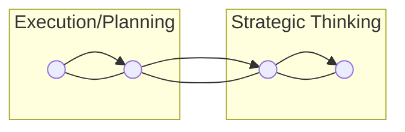
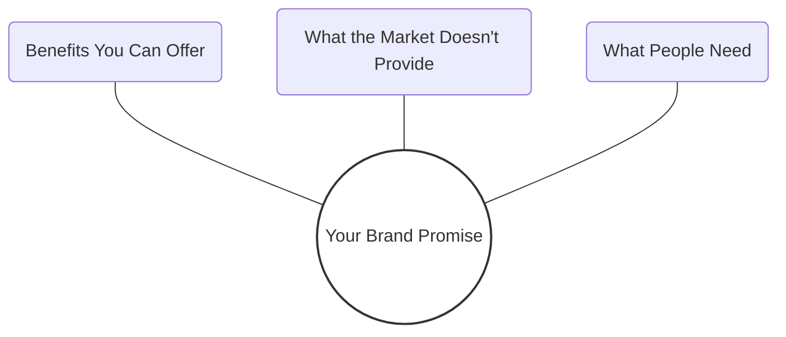
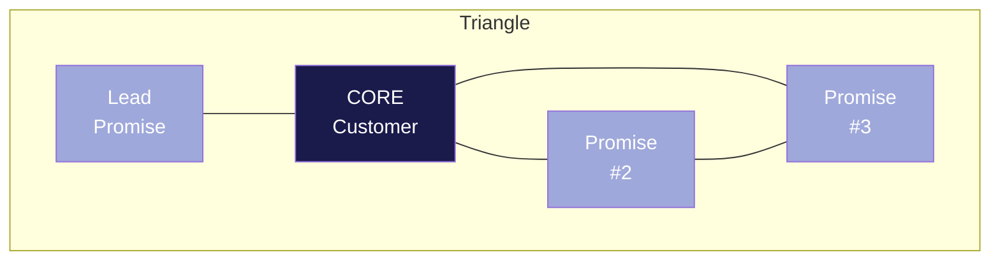
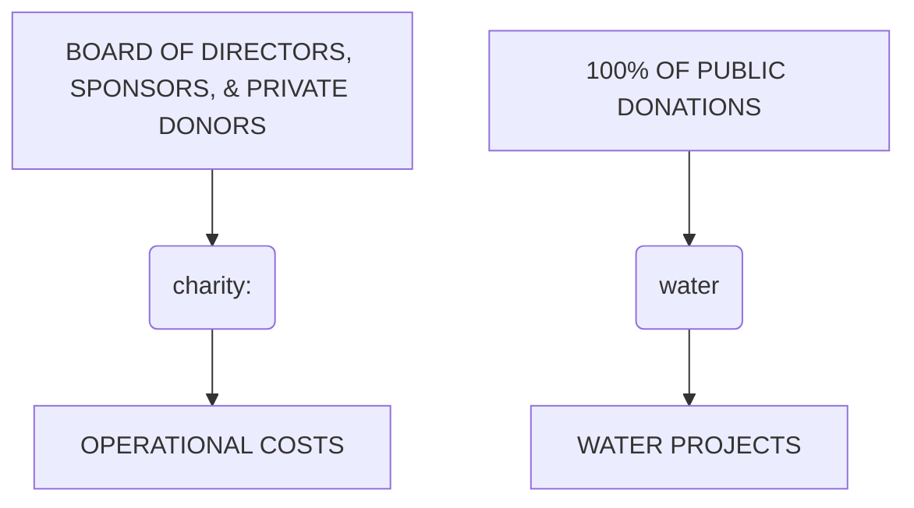

# <mark>LEARNING DAY</mark>
# Participant Workbook

**PURPOSE:**
Guide the Learning Day participant through the process of learning and applying the content of this module

1. Prior to Learning Day, read Scaling Up Assigned Pages (from Accelerator website)

2. Attend Accelerator Learning Day, and complete leadership team exercises.

3. Update Accelerator Accountability Tracking Plan.

4. Meet with Accountability Group & Coach, and share how you are applying leadership team exercises and results.


---


    
    
    
    

***


    
    
    
    

***


**EO Accelerator**

To empower entrepreneurs with the <mark>**TOOLS**</mark>, <mark>**COMMUNITY**</mark>, and <mark>**ACCOUNTABILITY**</mark> to aggressively grow and master their business.

    
    
    
    

***


# EOA Core Values

Trust and Respect

Thirst for Learning

Think Big, Be Bold

Together We Grow

    
    
    
    

---


### Process and Rules
* Phones, Emails and Breaks
* One Honest Conversation
* No Blame / No Shame
* Carry Your Own Bag
* Trust the Process
* Confidentiality

**SCALING UP** A GAZELLES COMPANY
**EOA**

----


### Introductions
* **Introduce Yourself & Company**
* **Biggest Win?**
* **Biggest Challenge Right Now?**

**SCALING UP** A GAZELLES COMPANY
**EOA**

----


### Growth is Hard

<table>
  <thead>
    <tr>
        <th>Revenue Category</th>
        <th>Percentage/Count of Firms</th>
        <th>Status</th>
    </tr>
  </thead>
  <tbody>
    <tr>
        <td>&lt;$1 Million</td>
<td>96%</td>
<td>Valley of Death</td>
    </tr>
<tr>
        <td>$1 Million</td>
<td>4%</td>
<td>Valley of Death</td>
    </tr>
<tr>
        <td>$10 Million</td>
<td>0.4%</td>
<td>Valley of Death</td>
    </tr>
<tr>
        <td>$50 Million</td>
<td>17,000</td>
<td>Valley of Death</td>
    </tr>
<tr>
        <td>Total Firms</td>
<td>32.5 Million Firms</td>
<td></td>
    </tr>
  </tbody>
</table>

**SCALING UP** A GAZELLES COMPANY
**EOA**

----


### The World Economy
* 2000-2023
* $34T to $105T

**United States**
Declined from > 60 to 26


**SCALING UP** A GAZELLES COMPANY
**EOA**


---


---


---


> "Strategy is not a lengthy action plan.
>
> It is the evolution of a central idea through continually changing circumstances."
>
> —Jack Welch

----

## Execution/Planning vs. Strategic Thinking



**Execution/Planning**

*   **Daily Weekly Quarterly**
    *   Priorities
    *   KPIs
    *   Critical #
    *   Theme
    *   Rewards
    *   Celebration
*   **Annual**
    *   Targets
    *   SWT
    *   Initiatives
    *   KPIs
    *   Critical #

**Strategic Thinking**

*   **3 Years**
    *   Vivid Vision
    *   Strategic Thrusts
    *   Core Customer
    *   Sandbox
    *   Brand Promise
    *   Profit/X
    *   Catalytic Mechanism
    *   X-Factor
    *   One Phrase Strategy
*   **10+ Years**
    *   Purpose (WHY)
    *   Values (HOW)
    *   BHAG (WHAT)

----

## Strategy vs. Execution

**Strategic Thinking**
*   3 to 5 key senior leaders
*   Strategic council: 2 hours weekly
*   Looking beyond the current year

**Execution Planning**
*   Day-to-day operational management team
*   Execution disciplines & meeting rhythms
*   Focus on executing current business year

----


**All About Trainual**

*   **Purpose** [x]
*   **Targets** [x]
*   **The Trainual Origin Story** [x]
*   **Our Core Values** [x]
    *   Core Value 1: Show Up Ready [x]
    *   Core Value 2: Carry the Groceries [x]
    *   Core Value 3: Make Ideas Happen [x]
    *   Core Value 4: No Red Tape [x]
    *   Core Value 5: Collect Experiences [x]

**Purpose**
Culture is a HUGE part of what makes us successful as a team and a player in our industry. In this Topic we'll talk about where we came from and the values we live by. You'll also learn about our Vision and Mission. Yes, those things that every business is supposed to have but often don't actually live by. We do, you'll see!

**Chris will be your guide through much of this Topic.**
Take some good notes (physical, digital, mental). Live the core values yourself a Wooly! What's that? Continue on, friend!

SCALING UP
A GAZELLES COMPANY
EOA


---


*   Core Customer
*   Brand Promise
*   Differentiating Activities
*   Sandbox

***


# Vision Summary
## Strategy Before Execution

<table>
  <thead>
    <tr>
        <th>Core Values</th>
        <th>Purpose</th>
        <th>Brand Promise</th>
    </tr>
  </thead>
  <tbody>
    <tr>
        <td>1. We act in our clients' best interest</td>
<td>WE</td>
<td>1. Best implementation: faster, right the first time</td>
    </tr>
<tr>
        <td>2. We thrive on detail</td>
<td>UNLEASH</td>
<td>2. Best partners: service &amp; support</td>
    </tr>
<tr>
        <td>3. We have a bias for action</td>
<td>POTENTIAL</td>
<td>3. Fastest ROI</td>
    </tr>
<tr>
        <td>4. We rely on initiative</td>
<td></td>
<td></td>
    </tr>
<tr>
        <td>5. We ensure the best idea wins</td>
        <td colspan="2"></td>
    </tr>
  </tbody>
</table>

**BHAG: $1 Billion ROI for Our Clients**

<table>
  <thead>
    <tr>
        <th>3-5 Year Goals</th>
        <th>1 Year Goals</th>
        <th>Quarterly Rocks</th>
    </tr>
  </thead>
  <tbody>
    <tr>
        <td>1. Launch European Operation</td>
<td>1. Add Resource Allocation s/w support</td>
<td>1. Add 2 strategic partners</td>
    </tr>
<tr>
        <td>2. Expand from consulting support to legal, accounting and engineering</td>
<td>2. Add 5 new strategic alliances</td>
<td>2. Hire VP of Sales</td>
    </tr>
<tr>
        <td>3. Open second US office or expand current office</td>
<td>3. Implement Agile/Scrum methodology with all development teams</td>
<td>3. Implement eNPS</td>
    </tr>
<tr>
        <td>4. Increase outsourced dev. to 50%</td>
<td>4. Add 1 new outsourced dev. partner</td>
<td></td>
    </tr>
<tr>
        <td>5. Research disruptive technologies</td>
<td>5. Implement Topgrading &amp; Measure Talent</td>
<td></td>
    </tr>
  </tbody>
</table>

<table>
  <thead>
    <tr>
        <th>Key Performance Indicators</th>
        <th>Critical Number (People or Process)</th>
        <th>Quarterly Action Items</th>
        <th>Due</th>
    </tr>
  </thead>
  <tbody>
    <tr>
        <td>% A-Players: 40%</td>
<td>10 (1st Demos)</td>
<td>Implement eNPS survey/Process</td>
<td>EOQ</td>
    </tr>
<tr>
        <td>eNPS: 60%</td>
<td>8 (1st Demos)</td>
<td>Pilot Topgrading for VP Sales hire</td>
<td>EOQ</td>
    </tr>
<tr>
        <td>Stay Interviews/wk: 2</td>
<td>60% (Close Ratios)</td>
<td>Implement Agile/Scrum w/ 2 teams</td>
<td>EOQ</td>
    </tr>
  </tbody>
</table>

***


# Business Models
## Introduction to Business Model Canvas

> You're holding a handbook for visionaries, game changers, and challengers striving to defy outmoded business models and design tomorrow's enterprises. It's a book for the...
> **Business Model Generation**

***


# The Business Model Canvas
*Alex Osterwalder & Yves Pigneur*

```description
A photo of Alex Osterwalder standing in front of a large-scale Business Model Canvas. The canvas is filled with various hand-drawn icons and sticky notes. Notable elements include:
- Key Partners: A link icon.
- Key Activities: Icons for network software engineering.
- Value Propositions: A gift icon and a magnifying glass icon labeled "FIND".
- Customer Relationships: A heart icon.
- Customer Segments: A stick figure icon and a "Google" logo.
- Cost Structure: An arrow icon.
- Revenue Streams: A circular icon.
```

EOA | SCALING UP A GAZELLES COMPANY


---

# Business Model Canvas

*   Customer Segments & Relationships
*   Value Proposition
*   Channels of Distribution
*   Revenue Streams
*   Infrastructure
    *   Key Activities, Resources & Partnerships
*   Cost Structure

EOA | SCALING UP A GAZELLES COMPANY

----

## Business Model Canvas Template

<table>
  <thead>
    <tr>
        <th>Key Partners</th>
        <th>Key Activities</th>
        <th>Value Propositions</th>
        <th>Customer Relationships</th>
        <th>Customer Segments</th>
        <th></th>
    </tr>
  </thead>
  <tbody>
    <tr>
        <td rowspan="2">Who will help you?</td>
<td>How do you do it?<br/>**DIFF. ACTIVITIES**</td>
        <td rowspan="2">START HERE<br/>What do you do?<br/><br/>**BRAND PROMISE**</td>
<td>How do you interact?</td>
        <td rowspan="2">Who do you help?<br/><br/>**CORE CUSTOMER**</td>
<td></td>
    </tr>
<tr>
        <th>Key Resources</th>
        <th>Channels</th>
        <th></th>
    </tr>
<tr>
        <th></th>
        <th>What do you need?</th>
        <th>How do you reach them?<br/>**SANDBOX**</th>
        <th></th>
        <th colspan="2"></th>
    </tr>
<tr>
        <td colspan="2">Cost Structure</td>
        <td colspan="3">Revenue Streams</td>
<td></td>
    </tr>
<tr>
        <td colspan="2">What will it cost?</td>
        <td colspan="3">How much will you make?</td>
<td></td>
    </tr>
  </tbody>
</table>

SCALING UP A GAZELLES COMPANY

----

## Google - Business Model Canvas

<table>
  <thead>
    <tr>
        <th>Keys Partners</th>
        <th>Key Activities</th>
        <th>Value Propositions</th>
        <th>Customer Relationship</th>
        <th>Customer Segments</th>
        <th colspan="2"></th>
    </tr>
  </thead>
  <tbody>
    <tr>
        <td>Ad Agencies</td>
<td>Platform Development and Maintenance</td>
<td>Free Services (web search, gmail, maps, translation, etc.)</td>
<td>Self Service</td>
<td>Internet Users</td>
        <td colspan="2"></td>
    </tr>
<tr>
        <td>Content Sites (display network)</td>
<td>R&amp;D</td>
<td>Google Adwords</td>
<td>Customer Support for Paying Customers</td>
<td>Advertisers</td>
        <td colspan="2"></td>
    </tr>
<tr>
        <td rowspan="2">OEMs</td>
<td>Key Resources</td>
<td>OS and Platforms (Android and Chrome)</td>
<td>Channels</td>
<td>Developers</td>
        <td colspan="2"></td>
    </tr>
<tr>
        <th>Google Algorithms and Data Centers</th>
        <th rowspan="2">Paid Services (Gsuite, Maps API, Cloud Hosting)</th>
        <th>Google.com</th>
        <th rowspan="2">Enterprise</th>
        <th colspan="2"></th>
    </tr>
<tr>
        <th></th>
        <th>Brand</th>
        <th>Sales Force</th>
        <th colspan="2"></th>
    </tr>
<tr>
        <td colspan="2">Cost Structure</td>
        <td colspan="3">Revenue Streams</td>
        <td colspan="2"></td>
    </tr>
<tr>
        <td>Datacenters</td>
<td>Marketing and Sales</td>
<td>R&amp;D</td>
<td>Free</td>
<td>Cost-per-Click</td>
<td>Percentage of App Sales and Subscriptions</td>
<td>Monthly/annual fees or per-usage fees</td>
    </tr>
  </tbody>
</table>

<page_header>
SCALING UP A GAZELLES COMPANY
</page_header>
<page_footer>
THE BUSINESS MODEL ANALYST | businessmodelanalyst.com
</page_footer>

----

## Zoom - Business Model Canvas

<table>
  <thead>
    <tr>
        <th>Keys Partners</th>
        <th>Key Activities</th>
        <th>Value Propositions</th>
        <th>Customer Relationship</th>
        <th>Customer Segments</th>
        <th></th>
    </tr>
  </thead>
  <tbody>
    <tr>
        <td>Skype</td>
<td>Platform Development and Maintenance</td>
<td>Free Video Conferencing that works well</td>
<td>Self Service</td>
<td>Worldwide Internet Users</td>
<td></td>
    </tr>
<tr>
        <td rowspan="2">Calendar Apps</td>
<td>Key Resources</td>
        <td rowspan="2">Video Conferencing with longer duration and professional features</td>
<td>Customer Support (phone and chat)</td>
        <td rowspan="2">Business Users (Enterprise, Education, Govt, Healthcare)</td>
<td></td>
    </tr>
<tr>
        <th>Zoom Platform</th>
        <th>Channels</th>
        <th></th>
    </tr>
<tr>
        <th></th>
        <th>Proprietary Video Compression Codec</th>
        <th>Website: zoom.us<br/>Zoom App (mobile and desktop)</th>
        <th></th>
        <th colspan="2"></th>
    </tr>
<tr>
        <td colspan="2">Cost Structure</td>
        <td colspan="3">Revenue Streams</td>
<td></td>
    </tr>
<tr>
        <td>Human Resources</td>
<td>Platform Development and Maintenance</td>
<td>Free</td>
<td>Subscription Plans</td>
        <td colspan="2"></td>
    </tr>
  </tbody>
</table>

<page_header>
SCALING UP A GAZELLES COMPANY
</page_header>
<page_footer>
THE BUSINESS MODEL ANALYST | businessmodelanalyst.com
</page_footer>

---

# The Business Model Canvas
**Designed for:** Microsoft
**Designed by:** Denis Oakley

<table>
  <thead>
    <tr>
        <th>Key Partners</th>
        <th>Key Activities</th>
        <th>Value Propositions</th>
        <th>Customer Relationships</th>
        <th>Customer Segments</th>
        <th colspan="4"></th>
    </tr>
  </thead>
  <tbody>
    <tr>
        <td>Resellers</td>
<td>Software Development</td>
<td>Desktop Operating Systems</td>
<td>Consumer Self Service</td>
<td>Consumers</td>
        <td colspan="4"></td>
    </tr>
<tr>
        <td>OEM</td>
<td>Marketing &amp; Sales</td>
<td>Microsoft Office</td>
<td>Enterprise Sales &amp; Support</td>
<td>Corporates</td>
        <td colspan="4"></td>
    </tr>
<tr>
        <th rowspan="2"></th>
        <th>Key Resources</th>
        <th rowspan="2"></th>
        <th>Channels</th>
        <th rowspan="2"></th>
        <th colspan="4"></th>
    </tr>
<tr>
        <td>Huge Embedded User Base</td>
<td>Website</td>
        <td colspan="4"></td>
    </tr>
<tr>
        <td rowspan="2"></td>
        <td rowspan="2"></td>
<td>Cloud Services</td>
<td>Retailers</td>
        <td rowspan="2"></td>
        <td colspan="4"></td>
    </tr>
<tr>
        <td>People</td>
<td>IP</td>
<td>OEM</td>
<td>Direct Sales &amp; Resellers</td>
        <td rowspan="2"></td>
<td></td>
    </tr>
<tr>
        <th>Cost Structure</th>
        <th rowspan="2"></th>
        <th>Revenue Streams</th>
        <th rowspan="2"></th>
        <th rowspan="2"></th>
        <th colspan="3"></th>
    </tr>
<tr>
        <td>Software Development</td>
<td>Software Development</td>
<td>Licenses</td>
<td>SaaS</td>
        <td rowspan="2"></td>
<td></td>
    </tr>
  </tbody>
</table>


**SCALING UP**
A GAZELLES COMPANY

----

# The Business Model Canvas
**Designed for:** amazon
**Designed by:** Denis Oakley

<table>
  <thead>
    <tr>
        <th>Key Partners</th>
        <th>Key Activities</th>
        <th>Value Propositions</th>
        <th>Customer Relationships</th>
        <th>Customer Segments</th>
        <th colspan="2"></th>
    </tr>
  </thead>
  <tbody>
    <tr>
        <td>Logistics Partners</td>
<td>Merchandising</td>
<td>Price</td>
<td>Automated &amp; Self Service</td>
<td>Consumers</td>
        <td colspan="2"></td>
    </tr>
<tr>
        <td>Affiliates</td>
<td>Platform Design &amp; Optimisation</td>
<td>Convenience</td>
        <td rowspan="2"></td>
        <td rowspan="2"></td>
        <td colspan="2"></td>
    </tr>
<tr>
        <th>Authors &amp; Publishers</th>
        <th>Key Resources</th>
        <th>Selection</th>
        <th>Channels</th>
        <th rowspan="2"></th>
    </tr>
<tr>
        <td>Sellers</td>
<td>Warehouses &amp; Automation</td>
        <td rowspan="2"></td>
<td>Affiliates</td>
        <td rowspan="2"></td>
<td></td>
    </tr>
<tr>
        <td rowspan="2"></td>
<td>Culture</td>
<td>Human: Software Engineers</td>
<td>Fast Fulfillment</td>
<td>Websites</td>
        <td rowspan="2"></td>
    </tr>
<tr>
        <th>Cost Structure</th>
        <th rowspan="2"></th>
        <th>Revenue Streams</th>
        <th rowspan="2"></th>
        <th rowspan="2"></th>
        <th></th>
    </tr>
<tr>
        <td>Cost Driven Structure</td>
<td>IT &amp; Fulfillment Infrastructure</td>
<td>Economies of Scale</td>
<td>Long Tail Benefits</td>
<td>Prime</td>
<td>Commissions &amp; Transaction Fees</td>
<td>Sales Margin</td>
    </tr>
  </tbody>
</table>

**SCALING UP**
A GAZELLES COMPANY

----

# Describe Your Business to AI

* Describe your customers
* What you do for them
* Where they are
* What's different about your operations
* How you reach them: channels/partners
* Your costs and revenue streams
* Name 2-3 Competitors
* Ask: create Business Model Canvas & 3 Ideas

**SCALING UP** A GAZELLES COMPANY  **EOA**

----

# Core Customer
## Do you know your WHO?


**EOA**
**SCALING UP**
A GAZELLES COMPANY

---

# The Business Model Canvas

**Designed for:**     
**Designed by:**     
**Date:**     
**Version:**     

<table>
  <thead>
    <tr>
        <th>Key Partners </th>
        <th>Key Activities </th>
        <th>Value Propositions </th>
        <th>Customer Relationships </th>
        <th>Customer Segments </th>
    </tr>
  </thead>
  <tbody>
    <tr>
        <td rowspan="2">    </td>
<td>    </td>
        <td rowspan="2">    </td>
<td>    </td>
        <td rowspan="2">    </td>
    </tr>
<tr>
        <th>Key Resources </th>
        <th>Channels </th>
    </tr>
<tr>
        <td></td>
<td>    </td>
<td>    </td>
        <td colspan="2"></td>
    </tr>
<tr>
        <th>Cost Structure </th>
        <th colspan="2">Revenue Streams </th>
        <th colspan="2"></th>
    </tr>
<tr>
        <td>    </td>
        <td colspan="2">    </td>
        <td colspan="2"></td>
    </tr>
  </tbody>
</table>

 This work is licensed under the Creative Commons Attribution-Share Alike 3.0 Unported License. To view a copy of this license, visit: http://creativecommons.org/licenses/by-sa/3.0/ or send a letter to Creative Commons, 171 Second Street, Suite 300, San Francisco, California, 94105, USA.

**DESIGNED BY: Strategyzer AG**
The makers of Business Model Generation and Strategyzer

# Strategyzer
strategyzer.com


---

# <mark>Designing Crystal Clear Business Model Canvases</mark>


*Use this checklist to design great business models or assess your own:*

*   **Does the level of granularity of your Canvas correspond to your objectives?**
    Your Canvas should only contain the most important building blocks when your objective is to explain the essence of your business model, also called the blueprint of your strategy. Your Canvas should have much more detail if its objective is to serve as a blueprint for implementation.

*   **Is every Building Block in your Canvas connected to one another?**
    Great Canvases have a story and flow where every building block relates to another. You should not have any "orphan" building blocks in your Canvas that don't connect to another building block. For example, a revenue stream always needs to come from a related customer segment for a related value proposition. Or a key partner always provides a key resource or activity that contributes to a value proposition. Or, there is no such thing as a customer segment with no specific value proposition.

*   **Is every Building Block in your Canvas precise enough?**
    Make sure every building business model block is self explanatory. For example, writing "products" in revenue streams is unclear. More precise would be "product sales" or "margins on product sales".

*   **Do you make smart use of both images and words to convey your message?**
    It takes our brain longer to process words than images, because every letter of a word is processed as an individual image. Hence, the use of images allows our brain to process a Canvas much quicker. To avoid ambiguity, the use of an image and a label for a building block is the most effective.

*   **Do you make good use of color-coding?**
    Using color-coding to explain specific aspects of your business model is a quick and easy way to clearly communicate even complex aspects of your business model. For example, you can use color-coding to highlight two very different segments with very different value propositions. Or you could use it to distinguish between your existing model and one you want to build.

*   **Does your Canvas distinguish between "as-is" and "to-be"?**
    Make sure you clearly distinguish between what exists in your business model the "as-is" state and what you want to or plan to build the "to-be" state. Color-coding can help achieve this distinction easily.

*   **Does your Canvas distinguish between "knowns/facts" and "unknowns/assumptions"?**
    When you are designing new business models, make sure you clearly distinguish between what you know (e.g. the demand for a specific value proposition) and what you don't know (e.g. which channels customers would prefer). You have facts to prove what you know (e.g. pre-orders), but only assumptions about the building blocks you think could work.

Copyright Strategyzer AG
The makers of Business Model Generation and Strategyzer


strategyzer.com


---


# STRATEGY
Canvas


## Core Customer
* Real person with wants, needs, fears
* Real customer and exists in customer base
* Unique identity, psychology, and behavior
* Will buy for optimal profit
* Pays timely, loyal, and refers others

**Customer Name:**     
**Ideal Characteristic:**     

1.     
2.     
3.     
4.     
5.     

**Discuss & refine your list of Core Customer attributes:**
1.     
2.     
3.     
4.     
5.     

**Describe your Core Customer: (10-20 words)**
    

## Brand Promise
* Does it FILL the right Core Customer's need?
* Does it DIFFERENTIATE you?
* Is it MEASURABLE?

**Lead Promise: What do they COUNT on?**
    

**Measurement:**     

**Promise #2: What do they EXPECT?**
    

**Measurement:**     

**Promise #3: What is UNIQUE about it?**
    

**Measurement:**     

**Draft your Brand Promise: (10-20 words)**
    

## Differentiating Activities
* Unique ways you deliver on brand promises
* Competitors would not or cannot do, without great effort or expense
* 3 to 5 activities; often synergistic

**List all the ways you are unique from your competitors: (in order of importance)**
    

**Main Competitors:**
1.     
2.     
3.     
4.     
5.     

**Differences:**
    

**Discuss & refine your unique activities:**
* **People:**     
* **Product(s):**     
* **Operations:**     
* **Terms/Price:**     
* **Other:**     

**Collaborate and align on the most important activities to your customer or your competitors or your company?**
1.     
2.     
3.     
4.     
5.     

## Sandbox
* Geographic area of target customer and service
* Product/service categories
* Distribution (selling) channels
* 3 to 5 years timetable

**WHERE - Target geographic areas:**
1.     
2.     
3.     
4.     
5.     

**WHAT - Top 3 to 5 product/service categories:**
1.     
2.     
3.     
4.     
5.     

**WHO - Top distribution/selling channels**
* **Retail:**     
* **Wholesale:**     
* **Online:**     
* **Direct:**     
* **Partner Network:**     
* **Other:**     

**FORECAST - changes/trends (3 to 5 years out)**
1.     
2.     
3.     
4.     
5.     


---


***


***


<table>
  <thead>
    <tr>
        <th>Category</th>
        <th>Value</th>
    </tr>
  </thead>
  <tbody>
    <tr>
        <td>1</td>
<td>12</td>
    </tr>
<tr>
        <td>2</td>
<td>15</td>
    </tr>
<tr>
        <td>3</td>
<td>10</td>
    </tr>
<tr>
        <td>4</td>
<td>5</td>
    </tr>
<tr>
        <td>5</td>
<td>-2</td>
    </tr>
<tr>
        <td>6</td>
<td>-10</td>
    </tr>
<tr>
        <td>7</td>
<td>-15</td>
    </tr>
<tr>
        <td>8</td>
<td>-18</td>
    </tr>
  </tbody>
</table>

***


---


# WHO? Your Core Customer

* Real person with wants, needs, fears
* Will buy for optimal profit
* Unique identity and behavior
* Pays timely, loyal, and refers others
* Exists in customer base


SCALING UP
A GAZELLES COMPANY

EOA


---


### Core Customer attributes:

Think about your best customers now. The ones who pay well, on time, and who really love your business, that are also loyal and who would recommend you to others.

* Real person with wants, needs, fears
* Real customer and exists in customer base
* Unique identity, psychology, and behavior
* Will buy for optimal profit
* Pays timely, loyal, and refers others

### List your top 5 Core Customers:

**Names of Real Customer**
1.     
2.     
3.     
4.     
5.     

**Ideal Characteristics**
1.     
2.     
3.     
4.     
5.     

### Discuss & refine your list of Core Customer attributes:

1.     
2.     
3.     
4.     
5.     

### In 10-20 words, draft a description of your Core Customer:

    
    
    
    
    

---


SCALING UP A GAZELLES COMPANY | EOA

# Continue AI Session

Create an ideal customer profile in the style of Bob Bloom and Inside Advantage. Ask me questions one at time until you have enough information to create my ICP and Avatar.

***

## Exercise: Core Customer

**STRATEGY**
Core Customer

* **Real individual with unique identity & needs**
* **List 5-7 customers and their ideal characteristics**

**EOA**

**Core Customer attributes:**
Think about your best customers now. The ones who pay well, on-time, and who really love your business, that are also loyal and who would recommend you to others.

* Real person with wants, needs, fears
* Real customer and exists in customer base
* Unique identity, psychology, and behavior
* Will buy for optimal profit
* Pays timely, loyal, and refers others

**List your Top 5 Core Customers:**

<table>
    <tr>
        <th>Names of Real Customer</th>
        <th>Ideal Characteristics</th>
    </tr>
<tr>
        <td>1. Eddie</td>
<td>1. Learner</td>
    </tr>
<tr>
        <td>2. Henry</td>
<td>2. Coachable</td>
    </tr>
<tr>
        <td>3. Christine</td>
<td>3. Huge goals</td>
    </tr>
<tr>
        <td>4. Wesley</td>
<td>4. Commits</td>
    </tr>
<tr>
        <td>5. Nate</td>
<td>5. Loyal</td>
    </tr>
</table>

**Discuss & refine your list of Core Customer attributes:**
1. Huge goals
2. Coachable
3. Open learner
4. Commits/Loyal
5. Style match

**In 10-20 words, draft a description of your Core Customer:**
Company with big goals, coachable but also matches our brand. Employees generally over 100, sales of $10M+, 10X+ growth goals, funded or good cash position.


***

## Brand Promises

* Your lead promise?
* Supporting promises?
* How to measure?



**SCALING UP A GAZELLES COMPANY**
**EOA**

***


*Verne Harnish*

**SCALING UP A GAZELLES COMPANY**


---


---


**Reasonable prices for a premium product and experience**
- measured by 100% satisfaction rating

EOA


***


**3 LFs**
* Low Fares
* Lots of Flights
* Lots of Fun

EOA


***


<table>
  <thead>
    <tr>
        <th>Starbucks Reserve Koffies</th>
        <th>Clover</th>
        <th>Slow Pour Over</th>
        <th>Cafetière</th>
        <th></th>
    </tr>
  </thead>
  <tbody>
    <tr>
        <td>Sun Dried Ethiopia Yirgacheffe</td>
<td>Tall €4.00 / Grande €4.50</td>
<td>Tall €4.00 / Grande €4.50</td>
<td>Tall €4.00 / Grande €4.50</td>
<td>Tall €4.00 / Grande €4.50</td>
    </tr>
<tr>
        <td>Aged Sumatra</td>
<td>Tall €4.00 / Grande €4.50</td>
<td>Tall €4.00 / Grande €4.50</td>
<td>Tall €4.00 / Grande €4.50</td>
<td>Tall €4.00 / Grande €4.50</td>
    </tr>
<tr>
        <td>Guatemala Antigua Santa Catalina</td>
<td>Tall €3.50 / Grande €4.00</td>
<td>Tall €3.50 / Grande €4.00</td>
<td>Tall €3.50 / Grande €4.00</td>
<td>Tall €3.50 / Grande €4.00</td>
    </tr>
  </tbody>
</table>

EOA


***


**PEACE OF MIND FOR YOUR MEXICO TRIP**

* **Coverage in Minutes**: Get great insurance coverage in less than 5 minutes.
* **20 Years of Trust**: We are Mexican insurance specialists with over 20 years in the industry.
* **We've Got Your Back**: Have a question or need support on a claim? We go above and beyond!

EOA


---

![Slide 1: Net Promoter Score overview. Includes the book cover of "The Ultimate Question" by Fred Reichheld. It shows a scale from 0 to 10 categorized into Detractors (0-6), Passives (7-8), and Promoters (9-10). A table describes each group: Detractors rate 0-6, require proactive outreach, and are not satisfied; Passives rate 7-8, are susceptible to competitors, and are left out of NPS calculation; Promoters rate 9-10, are loyal, and fuel growth through word of mouth. The formula shown is % Promoters - % Detractors = Net Promoter Score.](image)


---


# Your Brand Promise
* Does it differentiate you?
* Does it fill the Core Customer's need (not want)?
* Is it measurable?

EOA | SCALING UP A GAZELLES COMPANY

***

# Continue AI Session
> I need to develop my 3 simple brand promises. Ask me questions one at a time until you have enough information to suggest them.
>
> Bonus: Suggest 3 KPIs for them.

<page_footer>
SCALING UP A GAZELLES COMPANY | EOA
</page_footer>

***

# Exercise: Brand Promise
* What are your top 3 promises?
* How will you measure them?


### STRATEGY: Brand Promise
**Brand Promise:**
* Does it FILL the Core Customer's need?
* Does it DIFFERENTIATE you?
* Is it MEASURABLE?

**Your Core Customer:**
Company with big goals, coachable but also matches our brand. Employees generally over 100, sales of $10M+, 10X+ growth goals, funded or good cash position.

**What do they Count On?**
Software like growth and margins

**What do they Expect?**
Leading tools and consultant/coaches

**What's Unique about your business?**
Playful, funny, unconventional

**Using the information above, draft your Brand Promise (10-20 words):**
* Software like growth & margins **KPI:** NPS
* Save time (1 day/wk) **KPI:** Complete Contract
* Have more fun (practical tools, thought leader based) **KPI:** Renewal %

<page_footer>
EOA | SCALING UP A GAZELLES COMPANY
</page_footer>

***

# Core Customer Questions
1. What are we great/best at?
2. What's different about us?
3. What's weird or bad about us?

<page_footer>
EOA | SCALING UP A GAZELLES COMPANY
</page_footer>

---


# STRATEGY
## Brand Promise


### Brand Promise:

*   Does it FILL the Core Customer's need?
*   Does it DIFFERENTIATE you?
*   Is it MEASURABLE?

**Your Core Customer:**
    

**What do they Count On?**
    
    
    

**What do they Expect?**
    
    
    

**What's Unique about your business?**
    
    
    



### Using the information above, draft your Brand Promise (10-20 words):
    
    
    
    


---


---


Lawyers
Personal Injury
Large Cities - media options
One / NFL city

We will make you #1 in market
**100% Solution**
**<u>Even your call center</u>**
Bad customers to competition

Zero marketing costs
People beg for him
Great margin!

**cj Advertising**
**Arnie Malham**
Founder
EOA
SCALING UP
A GAZELLES COMPANY

***


SCALING UP
A GAZELLES COMPANY

## What is Fanatical Support® for AWS?

<table>
    <tr>
        <th>FANATICAL SUPPORT FOR AWS</th>
        <th>TOOLING &amp; AUTOMATION</th>
        <th>HUMAN EXPERTS</th>
    </tr>
<tr>
        <td>World leading support for a world leading cloud platform</td>
<td></td>
<td></td>
    </tr>
</table>

**rackspace**
The #1 managed cloud company
EOA

***


SCALING UP
A GAZELLES COMPANY



EOA

***


# PELOTON

EOA
SCALING UP
A GAZELLES COMPANY

---


---


# Differentiation:

Differentiating Activities are the UNIQUE ways you deliver on your Brand Promise(s).

Brainstorm and list all the ways you are different from your competitors:

<table>
  <thead>
    <tr>
        <th>Main Competitors</th>
        <th>How Different?</th>
    </tr>
  </thead>
  <tbody>
    <tr>
        <td>    </td>
<td>    </td>
    </tr>
<tr>
        <td>    </td>
<td>    </td>
    </tr>
<tr>
        <td>    </td>
<td>    </td>
    </tr>
<tr>
        <td>    </td>
<td>    </td>
    </tr>
<tr>
        <td>    </td>
<td>    </td>
    </tr>
  </tbody>
</table>

 **People?** [________________________________________________________________________________]

 **Product/Service?** [__________________________________________________________________________]

 **Operations?** [_______________________________________________________________________________]

 **Terms/Price?** [______________________________________________________________________________]

# Collaborate and align on your top 3 to 5 Differentiating Activities:

1. [________________________________________________________________________________________________________________]
2. [________________________________________________________________________________________________________________]
3. [________________________________________________________________________________________________________________]
4. [________________________________________________________________________________________________________________]
5. [________________________________________________________________________________________________________________]


---


----

## Exercise
### 3 to 5 Differentiating Activities

* List your differentiating activities
* Rank your top differentiating activities

**EOA**

#### STRATEGY
**Differentiating Activities**

**Differentiation:**
Differentiating activities are the UNIQUE ways you deliver on your Brand Promise.

Brainstorm and list all the ways you are different from your competitors:

<table>
  <thead>
    <tr>
        <th>Main Competitors</th>
        <th>How Different?</th>
        <th>People</th>
        <th>Professional firm backgrounds: law &amp; Acctg</th>
    </tr>
  </thead>
  <tbody>
    <tr>
        <td>saasy.io</td>
<td>Self service</td>
        <td rowspan="2">Product/Service</td>
        <td rowspan="2">Law &amp; Acctg specific</td>
    </tr>
<tr>
        <td>XYZ solutions</td>
<td>Very German</td>
    </tr>
<tr>
        <td>MySaaS.co</td>
<td>Small/Home Biz</td>
<td>Operations</td>
<td>24/7 distributed team</td>
    </tr>
<tr>
        <td></td>
<td></td>
<td>Systems</td>
<td>Premium but not Luxury</td>
    </tr>
  </tbody>
</table>

Collaborate and align on your top 3 to 5 Differentiating Activities:
1. Legal and accounting partners
2. Localized
3. Full suite
4.     
5.     

**SCALING UP A GAZELLES COMPANY**

----


----


---


**Lawyers**
**Personal Injury**
**Large Cities - media options**
**One / NFL city**

We will make you #1 in market
100% Solution
Even your call center
Bad customers to competition

Zero marketing costs
People beg for him
Great margin!

**cj Advertising**
**Arnie Malham**
Founder
EOA
SCALING UP
A GAZELLLES COMPANY

***


**LIFESQUIRE**
**Valerie Riley, EO Oklahoma City**
EOA
SCALING UP
A GAZELLLES COMPANY

***


# World churches get a door to the world from Hatay
HATAY - Dogan News Agency

SCALING UP
A GAZELLLES COMPANY
EOA

***


# Sandbox
## Define your field of play

* Where will you sell?
* What will you sell?
* Who will you sell to?

EOA
SCALING UP
A GAZELLLES COMPANY

---


# STRATEGY
Sandbox


## WHERE will you sell? (Target geographic areas)


1.     
2.     
3.     
4.     
5.     

## WHAT will you sell? (Top 3 to 5 product/service categories)

**What are your top 3-5 categories of Service or Product?**
1.     
2.     
3.     
4.     
5.     

## WHO will you sell to? (Top distribution/selling channels)

* Partners [ ]
* Direct [ ]
* Online [ ]
* Retail [ ]
* Wholesale [ ]
*      [ ]

1.     
2.     
3.     
4.     
5.     

## FORECAST changes/trends (3 to 5 years out)

**What changes do you envision for the future?**
1.     
2.     
3.     
4.     
5.     

---

# Continuing with AI...

*   What distribution channels or partners are my competitors using? And, which ones might be best for me?
*   How would I use      and     ?

 

***

# Exercise
## Sandbox

*   **WHERE** will you sell? <sub>(Sales Territory)</sub>
*   **WHAT** will you sell? <sub>(Product Lines)</sub>
*   **To WHOM** will you sell? <sub>(Customers/Distribution channels)</sub>


### STRATEGY Sandbox
 

**WHERE will you sell?** (Target geographic areas)
1. US home office
2. 2nd US Office
3. European Office
4. ?
5.     

**WHAT will you sell?** (Top 3 to 5 product/service categories)
**What are your top 3-5 categories of Service or Product?**
1. Professional Services Management S/W
2. CRM
3. Billing
4. HR
5.     

**WHO will you sell to?** (Top distribution/selling channels)
[x] Partners
[x] Direct
[x] Online
[ ] Retail
[ ] Wholesale
[ ]     

1. Prof Svcs Mgt or Alliance Groups
2. Law firms
3. Accounting Firms
4.     
5.     

**FORECAST changes/trends (3 to 5 years out)**
**What changes do you envision for the future?**
1. More partners/alliance groups
2. 2nd US Office
3. European Office
4. More direct?
5.     

***

# Your 10 Year Personal Plan

 

***


# #2 Begin With the End in Mind


---


***


***


# One Page Personal Plan

**Name**:      **Date**:     

<table>
  <thead>
    <tr>
        <th>Relationship</th>
        <th>Family</th>
        <th>Friends</th>
        <th>Health/ Fitness</th>
        <th>Work/ Business</th>
        <th>Money/ Security</th>
        <th>Fun/Hobbies</th>
        <th>Spiritual/ Purpose</th>
        <th></th>
    </tr>
  </thead>
  <tbody>
    <tr>
        <td rowspan="2">10-25 Years</td>
        <td colspan="8">    </td>
    </tr>
<tr>
        <td rowspan="2">One Year</td>
        <td colspan="8">    </td>
    </tr>
<tr>
        <td>Start</td>
        <td colspan="8">    </td>
    </tr>
<tr>
        <td>Stop</td>
        <td colspan="8">    </td>
    </tr>
  </tbody>
</table>

***


SCALING UP
A GAZELLS COMPANY


---

<description>
The page consists of four horizontal sections, each containing a slide-like graphic on the left and a lined note-taking area on the right.
</description>

# Now imagine it's 2035

EOA | SCALING UP A GAZELLES COMPANY

----

# What do you see?
<page_header>
EOA | SCALING UP A GAZELLES COMPANY
</page_header>

----

# I will be     
# kids will be      &     
# parents are      &     
<page_header>
EOA | SCALING UP A GAZELLES COMPANY
</page_header>

----

## One Page Personal Plan
**Name**:      **Date**: 2033

<table>
  <thead>
    <tr>
        <th>Relationship</th>
        <th>Family</th>
        <th>Friends</th>
        <th>Health/ Fitness</th>
        <th>Work/ Business</th>
        <th>Money/ Security</th>
        <th>Fun/Hobbies</th>
        <th>Spiritual/ Purpose</th>
    </tr>
  </thead>
  <tbody>
    <tr>
        <td rowspan="4">10-25 Years</td>
<td>Age 35, parents 60, holidays w/them</td>
        <td colspan="6">Married 5 years and still fun. Some of Forum has moved on but we still meet yearly. Annual trip with old girlfriends group.</td>
    </tr>
<tr>
        <td>Still active in my running group.</td>
        <td colspan="6">We have begun to host some holidays at our house.</td>
    </tr>
<tr>
        <td>Celebrating our first child. Made Inc 5000 list.</td>
        <td colspan="6">Best places to work in Phoenix.</td>
    </tr>
<tr>
        <td>Statewide biz and growing regionally.</td>
        <td colspan="6">Marathon finished within year after giving birth. Annual girlfriends trip. Forum retreat. Regular company off-sites. Annual marriage retreats. Adjusting with our first kid. Creating family rituals. Sunday morning quiet time. Screens off in bedroom. 1 year emergency fund practicing profit first. 5yr plan to pay off house saving 10% plus. Beginning to plan biz exit. Helping parents retire. Buying our building.</td>
    </tr>
<tr>
        <td rowspan="2">One Year</td>
<td>Making time to date for real. Girlfriends ski trip. Holidays at parents finally.</td>
        <td colspan="6">Yoga retreat to Costa Rica. Weekly running group. Personal Best Marathon.</td>
    </tr>
<tr>
        <td>Promoted Dir Ops. 2nd Location. Doubled the biz &amp; profit. Learned to surf. Went to Burning Man. First Forum Retreat. First company offsite. Sunday morning reading and meditation.</td>
        <td colspan="6">Sunday dinners w/friends. Profit first begun. Saving 10% monthly. House fund started. Completed Scaling Up opsp. 3 months cash reserves.</td>
    </tr>
<tr>
        <td>Start</td>
<td>Friday night friends. Saturday date night. Sunday me time. Book holidays w/family. Consistent yoga. Friends ski. Running.</td>
        <td colspan="6">Coaching Ops Dir. Developing my team. Looking for 2nd location. Plan time for surfing. Booking in Burning Man and prep. Protect time for RH meetings and off-sites. Inviting friends over for Sunday dinners. Sunday morning reflection /meditation. Profit first work &amp; finance bi-weekly.</td>
    </tr>
<tr>
        <td>Stop</td>
<td>Stop saying yes to everything. Stop Working on the weekend. Drinking too much. Running like I always have.</td>
        <td colspan="6">Doing everything myself, micromanaging. Too much time social media. Holding back in conversations. Using my credit cards. Looking at bank daily.</td>
    </tr>
  </tbody>
</table>

EOA | SCALING UP A GAZELLES COMPANY


---


# One Page Personal Plan


**Name**:     
**Date**:     

<table>
  <thead>
    <tr>
        <th></th>
        <th>Relationship</th>
        <th>Family</th>
        <th>Friends</th>
        <th>Health/<br/>Fitness</th>
        <th>Work/<br/>Business</th>
        <th>Money/<br/>Security</th>
        <th>Fun/Hobbies</th>
        <th>Spiritual/<br/>Purpose</th>
    </tr>
  </thead>
  <tbody>
    <tr>
        <td>10-25<br/>Years</td>
<td>    </td>
<td>    </td>
<td>    </td>
<td>    </td>
<td>    </td>
<td>    </td>
<td>    </td>
<td>    </td>
    </tr>
<tr>
        <td>One<br/>Year</td>
<td>    </td>
<td>    </td>
<td>    </td>
<td>    </td>
<td>    </td>
<td>    </td>
<td>    </td>
<td>    </td>
    </tr>
<tr>
        <td>Start</td>
<td>    </td>
<td>    </td>
<td>    </td>
<td>    </td>
<td>    </td>
<td>    </td>
<td>    </td>
<td>    </td>
    </tr>
<tr>
        <td>Stop</td>
<td>    </td>
<td>    </td>
<td>    </td>
<td>    </td>
<td>    </td>
<td>    </td>
<td>    </td>
<td>    </td>
    </tr>
  </tbody>
</table>


---

# Ask AI

You could put your handwritten ideation as a photo into AI and ask it to transcribe and clean up.

You could also ask it to format and create in a narrative style from the future, in the style of a Vivid Vision from Conscious Copy and Jennifer Hudye.

SCALING UP A GAZELLES COMPANY | EOA

# Vision Boards

* Use intuition to choose images
* Choose pictures that represent your feelings and ideas
* Add a few power words

<page_header>
SCALING UP A GAZELLES COMPANY | EOA
</page_header>


<page_header>
EOA | SCALING UP A GAZELLES COMPANY
</page_header>


<page_header>
EOA | SCALING UP A GAZELLES COMPANY
</page_header>

---


---


# It's time to make a change

**SCALING UP**
A GAZELLLES COMPANY

**EOA**

----


## What will you COMMIT to?
(between now and the next accountability group meeting?)

### Vision Summary

**SCALING UP**
A GAZELLLES COMPANY

**EOA**

----

### EO Accelerator Vision Summary

**Core Values**
1. We act in our clients' best interest
2. We thrive on detail.
3. We have a bias for action.
4. We rely on initiative.
5. We ensure the best idea wins.

**Purpose**
WE UNLEASH POTENTIAL

**Brand Promises**
1. Best implementation: faster, right the first time
2. Best partners: service & support
3. Fastest ROI

**BHAG**
$1 Billion ROI for Our Clients

<table>
    <tr>
        <th>3-5 Years</th>
        <th>1 Year</th>
        <th>Quarterly Rocks</th>
    </tr>
<tr>
        <td>1. Launch European Operation&lt;br/&gt;2. Expand from consulting support to legal, accounting and engineering&lt;br/&gt;3. Open second US office or expand current office&lt;br/&gt;4. Increase outsourced dev. to 50%&lt;br/&gt;5. Research disruptive technologies</td>
<td>1. Add Resource Allocation s/w support&lt;br/&gt;2. Add 5 new strategic alliances&lt;br/&gt;3. Implement Agile/Scrum methodology with all development teams&lt;br/&gt;4. Add 1 new outsourced dev. partner&lt;br/&gt;5. Implement Topgrading &amp; Measure Talent</td>
<td>1. Add 2 strategic partners&lt;br/&gt;2. Hire VP of Sales&lt;br/&gt;3. Implement eNPS</td>
    </tr>
</table>

**Key Performance Indicators**
* **% A-Players**: 40%
* **eNPS**: 60%
* **Stay Interviews/wk**: 2

**Critical Number (Left)**
* **1st Demos**: 10 (Current: 8, Goal: 4)

**Critical Number (Right)**
* **Close Ratios**: 60% (Current: 45%, Goal: 30%)

**Quarterly Priorities**

<table>
    <tr>
        <th>Priority</th>
        <th>Due</th>
    </tr>
<tr>
        <td>Implement eNPS survey/Process</td>
<td>EOQ</td>
    </tr>
<tr>
        <td>Pilot Topgrading for VP Sales hire</td>
<td>EOQ</td>
    </tr>
<tr>
        <td>Implement Agile/Scrum w/ 2 teams</td>
<td>EOQ</td>
    </tr>
</table>

---

# Housekeeping

* Complete session survey
* Note your next Learning Day
* Next accountability group meeting


**EOA**

---


 
# Vision Summary

<table>
    <tr>
        <th>Core Values</th>
        <th>Purpose</th>
        <th>Brand Promises</th>
    </tr>
<tr>
        <td>    </td>
<td>    </td>
<td>    </td>
    </tr>
</table>

## BHAG®
    

## STRATEGIC PRIORITIES

<table>
    <tr>
        <th>3-5 Years</th>
        <th>1 Year</th>
        <th>Quarter</th>
    </tr>
<tr>
        <td>    </td>
<td>    </td>
<td>    </td>
    </tr>
</table>

**YOUR NAME**:     

<table>
    <tr>
        <th>Your KPIs</th>
        <th>Goal</th>
        <th></th>
        <th>Critical #: People or B/S</th>
        <th></th>
        <th>Your Quarterly Priorities</th>
        <th>Due</th>
    </tr>
<tr>
        <td>**1**     </td>
<td>    </td>
<td></td>
<td>&lt;mark style="background-color: green"&gt;●&lt;/mark&gt;     </td>
<td>**1**</td>
<td>    </td>
<td>    </td>
    </tr>
<tr>
        <td></td>
<td></td>
<td></td>
<td>&lt;mark style="background-color: green"&gt;●&lt;/mark&gt;     </td>
<td></td>
<td></td>
<td></td>
    </tr>
<tr>
        <td>**2**     </td>
<td>    </td>
<td></td>
<td>&lt;mark style="background-color: yellow"&gt;●&lt;/mark&gt; *Between green and red*</td>
<td>**2**</td>
<td>    </td>
<td>    </td>
    </tr>
<tr>
        <td></td>
<td></td>
<td></td>
<td>&lt;mark style="background-color: red"&gt;●&lt;/mark&gt;     </td>
<td></td>
<td></td>
<td></td>
    </tr>
<tr>
        <td></td>
<td></td>
<td></td>
<td></td>
<td>**3**</td>
<td>    </td>
<td>    </td>
    </tr>
<tr>
        <td></td>
<td></td>
<td></td>
<td>**Critical #: Process or P/L**</td>
<td></td>
<td></td>
<td></td>
    </tr>
<tr>
        <td>**3**     </td>
<td>    </td>
<td></td>
<td>&lt;mark style="background-color: green"&gt;●&lt;/mark&gt;     </td>
<td>**4**</td>
<td>    </td>
<td>    </td>
    </tr>
<tr>
        <td></td>
<td></td>
<td></td>
<td>&lt;mark style="background-color: green"&gt;●&lt;/mark&gt;     </td>
<td></td>
<td></td>
<td></td>
    </tr>
<tr>
        <td></td>
<td></td>
<td></td>
<td>&lt;mark style="background-color: yellow"&gt;●&lt;/mark&gt; *Between green and red*</td>
<td>**5**</td>
<td>    </td>
<td>    </td>
    </tr>
<tr>
        <td></td>
<td></td>
<td></td>
<td>&lt;mark style="background-color: red"&gt;●&lt;/mark&gt;     </td>
<td></td>
<td></td>
<td></td>
    </tr>
</table>

Adapted from Scaling Up by Verne Harnish & the team at ScaleUpU with permission Sept.2021


---


# STRATEGY


NOTES:

    
    
    
    
    
    
    
    
    
    
    
    
    
    
    
    
    
    
    
    
    
    
    
    
    
    
    
    
    
    
    
    
    
    
    

---


# STRATEGY


This publication and associated worksheets are protected under U.S. and foreign copyright laws, all rights reserved to Gazelles International™, Inc., and/or its licensors. No reproduction, modification, distribution or other use without prior express written authorization of Gazelles International, Inc. Gazelles International™ and Four Decisions™ are trademarks of Gazelles International, Inc., all rights reserved.


500 Montgomery Street Suite 700 Alexandria, VA 22314-1437 | p: 703.519.6700 | www.EONetwork.org/eo-accelerator
www.eoaccelerator.org
