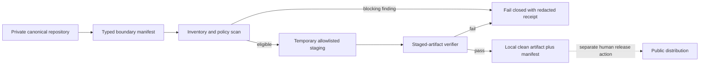
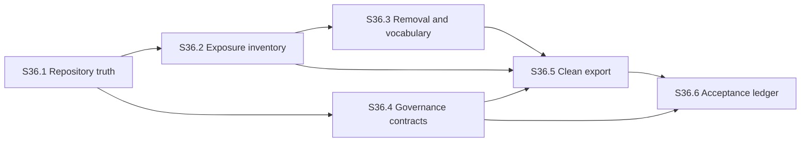

# E36 Design: Product Truth, IP Boundary & Governance

## Design Intent

E36 establishes a trustworthy release boundary before ESCALA Local V2 adds
runtime or business functionality. The private repository remains the canonical
development source. A public package is a derived, verified artifact assembled
from an explicit allowlist; it is not a branch, mirror, or manually maintained
copy of the private tree.

This design implements the local-only product decision: ESCALA executes on the
installer's machine, authoritative company state stays there, and team exchange
uses ordinary files in a user-controlled synced folder. No E36 component adds a
hosted service, cloud database, Drive/OneDrive API, OAuth dependency, or
multi-writer database.

## Gemba: Current-State Evidence

The design was derived from the actual repositories and code, not from planned
documentation alone.

| Observation | Verified state | Design consequence |
|---|---|---|
| Canonical branch tracking | Local `main` tracks an obsolete remote even though `origin/main` is the private canonical remote. | S36.1 repairs upstream truth and removes unsafe obsolete configuration without changing history. |
| Mixed private corpus | The private tree tracks 1,146 files; 733 are PDF/TXT/MD and 217 tracked files match at least one prohibited source-facing phrase. | The private repository cannot itself be the public artifact. Export must be allowlist-first. |
| Raw reference asset | The raw PDF is intentionally deleted in the working tree but not yet committed. Derived private assets also exist. | Current-tree deletion, private historical exposure, derived-material classification, and public eligibility must be reported separately. |
| Existing export validator | `validators/export.py` validates Action Plan headings only; a near-duplicate exists under `.scaleup/agent`. | Preserve its business responsibility. Create a separately named public-package verifier. |
| Installer drift | Root, `.scaleup`, and `escala-agent` installers implement different layouts and update behavior. | E36 records distribution truth; E41 owns one reproducible installer/update contract. |
| Public candidate repository | A local public-like repository exists but is hundreds of commits behind and contains intentional dirty work plus source-facing vocabulary. | Treat it as read-only evidence. Never overwrite or synchronize it; migrate only from a reviewed clean export. |
| Secret/public-boundary tooling | No tracked secret scanner, public allowlist, clean-export builder, or third-party manifest was found. | E36 adds small deterministic tools and machine-readable policies. |
| Closure taxonomy | Closure rules are literal constants in `validators/epic_closure.py`; a prior bug showed consumers can drift. | One typed contract feeds every closure consumer and its positive/negative tests. |
| Epic identity | E18-E22 each have duplicate numeric folder identities; the graph reports collisions despite a prose legacy-disposition index. | Add explicit canonical identities/aliases and make graph resolution consume them or rename only after link impact is proven. |
| ADR convention | No repository-wide ADR directory/template exists; E14 keeps its ADR with the owning epic. | E36 keeps its decision record beside this design. |

Sensitive remote values are never copied into evidence. Reports contain only
redacted remote names, credential-class findings, relative paths, rule IDs, and
content hashes where needed for reproducibility.

## Architecture Decision

The binding decision is recorded in
`adr-private-canonical-source-and-clean-export.md`:

1. one private canonical repository;
2. deny-by-default public export from an allowlist;
3. local-only runtime and data authority;
4. typed manifests as governance input;
5. no automatic publication in E36.

## Target Components

### 1. Repository Truth Contract

A sanitized audit records:

- canonical remote name and expected privacy role;
- active branch/upstream relationship;
- obsolete/unsafe remote presence as a boolean finding, never as a printed URL;
- divergence counts against `origin/main`;
- private-source versus public-artifact responsibilities.

S36.1 changes local configuration only after the audit identifies the exact
target. No force-push, history rewrite, or modification of the dirty public
candidate repository is permitted.

### 2. Product Boundary Manifest

`governance/product-boundary.yaml` becomes the machine-readable policy source.
It declares:

- schema version and product invariants;
- allowlisted public roots/files;
- denied path, content, credential, private-data, and provenance rule IDs;
- private-only source classes;
- required package metadata (`LICENSE`, notices, manifest, version/provenance);
- generated-output exclusions;
- evidence redaction behavior.

`validators/product_boundary.py` loads the manifest into strict Pydantic models.
Unknown fields, invalid enum values, overlapping rules, missing required
metadata, and paths outside the repository fail closed.

The manifest is policy, not an inventory of every private file. A new file is
non-distributable until an explicit allowlist rule includes it.

### 3. Exposure Inventory

`tools/audit_product_boundary.py` produces deterministic JSON plus a readable
Markdown summary. Findings use stable IDs and these distinct surfaces:

- `current_private_tree`;
- `private_git_history`;
- `local_git_configuration`;
- `candidate_public_tree` (read-only evidence when present);
- `generated_public_staging`.

Each finding carries severity, category, relative path or redacted location,
rule ID, disposition, and evidence hash. It never prints a credential value or
an unsafe remote URL. Critical unresolved findings block a clean export.

Historical matches are truthful evidence of private history; they do not claim
current-tree presence or public distribution. History rewriting remains outside
E36.

### 4. Closure and Identity Contracts

`governance/closure-dispositions.yaml` defines every accepted disposition and
whether it is terminal, completed, reviewable, or activation-eligible.
`validators/governance_contract.py` parses that source through Pydantic and
exposes typed queries. `validators/epic_closure.py` consumes those queries
instead of maintaining its own competing vocabulary.

Tests cover every accepted disposition plus unknown, malformed, legacy-only,
and semantically incomplete values. Unknown values always block closure.

`governance/epic-identities.yaml` assigns a unique canonical identifier to each
legacy E18-E22 directory and preserves old numeric/folder aliases. The graph
resolver must prove collision-free output and link resolution before any folder
rename. If the current graph cannot consume aliases, S36.4 adds the smallest
normalization seam rather than encoding another prose-only exception.

### 5. Clean Export Builder and Verifier

`tools/build_public_export.py` accepts the private repository root, an empty
staging destination, and `--dry-run`. It performs this deterministic sequence:

1. load and validate the product-boundary manifest;
2. enumerate only allowlisted tracked inputs;
3. copy into a newly created staging directory;
4. scan path names and contents with deny rules;
5. verify license, notices, third-party inventory, version, and provenance;
6. reject symlinks escaping the staging root and any unexpected file;
7. emit a sorted file manifest with hashes and a redacted verification receipt;
8. produce no external publication or repository mutation.

The verifier runs on the staged artifact, not merely on the private source. A
package passes only when all required checks are evidenced and there are zero
unresolved blocking findings.

The existing Action Plan export validator keeps its current name and purpose;
the new public-package verifier uses product-boundary terminology to avoid an
ambiguous API.

### 6. Master Acceptance Ledger

`work/epics/e36-product-truth-ip-governance/master-acceptance-ledger.yaml` is
the machine-readable control plane for E37-E42. A rendered Markdown view makes
it reviewable by a human. Every requirement has:

- unique requirement ID;
- owning epic/story;
- observable acceptance statement;
- evidence artifact and verification command;
- required gates and supported operating systems;
- no-host/local-data classification;
- status with fail-closed semantics.

The ledger cannot mark a requirement complete from a plan or unchecked box.
Completion requires the named artifact plus a passing verification receipt.

## Data Contracts

All new Python data structures are strict Pydantic models with type annotations.
Enums are serialized as stable lowercase strings. JSON and YAML outputs include
`schema_version`; readers reject unsupported major versions.

Core records:

| Record | Required fields | Fail-closed rule |
|---|---|---|
| `BoundaryPolicy` | schema version, allowlist, deny rules, required metadata, invariants | Invalid/unknown configuration blocks audit and export. |
| `BoundaryFinding` | ID, surface, category, severity, rule, redacted location, disposition | Unknown severity/category/disposition is blocking. |
| `ClosureDisposition` | ID, terminal, complete, reviewable, activation eligible | Missing or unknown state cannot close work. |
| `EpicIdentity` | canonical ID, folder, legacy aliases, disposition | Duplicate canonical ID or alias is blocking. |
| `AcceptanceRequirement` | ID, owner, acceptance, evidence, gates, platform, state | Missing evidence cannot become complete. |
| `ExportReceipt` | source commit, policy hash, sorted file hashes, checks, result | Any missing check or unexpected file fails export. |

## Control Flow

No node represents a hosted ESCALA service. Public distribution is deliberately
outside the E36 execution flow.

## Story Dependency Design

S36.2 and S36.4 may proceed independently after repository truth is repaired.
The clean export depends on both policy classification and governance identity.

## Migration Strategy

1. Repair local upstream/remote configuration and commit the intentional raw
   asset deletion without rewriting history.
2. Capture baseline inventories before changing public-facing vocabulary.
3. Introduce typed policies beside existing validators; lock behavior with
   negative tests before switching consumers.
4. Resolve graph identity through explicit aliases/normalization and prove old
   links before considering any rename.
5. Build and verify a temporary local artifact. Do not touch the dirty public
   candidate repository.
6. Baseline E37-E42 in the acceptance ledger; later epics update it only with
   evidence-backed state transitions.

Every migration step is independently commit-sized and recoverable. No step
requires force operations, history rewriting, publication, or cloud access.

## Validation Strategy

Each implementation task follows RED-GREEN-REFACTOR. Required evidence includes:

- focused unit/contract tests for new policy behavior;
- negative fixtures for prohibited references, credentials, traversal,
  unexpected files, unknown statuses, and duplicate identities;
- positive fixtures proving allowed portable content is not rejected;
- full repository test, lint, format, and type gates before every commit;
- graph-build receipt with zero duplicate canonical IDs;
- clean-export dry run from a clean private commit into a temporary directory;
- independent scan of the staged artifact and receipt consistency check;
- sanitized `git status`, branch/upstream, and artifact-manifest evidence.

macOS is exercised locally during E36. Windows behavior belongs to E41's
installer matrix; E36's acceptance ledger requires it before public release.

## Risks and Controls

| Risk | Control |
|---|---|
| A blacklist misses a private file | Allowlist-only enumeration; unexpected staged files fail. |
| Scanning leaks the secret it found | Store rule/category/redacted location only; never matching values or remote URLs. |
| Deleting the current PDF is mistaken for purged history | Separate current-tree, history, and public-artifact surfaces in every report. |
| Derived business logic is removed without analysis | Classify private derivation and public vocabulary separately; verify behavior with product tests. |
| Duplicate IDs are hidden instead of repaired | Typed unique identities plus graph-build and alias-resolution tests. |
| Existing public-candidate work is destroyed | Read-only evidence; no sync, reset, clean, copy-over, or push. |
| Governance becomes a generic policy platform | Limit models and rules to E36 acceptance contracts. |
| A passing private-source scan is treated as release proof | Stage and independently verify the exact local artifact. |
| E36 drifts into hosted collaboration | Encode no-host/local-authority invariants in policy and acceptance ledger. |

## Design Exit Criteria

- Scope, story sizes, dependencies, and architectural boundaries are explicit.
- The private-canonical/clean-export decision is recorded as an accepted ADR.
- Gemba evidence distinguishes current code from intended architecture.
- The local-only and synced-folder constraints are represented in executable
  future contracts, not merely narrative.
- Risks outside E36 are parked with promotion conditions.
- No implementation or external publication occurs during design.
