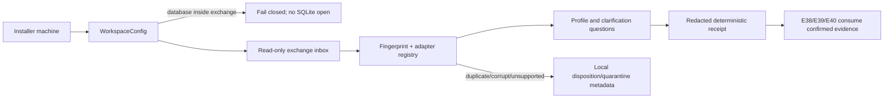
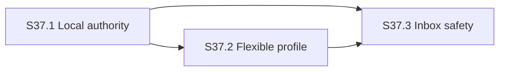

# E37 Design: Local Workspace & Flexible Ingestion

## Design Intent

E37 convierte la promesa local de E36 en una frontera de runtime comprobable y
en un primer flujo de valor: el empresario selecciona un workspace local y una
carpeta de intercambio, entrega sus archivos existentes y recibe un perfil
honesto de lo que el sistema pudo extraer. El flujo es filesystem-only; una
carpeta de Drive u OneDrive ya sincronizada se trata exactamente como una
carpeta ordinaria y nunca como una integración cloud.

El diseño separa tres cosas que hoy están mezcladas: la autoridad de SQLite,
la bandeja de documentos y la interpretación de una fuente. La entrada no
escribe directamente tablas de empresa; primero produce un descriptor y un
estado de extracción que E38-E40 podrán consumir con evidencia.

## PRIME: Retrieved Context

Las consultas de grafo devolvieron como contexto relevante:

- E36: frontera local-only, autoridad de datos en la máquina del instalador y
  carpeta sincronizada solo para documentos.
- E1802: existencia de un servidor HTTP local y el riesgo de confundir el
  servidor local con una arquitectura hospedada.
- E13/E29/E33: necesidad de distinguir código existente, artefactos históricos
  y evidencia real antes de declarar una capacidad.
- Guardrails de RaiSE: no generar sin entender, fallar cerrado y no saltar
  gates para ganar velocidad.

Estos resultados refuerzan el alcance; no se usan como prueba de que E37 ya
está implementado.

## Gemba: Current-State Evidence

El diseño se basa en lectura del checkout actual:

| Observación | Estado verificado | Consecuencia de diseño |
|---|---|---|
| `escala_server/cli.py` y `escala_server/__main__.py` | Ya arrancan un HTTP server local y por defecto colocan SQLite en `~/.escala/escala.db`. | Reutilizar el entrypoint local, pero validar la autoridad antes de inicializar DAOs; no añadir un server remoto. |
| `escala_server/daos/schema.py` y `escala_server/schema.py` | Existen dos inicializadores SQLite con layouts distintos. | E37 no crea una tercera base ni sincroniza ninguna; S37.1 introduce un guard de ruta común y deja la consolidación de esquema fuera del walking skeleton. |
| `coaching/class_intake.py` | Ingresa solo transcripts de clase, persiste YAML y serializa rutas absolutas. | No es un ingestor genérico reutilizable: se conserva para compatibilidad de cursos y se crea un modelo neutral con procedencia relativa. |
| `escala_server/data/book_parser.py` y `knowledge_ingester.py` | Son ingestores orientados a conocimiento interno y a un formato específico. | No se presentan como soporte de archivos empresariales; el registro E37 será extensible y source-neutral. |
| `escala_server/migrate.py` | Migra YAML a SQLite con IDs derivados de paths y logs con rutas absolutas. | El nuevo receipt no reutiliza esos logs; se rediseña la identidad de fuente con SHA-256 y rutas relativas. |
| `pyproject.toml` | Solo declara Pydantic y PyYAML como runtime; no hay parser universal de XLSX/DOCX/PDF. | Los adaptadores se aíslan por formato y reportan `unsupported` si el proveedor local no está disponible; no se promete extracción silenciosa. |
| Tests existentes | Hay fixtures y pruebas de SQLite, sesiones y class intake, pero no de workspace, inbox, fingerprints o cuarentena. | E37 agrega gates negativos y un caso sintético end-to-end; los tests legacy no se reescriben salvo para conectar el seam. |

No se encontró un componente genérico de workspace o inbox que se pueda
reutilizar sin duplicación. La única integración externa permitida es la que el
sistema operativo ya monta como carpeta.

## Architecture Decisions

### AD-37.1 — Una autoridad local explícita

`WorkspaceConfig` declara `data_root`, `database_path` y `exchange_root`.
Todos se resuelven con `Path.resolve()` antes de abrir o crear SQLite. Si el
database path está dentro de `exchange_root` (incluyendo un symlink resuelto),
la operación falla cerrado antes de crear directorios, abrir conexiones o
alterar el estado. El producto no intenta adivinar si una carpeta se llama
"Drive" o "OneDrive"; la seguridad se basa en el rol configurado, no en el
nombre.

### AD-37.2 — Registro de adaptadores por extensión declarada

Un `FormatRegistry` selecciona un adaptador local para extensiones conocidas y
devuelve un estado tipado para cada entrada:

| Grupo | Ejemplos iniciales | Resultado si falta proveedor |
|---|---|---|
| Delimitado/texto | `.csv`, `.tsv`, `.txt`, `.md`, `.srt`, `.vtt` | Perfil de texto/tabla o `unsupported` con causa. |
| Hoja de cálculo | `.xlsx`, `.xlsm` y variantes declaradas | Perfil de hojas/tablas o `unsupported`; nunca valores inventados. |
| Documento/PDF | `.docx`, `.pdf` | Metadatos y extracción disponible localmente; si no, `unsupported`/`needs_clarification`. |

La registry es un seam; cada adapter debe declarar límites de tamaño,
codificación, hojas encontradas y capacidad de extracción. Un sufijo no
conocido se reporta, no se procesa como texto por accidente.

### AD-37.3 — Perfil antes de persistencia

`SourceDescriptor` y `ExtractionProfile` son modelos Pydantic estrictos. Una
corrida produce:

1. fingerprint SHA-256 del contenido y un `source_id` estable derivado de ese
   fingerprint más el workspace lógico;
2. `relative_path` respecto al exchange root (o un locator lógico cuando la
   fuente fue entregada fuera del inbox);
3. formato, tamaño acotado, hojas/tablas/headers/unidades/fechas/entidades
   candidatas y estado de extracción;
4. preguntas `needs_clarification` cuando una selección material no puede
   resolverse con los datos presentes;
5. receipt determinista sin contenido, secretos ni rutas absolutas.

El perfil es evidencia de entrada, no una afirmación contable ni una escritura
en `companies`, `worksheets` o memoria.

### AD-37.4 — Inbox no destructivo e idempotente

El processor enumera una carpeta configurada en orden estable, ignora sus
subdirectorios de estado y calcula fingerprint antes de copiar o persistir
metadatos. Un fingerprint ya visto produce `duplicate` y no crea una segunda
fuente. Para corrupción, cifrado, exceso de tamaño o formato no soportado se
registra una disposición local `quarantined`/`reported`; el archivo original
permanece intacto y nunca se borra o sobrescribe automáticamente.

El estado del inbox vive bajo el `data_root` local, fuera de `exchange_root` y
fuera de la SQLite autoritativa. Esto permite que la carpeta se sincronice con
el equipo sin transportar la base ni el estado interno.

## Target Components

Los nombres son límites de responsabilidad, no una obligación de implementar
todo en un solo commit:

- `escala_server/workspace/authority.py`: `WorkspaceConfig`, guardas de rutas,
  roles de autoridad y prueba no-SQLite-sync.
- `escala_server/ingestion/models.py`: modelos Pydantic de fuente, perfil,
  pregunta, disposición y receipt.
- `escala_server/ingestion/registry.py`: registro de adapters y capacidades
  declaradas.
- `escala_server/ingestion/profile.py`: perfilado de texto/tablas y seam para
  hojas/documentos/PDF.
- `escala_server/ingestion/inbox.py`: enumeración estable, idempotencia,
  estado local y cuarentena no destructiva.
- `validators/` o gates RaiSE: validaciones de contrato, redacción, no
  mutación y ausencia de llamadas cloud.

Los DAOs actuales siguen siendo consumidores de estado canónico. E37 no
introduce importación directa a sus tablas; E38-E40 decidirán qué perfiles
confirmados pueden convertirse en hechos de negocio.

## Data Contracts

Todos los modelos nuevos son Pydantic estrictos, con `schema_version`, enums
serializados en minúsculas y campos adicionales rechazados:

| Record | Campos esenciales | Falla cerrada |
|---|---|---|
| `WorkspaceConfig` | `data_root`, `database_path`, `exchange_root`, `platform` | Ruta inválida, database dentro del exchange o roots ambiguos. |
| `SourceDescriptor` | `source_id`, `relative_path`, `sha256`, `size_bytes`, `format` | Hash/locator ausente, path absoluto o tamaño fuera de límite. |
| `ExtractionProfile` | sheets/tables/headers/units/dates/entities, `status`, `questions` | Inferencia material sin pregunta o valores no verificables. |
| `InboxDisposition` | `source_id`, `state`, `reason`, `receipt_id` | Duplicado/fallo que muta el canonical state. |
| `IngestionReceipt` | `run_id`, sorted items, checks, redacted result | Contenido sensible, machine path o resultado no determinista. |

## Control Flow

No node in this flow is a cloud service. The only write during E37 is local
metadata under `data_root`; the exchange source remains user-owned and
untouched.

## Story Dependency Design

S37.1 is the walking skeleton and blocks any source processing. S37.2 proves
the profile contract with deterministic fixtures. S37.3 integrates both paths
against a real temporary folder and verifies re-run, failure, and no-mutation
behavior.

## Test and Evidence Strategy

- RED tests for path containment, symlink resolution, platform separators and
  rejection of SQLite in exchange.
- RED/GREEN fixtures for CSV/TSV/text, workbook sheet discovery, document/PDF
  metadata, unknown extensions, encrypted/corrupt bytes and size limits.
- Determinism tests: identical input produces identical `source_id` and receipt
  payload except for an explicitly excluded run timestamp.
- Rerun tests: second inbox pass yields `duplicate` and leaves canonical DB and
  local source state byte-identical.
- No-leak tests: receipts and human rendering contain no absolute path, file
  content, token, URL credential or SQLite path.
- One synthetic end-to-end flow writes only to an isolated temporary workspace;
  it never touches the repository's `.scaleup/` or the user's real folders.

## Risks and Mitigations

| Risk | Impact | Mitigation |
|---|---|---|
| Real workbooks require libraries not shipped in the current runtime | High | Adapter capability reports, explicit `unsupported`, and local dependency decision in S37.2; no guessing. |
| Symlink or case-folding differences bypass the exchange guard | High | Resolve paths, compare common paths, test macOS and Windows-style inputs, and fail on uncertain resolution. |
| Reprocessing a synced file races with the sync client | Medium | Read-only enumeration, fingerprint-before-profile, stable retry state and no source overwrite. |
| Existing legacy intake writes absolute paths | Medium | Keep it isolated for course compatibility; all E37 receipts use relative provenance and redaction tests. |
| New ingestion accidentally writes business facts too early | High | Profiles are separate from DAOs; only later epics can promote confirmed evidence. |

## Deferred / Parking Lot

- OCR for image-only PDFs — promote only after a real user sample proves local
  extraction is insufficient and privacy/performance are measured.
- Cloud Drive/OneDrive API or OAuth — rejected by the current product invariant;
  requires a new product decision and ADR.
- Multi-writer shared database — incompatible with local-only authority; never
  promote under E37.

## Exit State

E37 is ready for `/rai-epic-plan` when this design and scope are committed,
the three stories map one-to-one to REQ-E37-001…007, and no story assumes that
the master ledger or existing `class_intake` implementation is proof of
functionality.
