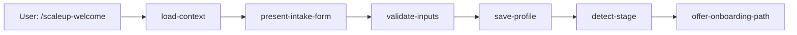

# Epic Design: E8 — Coaching Engine

## Architecture: Core + Adapters (Cross-Platform)

**Context:** Los 26 skills actuales son SKILL.md puro (instrucciones LLM en markdown). Esto funciona en Claude Code pero no es portable a Hermes Agent ni Codex CLI. Para E8, los nuevos skills de coaching deben poder ejecutarse en cualquier plataforma.

**Decision:** Arquitectura de 3 capas:

```
.scaleup/coaching/{skill}/        ← Core Python (lógica de negocio pura)
  ├── __init__.py                   ← entry point: run(context) → result
  ├── models.py                     ← tipos de datos, esquemas
  ├── engine.py                     ← lógica de negocio principal
  └── tests/                        ← tests unitarios

.claude/skills/scaleup-{skill}/   ← Adapter Claude Code (SKILL.md delgado)
  └── SKILL.md                      ← invoca python .scaleup/coaching/{skill}

.scaleup/agent/validators/        ← Quality gates en Python
  ├── welcome.py                    ← valida perfil completo
  ├── diagnose.py                   ← valida scores en rango 1-5
  ├── worksheet.py                  ← valida campos requeridos
  └── progress.py                   ← valida consistencia de datos
```

**Reglas:**
1. **Core Python NO sabe qué agente lo invoca** — recibe contexto, devuelve resultado
2. **Adapter SKILL.md solo orquesta** — lee contexto del agente, llama al core, presenta resultado
3. **Quality gates en Python** — validan artefactos producidos, no confían en LLM
4. **Tests unitarios** para cada core module (pytest)
5. **Misma estructura de datos** que E7 (company-profile.yaml es source of truth)

## Core Module Contract

Cada core module expone:

```python
def run(context: dict) -> dict:
    """
    Args:
        context: dict con keys estándar del agente:
            - company_profile: dict del perfil de empresa
            - scores: dict con scores actuales
            - tasks: list de tareas abiertas
            - sessions: list de sesiones recientes
            - goal: dict con SMART goal
            - ontology_params: dict con parámetros de consulta

    Returns:
        dict con:
            - output: str (markdown para presentar al usuario)
            - artifacts: dict (datos a persistir)
            - errors: list (si hubo validaciones fallidas)
    """
```

## Story Decomposition

### S8.1 — Coaching Core + Welcome

**Core modules:**
- `.scaleup/coaching/welcome/` — intake form, stage detection, profile creation
- `.scaleup/coaching/core/` — shared utilities (context loader, formatters)

**Adapter:**
- `.claude/skills/scaleup-welcome/SKILL.md` → invoca welcome/__init__.py

**Quality gate:**
- `welcome.py` — valida que profile tenga: company name, stage, industry, employees

**Pipeline:**


### S8.2 — Diagnosis Engine

**Core modules:**
- `.scaleup/coaching/diagnose/` — structured assessment across 4 decisions
- Questions mapped to ontology nodes (from E6)
- Score calculation (1-5 per decision)
- Priority detection (lowest score = highest priority)

**Adapter:**
- `.claude/skills/scaleup-diagnose/SKILL.md`

**Quality gate:**
- `diagnose.py` — scores in 1-5 range, at least one question answered per decision

**Pipeline:**
```mermaid
graph LR
    A[/scaleup-diagnose] --> B[assess-people]
    A --> C[assess-strategy]
    A --> D[assess-execution]
    A --> E[assess-cash]
    B --> F[calculate-scores]
    C --> F
    D --> F
    E --> F
    F --> G[generate-report]
    G --> H[save-to-profile]
    H --> I[present-results]
```

### S8.3 — Worksheet Guidance Engine

**Core modules:**
- `.scaleup/coaching/worksheet/` — load from ontology, guide step-by-step, validate

**Adapter:**
- `.claude/skills/scaleup-worksheet/SKILL.md`

**Quality gate:**
- `worksheet.py` — required fields filled, no contradictions

### S8.4 — Progress Tracker

**Core modules:**
- `.scaleup/coaching/progress/` — calculate completion %, suggest next, render dashboard

**Adapter:**
- `.claude/skills/scaleup-progress/SKILL.md`

**Quality gate:**
- `progress.py` — percentages sum correctly, no negative values

### S8.5 — Level-Aware Coaching

**Core modules:**
- `.scaleup/coaching/level/` — detect Shu/Ha/Ri, adjust tone/depth

**Adapter:**
- `.claude/skills/scaleup-level/SKILL.md`

### S8.6 — Sub-agent Router

**Core modules:**
- `.scaleup/coaching/router/` — route to decision sub-agents based on context

**Adapter:**
- Updated routing in CLAUDE.md

## ADR-1: Core Python Structure

`.scaleup/coaching/` es el directorio compartido. Cada skill tiene su subdirectorio con `__init__.py` que exporta `run(context)`. Las dependencias compartidas van en `.scaleup/coaching/core/`.

## ADR-2: Adapter SKILL.md es Delgado

El SKILL.md de Claude Code NO contiene lógica de negocio. Solo:
1. Lee contexto del agente (archivos, variables de entorno)
2. Invoca `python3 .scaleup/coaching/{skill}/__init__.py` con el contexto como JSON
3. Captura output y lo presenta al usuario

## ADR-3: Misma Estructura de Datos que E7

Los core modules leen/escriben los mismos archivos YAML que E7 creó:
- `.scaleup/agent/memory/company-profile.yaml`
- `.scaleup/my-company/tasks.md`
- `.scaleup/my-company/sessions/YYYY-MM-DD.md`

## Risks

| Risk | Likelihood | Impact | Mitigation |
|------|-----------|--------|-----------|
| Python overhead en skills simples (menos de 10 líneas) | Medium | Low | Regla: si cabe en 15 líneas de SKILL.md, no crear core Python |
| Gap entre lo que el core Python produce y lo que el LLM necesita | Medium | High | Core devuelve output markdown + artifacts dict. El adapter puede enriquecer |
| Ontología E6 no cubre todas las preguntas de diagnóstico | Low | High | S8.2 debe validar cobertura contra el worksheet registry antes de implementar |
| Los tests de core modules se vuelven frágiles | Medium | Medium | Testear contracts (input → output), no implementación interna |
